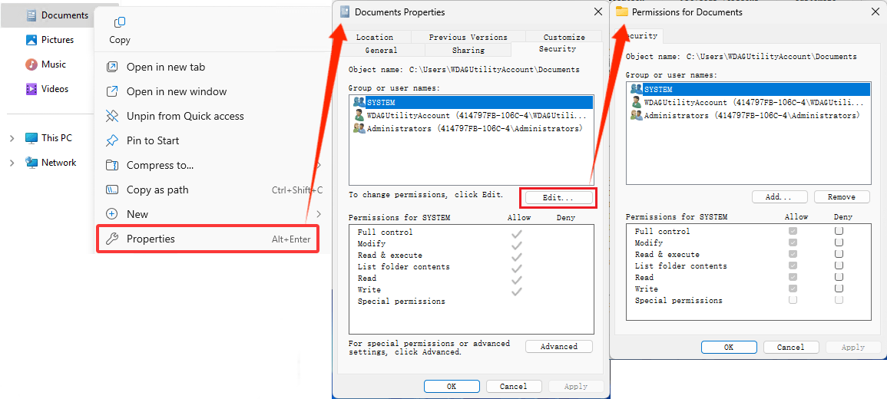

# Adjust case sensitivity

Case sensitivity determines whether uppercase (FOO.txt) and lowercase (foo.txt) letters are handled as distinct (case-sensitive) or equivalent (case-insensitive) in a file name or directory.

- Case-sensitive: FOO.txt ≠ foo.txt ≠ Foo.txt
- Case-insensitive: FOO.txt = foo.txt = Foo.txt

## Differences between Windows and Linux case sensitivity

When working with both Linux and Windows files and directories, you may need to adjust how case sensitivity is handled.

Standard behavior:

- Windows file system treats file and directory names as case-insensitive. FOO.txt and foo.txt will be treated as equivalent files.
- Linux file system treats file and directory names as case-sensitive. FOO.txt and foo.txt will be treated as distinct files.

The Windows file system supports setting case sensitivity with attribute flags per directory. While the standard behavior is to be case-insensitive, you can assign an attribute flag to make a directory case sensitive, so that it will recognize Linux files and folders that may differ only by case.

This may be especially true when mounting drives to the Windows Subsystem for Linux (WSL) file system. When working in the WSL file system, you are running Linux, thus files and directories are treated as case-sensitive by default.

> [!NOTE]
> In the past, if you had files whose name differed only by case, these files could not be accessed by Windows, because Windows applications treat the file system as case insensitive and cannot distinguish between files whose names only differ in case. While Windows File Explorer will show both files, only one will open regardless of which you select.

## Change the case sensitivity of files and directories

The following steps explain how to change a directory on the Windows file system so that it is case-sensitive and will recognize files and folders that differ only by case.

> [!WARNING]
> Some Windows applications, using the assumption that the file system is case insensitive, don’t use the correct case to refer to files. For example, it’s not uncommon for applications to transform filenames to use all upper or lower case. In directories marked as case sensitive, this means that these applications can no longer access the files. Additionally, if Windows applications create new directories in a directory tree where you are using case sensitive files, these directories are not case sensitive. This can make it difficult to work with Windows tools in case sensitive directories, so exercise caution when changing Windows file system case-sensitivity settings.

### Inspect current case sensitivity

To check if a directory is case sensitive in the Windows filesystem, run the command:

```powershell
fsutil.exe file queryCaseSensitiveInfo <path>
```

Replace `<path>` with your file path. For a directory in the Windows (NTFS) file system, the `<path>` will look like: `C:\Users\user1\case-test` or if you are already in the `user1` directory, you could just run: `fsutil.exe file setCaseSensitiveInfo case-test`

### Modify case sensitivity

Support for per-directory case sensitivity began in Windows 10, build 17107. In Windows 10, build 17692, support was updated to include inspecting and modifying the case sensitivity flag for a directory from inside WSL. Case sensitivity is exposed using an extended attribute named `system.wsl_case_sensitive`. The value of this attribute will be 0 for case insensitive directories, and 1 for case sensitive directories.

Changing the case-sensitivity of a directory requires that you run **elevated permissions** (run as Administrator). Changing the case-sensitivity flag also requires “Write attributes”, “Create files”, “Create folders” and “Delete subfolders and files” permissions on the directory. [See the troubleshooting section for more about this](#error-access-denied).

To change a directory in the Windows file system so that it is case-sensitive (FOO ≠ foo), run PowerShell as Administrator and use the command:

```powershell
fsutil.exe file setCaseSensitiveInfo <path> enable
```

To change a directory in the Windows file system back to the case-insensitive default (FOO = foo), run PowerShell as Administrator and use the command:

```powershell
fsutil.exe file setCaseSensitiveInfo <path> disable
```

A directory must be empty in order to change the case sensitivity flag attribute on that directory. You cannot disable the case sensitivity flag on a directory containing folders/files whose names differ on only by case.

### Case sensitivity inheritance

When creating new directories, those directories will inherit the case sensitivity from its parent directory.

> [!WARNING]
> There is an exception to this inheritance policy when running in WSL 1 mode. When a distribution is running in WSL 1 mode, the per-directory case sensitivity flag is not inherited; directories created in a case sensitive directory are not automatically case sensitive themselves. You must explicitly mark each directory as case sensitive

## Case sensitivity options for mounting a drive in WSL configuration file

Case sensitivity can be managed when mounting a drive on the Windows Subsystem for Linux using the WSL config file. Each Linux distribution that you have installed can have it's own WSL config file, called `/etc/wsl.conf`. For more information about how to mount a drive, see [Get started mounting a Linux disk in WSL 2](./wsl2-mount-disk.md).

To configure the case sensitivity option in the `wsl.conf` file when mounting a drive:

1. Open the Linux distribution you will be using (ie. Ubuntu).
2. Change directories up until you see the `etc` folder (this may require you to `cd ..` up from the `home` directory).
3. List the files in the `etc` directory to see if a `wsl.conf` file already exists (use the `ls` command, or `explorer.exe .` to view the directory with Windows File Explorer).
4. If the `wsl.conf` file does not already exist, you can create it using: `sudo touch wsl.conf` or by running `sudo nano /etc/wsl.conf`, which will create the file upon saving from the Nano editor.
5. The following options are available for you to add into your `wsl.conf` file:

**Default setting: `dir` for enabling case sensitivity per directory.**

```bash
[automount]
options = case = dir
```

**Case sensitivity unavailable (all directories on mounted NTFS drives will be case insensitive): `off`**

```bash
[automount]
options = case = off
```

**Treat all directories on the (NTFS) drive as case sensitive: `force`**

```bash
[automount]
options = case = force
```

This option is only supported for mounting drives on Linux distributions running as WSL 1 and may require a registration key. To add a registration key, you can use this command from an elevated (admin) command prompt: `reg.exe add HKLM\SYSTEM\CurrentControlSet\Services\lxss /v DrvFsAllowForceCaseSensitivity /t REG_DWORD /d 1`.

You will need to restart WSL after making any changes to the `wsl.conf` file in order for those changes to take effect. You can restart WSL using the command: `wsl --shutdown`

> [!TIP]
> To mount a drive (which uses the DrvFs filesystem plugin to make the disk available under /mnt, such as /mnt/c, /mnt/d, etc) with a specific case sensitivity setting for ALL drives, use `/etc/wsl.conf` as described above. To set the default mount options for one specific drive, use the [`/etc/fstab` file](http://manpages.ubuntu.com/manpages/xenial/man5/fstab.5.html) to specify these options.
> For more WSL configuration options, see [Configure per distro launch settings with wslconf](/windows/wsl/wsl-config#configure-settings-with-wslconfig-and-wslconf).

### Changing the case sensitivity on a drive mounted to a WSL distribution

NTFS-formatted drives mounted to a WSL distribution will be case-insensitive by default. To change the case sensitivity for a directory on a drive mounted to a WSL distribution (ie. Ubuntu), follow the same steps as listed above for the Windows file system. (EXT4 drives will be case-sensitive by default).

To enable case-sensitivity on a directory (FOO ≠ foo), use the command:

```bash
fsutil.exe file setCaseSensitiveInfo <path> enable
```

To disable case-sensitivity on a directory and return to the case-insensitive default (FOO = foo), use the command:

```bash
fsutil.exe file setCaseSensitiveInfo <path> disable
```

> [!NOTE]
> If you change the case sensitive flag on an existing directory for a mounted drive while WSL is running, ensure WSL has no references to that directory or else the change will not be effective. This means the directory must not be open by any WSL processes, including using the directory (or its descendants) as the current working directory.

## Configure case sensitivity with Git

The Git version control system also has a configuration setting that can be used to adjust case sensitivity for the files you are working with. If you are using Git, you may want to adjust the [`git config core.ignorecase`](https://git-scm.com/docs/git-config/#Documentation/git-config.txt-coreignoreCase) setting.

To set Git to be case-sensitive (FOO.txt ≠ foo.txt), enter:

`git config core.ignorecase false`

To set Git to be case-insensitive (FOO.txt = foo.txt), enter:

`git config core.ignorecase true`

Setting this option to false on a case-insensitive file system may lead to confusing errors, false conflicts, or duplicate files.

For more information, see the [Git Config documentation](https://git-scm.com/docs/git-config/).

## Troubleshooting

### My directory has files that are mixed case and require case sensitivity but Windows FS tools will not recognize these files

To use Windows file system tools to work on a Linux directory that contains mixed case files, you will need to create a brand new directory and set it to be case-sensitive, then copy the files into that directory (using git clone or untar). The files will remain mixed case. (Note that if you have already tried moving the files to a case-insensitive directory and there were conflicts, there were likely some files that were overwritten and will no longer be available.)

### Error: The directory is not empty

You cannot change the case sensitivity setting on a directory that contains other files or directories. Try creating a new directory, changing the setting, then copying your mixed-case files into it.

### Error: Access denied

Ensure that you have the “Write attributes”, “Create files”, “Create folders” and “Delete subfolders and files” permissions on the directory required for changing case-sensitivity. To check these settings, open the directory in Windows File Explorer (from command line, use the command: `explorer.exe .`). Right-click the directory and select **Properties** to open the Document Properties window, then select **Edit** to view or change permissions for the directory.



### Error: A local NTFS volume is required for this operation

The case sensitivity attribute can only be set on directories within an NTFS-formatted file system. Directories in the WSL (Linux) file system are case sensitive by default (and cannot be set to be case insensitive using the fsutil.exe tool).  

## Additional resources

- [DevBlog: Per-directory case sensitivity and WSL](https://devblogs.microsoft.com/commandline/per-directory-case-sensitivity-and-wsl/)
- [DevBlog: Improved per-directory case sensitivity support in WSL](https://devblogs.microsoft.com/commandline/improved-per-directory-case-sensitivity-support-in-wsl/)
