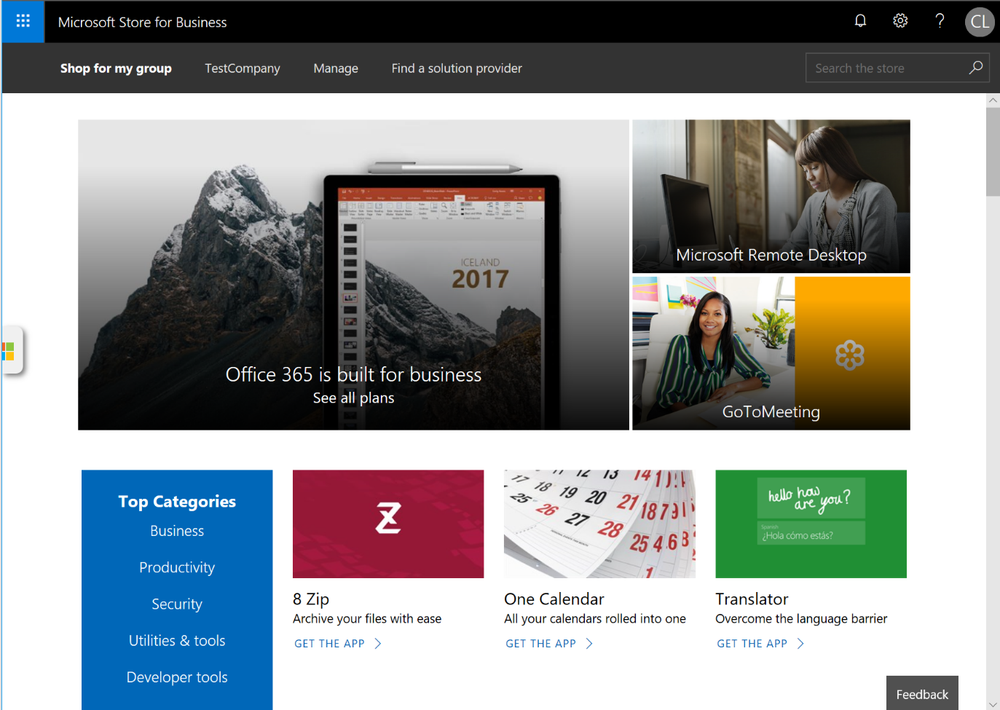
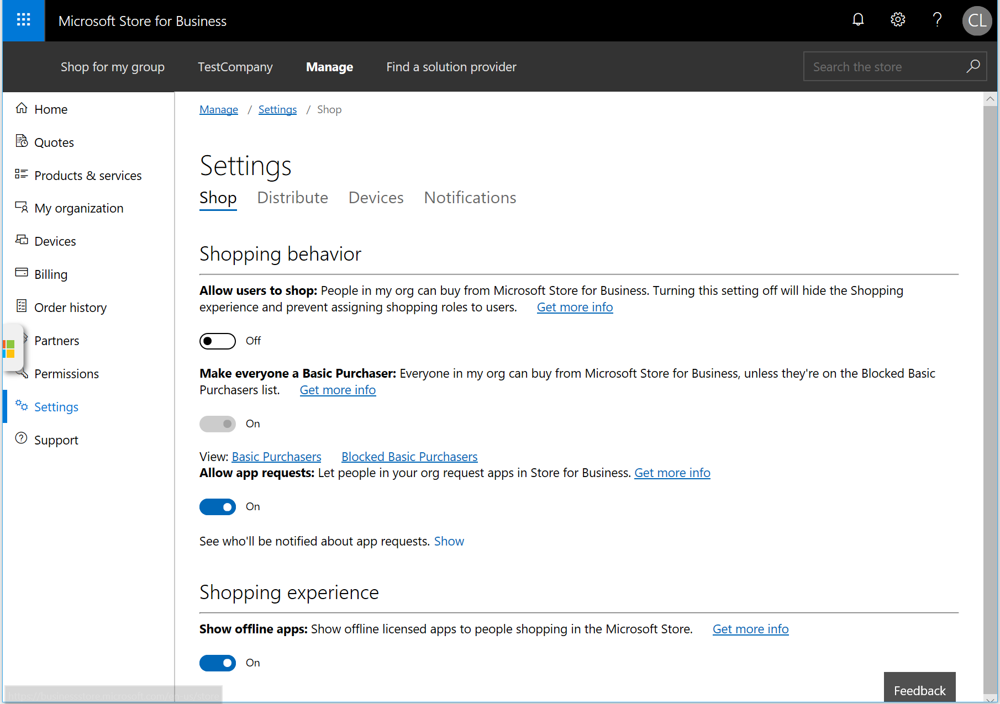
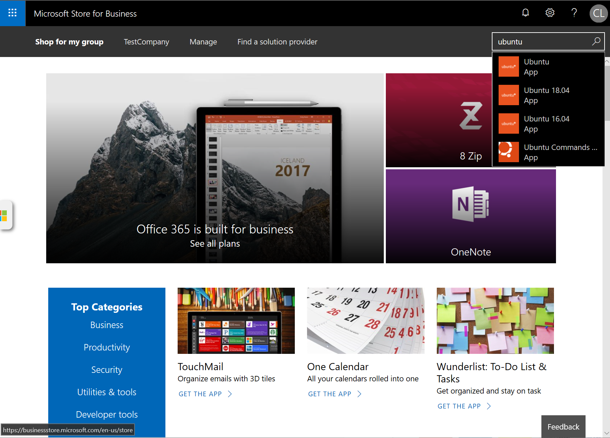
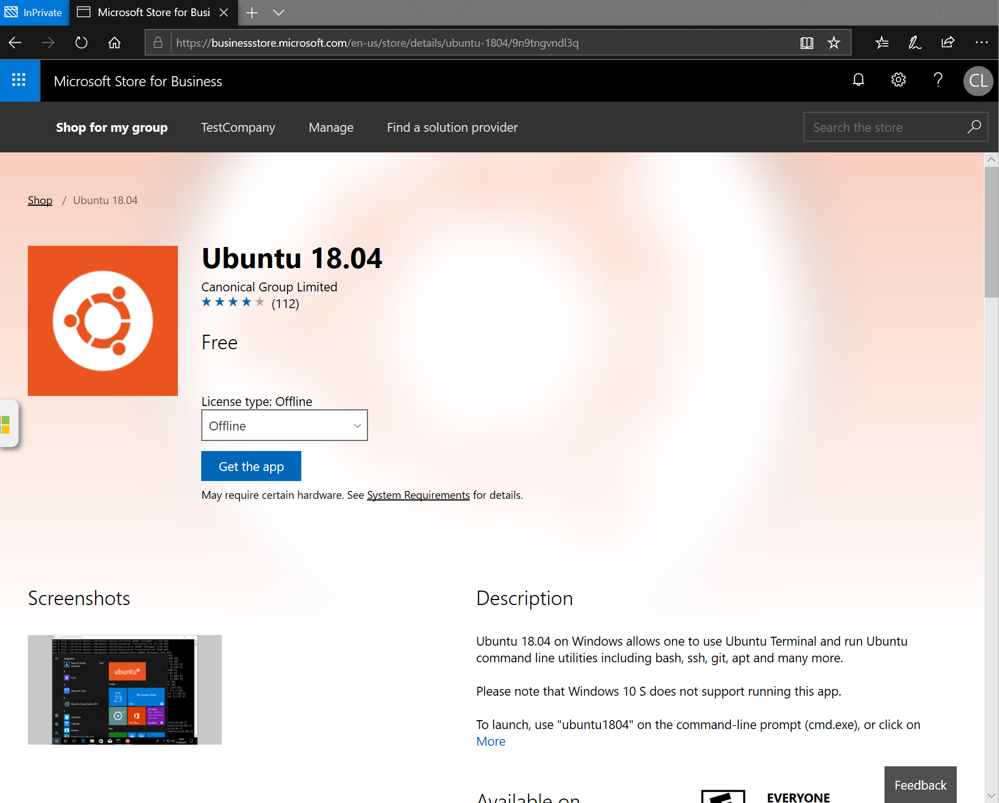
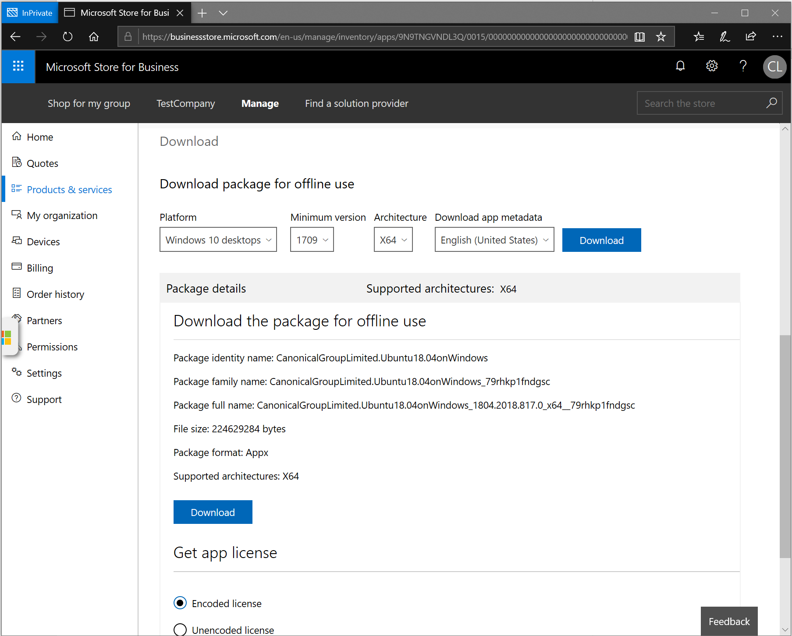

# Windows Subsystem for Linux for Enterprise

The Microsoft Store for Business offers a variety of solutions to Enterprises who want to deploy WSL to their company. The [online docs](https://docs.microsoft.com/en-us/microsoft-store/) for the Microsoft Store for Business are a great resource to find out general information about the Store experience.

If you’re a company that’s just looking to get set up to start deploying WSL you can follow these steps, which are explained inside of the Microsoft Store docs:

* [Sign up for the Microsoft Store for Business and get started](https://docs.microsoft.com/en-us/microsoft-store/sign-up-microsoft-store-for-business-overview)
* [Manage your products and services (including who can access which apps in your private store)](https://docs.microsoft.com/en-us/microsoft-store/manage-apps-microsoft-store-for-business-overview). Here you can add WSL distros to your store and control who can install them
* [Use a distribution method of your choice to deploy the software to your company](https://docs.microsoft.com/en-us/microsoft-store/distribute-apps-to-your-employees-microsoft-store-for-business)
* Communicate to users who have access to WSL distros that they can [use these steps](https://docs.microsoft.com/en-us/windows/wsl/install-win10) to install the distro or distros of their choice 

## How to Distribute a Distro Offline

If the computers in your company don’t have access to the Microsoft Store or the Microsoft Store for Business, then you can download the installer of a Linux distro that has an offline license by following these steps. 

### Set up an Azure Active Directory (AD) Account 

You need to have an Azure AD account and be the global administrator for your organization to get the installer of Microsoft Store apps. If you already have an account, you can skip this step.

The instructions to register an account can be found here:
https://docs.microsoft.com/en-us/microsoft-store/sign-up-microsoft-store-for-business

### Sign into the Store for Business and go to the homepage
Sign in here: www.microsoft.com/business-store

### Go to Manage->Settings and enable 'Show offline apps'

### Go back to the main page by clicking 'Shop for my group'

### Search for your desired distro and select it

### Select an ‘Offline’ license in the License type dropdown menu and click ‘Get the app’

Please note: some distros may elect not to have an offline license

### Click the ‘Manage’ button to get to the app’s product page

### Select your architecture and download the package for offline use

This installer can then be distributed to any computer where you would like to install WSL.