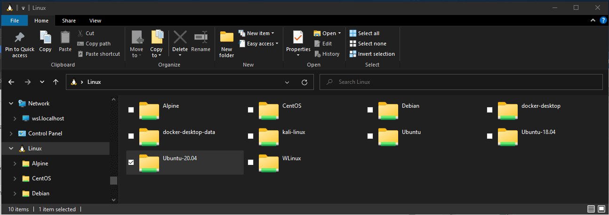

# Working across Windows and Linux file systems

There are a number of considerations to keep in mind when working between Windows and Linux file systems. We have outlined a few of them for you in this guide, including some examples of interoperability support for mixing Windows and Linux-based commands.

## File storage and performance across file systems

We recommend against working across operating systems with your files, unless you have a specific reason for doing so. For the fastest performance speed, store your files in the WSL file system if you are working in a Linux command line (Ubuntu, OpenSUSE, etc). If you're working in a Windows command line (PowerShell, Command Prompt), store your files in the Windows file system.

For example, when storing your WSL project files:

- Use the Linux file system root directory: `/home/<user name>/Project`
- Not the Windows file system root directory: `/mnt/c/Users/<user name>/Project$` or  `C:\Users\<user name>\Project`

When you see `/mnt/` in the file path of a WSL command line, it means that you are working from a mounted drive. So the Windows file system C:/ drive (`C:\Users\<user name>\Project`) will look like this when mounted in a WSL command line: `/mnt/c/Users/<user name>/Project$`. It is possible to store your project files on a mounted drive, but your performance speed will improve if you store them directly on the `\\wsl$` drive.

## View your current directory in Windows File Explorer

You can view the directory where your files are stored by opening the Windows File Explorer from the command line, using:

```bash
explorer.exe .
```

Alternatively, you can also use the command: `powershell.exe /c start .` Be sure to add the period at the end of the command to open the current directory.

To view all of your available Linux distributions and their root file systems in Windows File explorer, in the address bar enter: `\\wsl$`



## Filename and directory case sensitivity

Case sensitivity determines whether uppercase (FOO.txt) and lowercase (foo.txt) letters are handled as distinct (case-sensitive) or equivalent (case-insensitive) in a file name or directory. Windows and Linux file systems handle case sensitivity in different ways - Windows is case-insensitive and Linux is case-sensitive. Learn more about how to adjust case sensitivity, particularly when mounting disks with WSL, in the [Adjust case sensitivity](./case-sensitivity.md) how-to article.

## Interoperability between Windows and Linux commands

Windows and Linux tools and commands can be used interchangeably with WSL.

- Run Windows tools (ie. notepad.exe) from a Linux command line (ie. Ubuntu).
- Run Linux tools (ie. grep) from a Windows command line (ie. PowerShell).
- Share environment variables between Linux and Windows. (Build 17063+)

## Run Linux tools from a Windows command line

Run Linux binaries from the Windows Command Prompt (CMD) or PowerShell using `wsl <command>` (or `wsl.exe <command>`).

For example:

```powershell
C:\temp> wsl ls -la
<- contents of C:\temp ->
```

Binaries invoked in this way:

- Use the same working directory as the current CMD or PowerShell prompt.
- Run as the WSL default user.
- Have the same Windows administrative rights as the calling process and terminal.

The Linux command following `wsl` (or `wsl.exe`) is handled like any command run in WSL.  Things such as sudo, piping, and file redirection work.

Example using sudo to update your default Linux distribution:

```powershell
C:\temp> wsl sudo apt-get update
```

Your default Linux distribution user name will be listed after running this command and you will be asked for your password. After entering your password correctly, your distribution will download updates.

## Mixing Linux and Windows commands

Here are a few examples of mixing Linux and Windows commands using PowerShell.

To use the Linux command `ls -la` to list files and the PowerShell command `findstr` to filter the results for words containing "git", combine the commands:

```powershell
wsl ls -la | findstr "git"
```

To use the PowerShell command `dir` to list files and the Linux command `grep` to filter the results for words containing "git", combine the commands:

```powershell
C:\temp> dir | wsl grep git
```

To use the Linux command `ls -la` to list files and the PowerShell command `> out.txt` to print that list to a text file named "out.txt", combine the commands:

```powershell
C:\temp> wsl ls -la > out.txt
```

The commands passed into `wsl.exe` are forwarded to the WSL process without modification.  File paths must be specified in the WSL format.

To use the Linux command `ls -la` to list files in the `/proc/cpuinfo` Linux file system path, using PowerShell:

```powershell
C:\temp> wsl ls -la /proc/cpuinfo
```

To use the Linux command `ls -la` to list files in the `C:\Program Files` Windows file system path, using PowerShell:

```powershell
C:\temp> wsl ls -la "/mnt/c/Program Files"
```

## Run Windows tools from Linux

WSL can run Windows tools directly from the WSL command line using `[tool-name].exe`.  For example, `notepad.exe`.

Applications run this way have the following properties:

- Retain the working directory as the WSL command prompt (for the most part -- exceptions are explained below).
- Have the same permission rights as the WSL process.
- Run as the active Windows user.
- Appear in the Windows Task Manager as if directly executed from the CMD prompt.

Windows executables run in WSL are handled similarly to native Linux executables -- piping, redirects, and even backgrounding work as expected.

To run the Windows tool `ipconfig.exe`, use the Linux tool `grep` to filter the "IPv4" results, and use the Linux tool `cut` to remove the column fields, from a Linux distribution (for example, Ubuntu) enter:

```bash
ipconfig.exe | grep IPv4 | cut -d: -f2
```

Let's try an example mixing Windows and Linux commands. Open your Linux distribution (ie. Ubuntu) and create a text file: `touch foo.txt`. Now use the Linux command `ls -la` to list the direct files and their creation details, plus the Windows PowerShell tool `findstr.exe` to filter the results so only your `foo.txt` file shows in the results:

```bash
ls -la | findstr.exe foo.txt
```

Windows tools must include the file extension, match the file case, and be executable.  Non-executables including batch scripts.  CMD native commands like `dir` can be run with `cmd.exe /C` command.

For example, list the contents of your Windows files system C:\ directory, by entering:

```bash
cmd.exe /C dir
```

Or use the `ping` command to send an echo request to the microsoft.com website:

```bash
ping.exe www.microsoft.com
```

Parameters are passed to the Windows binary unmodified. As an example, the following command will open `C:\temp\foo.txt` in `notepad.exe`:

```bash
notepad.exe "C:\temp\foo.txt"
```

This will also work:

```bash
notepad.exe C:\\temp\\foo.txt
```

## Share environment variables between Windows and WSL with WSLENV

WSL and Windows share a special environment variable, `WSLENV`, created to bridge Windows and Linux distributions running on WSL.

Properties of `WSLENV` variable:

- It is shared; it exists in both Windows and WSL environments.
- It is a list of environment variables to share between Windows and WSL.
- It can format environment variables to work well in Windows and WSL.
- It can assist in the flow between WSL and Win32.

> [!NOTE]
> Prior to 17063, only Windows environment variable that WSL could access was `PATH` (so you could launch Win32 executables from under WSL). Starting in 17063, `WSLENV` begins being supported.
> WSLENV is case sensitive.

## WSLENV flags

There are four flags available in `WSLENV` to influence how the environment variable is translated.

`WSLENV` flags:

- `/p` - translates the path between WSL/Linux style paths and Win32 paths.
- `/l` - indicates the environment variable is a list of paths.
- `/u` - indicates that this environment variable should only be included when running WSL from Win32.
- `/w` - indicates that this environment variable should only be included when running Win32 from WSL.

Flags can be combined as needed.

[Read more about WSLENV](https://devblogs.microsoft.com/commandline/share-environment-vars-between-wsl-and-windows/), including FAQs and examples of setting the value of WSLENV to a concatenation of other pre-defined environment vars, each suffixed with a slash followed by flags to specify how the value should be translated and passing variables with a script. This article also includes an example for setting up a dev environment with the [Go programming language](https://golang.org/), configured to share a GOPATH between WSL and Win32.

## Disable interoperability

Users may disable the ability to run Windows tools for a single WSL session by running the following command as root:

```bash
echo 0 > /proc/sys/fs/binfmt_misc/WSLInterop
```

To re-enable Windows binaries, exit all WSL sessions and re-run bash.exe or run the following command as root:

```bash
echo 1 > /proc/sys/fs/binfmt_misc/WSLInterop
```

Disabling interop will not persist between WSL sessions -- interop will be enabled again when a new session is launched.
