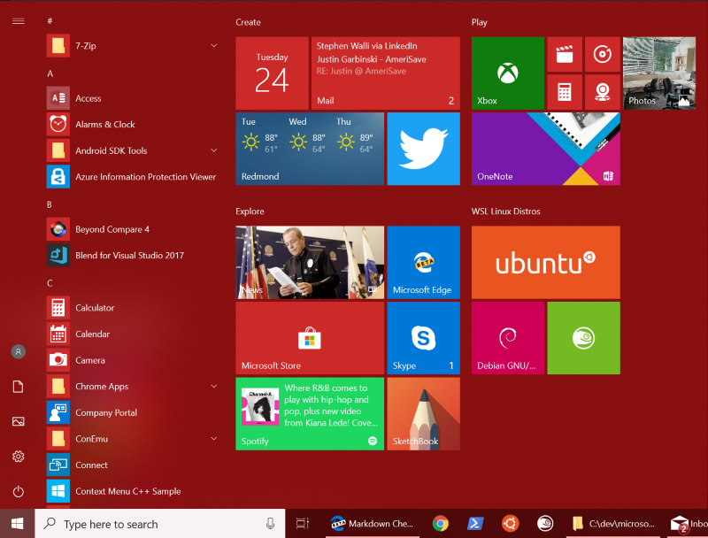
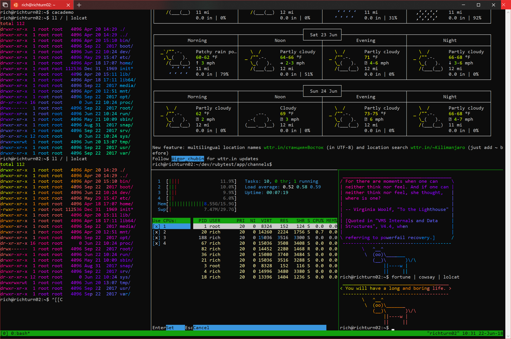

# Initializing a newly installed distro
Once your distro has been downloaded and installed, you'll need to complete initialization of the new distro:

## Launch a distro
To complete the initialization of your newly installed distro, launch a new instance. You can do this by clicking the "launch" button in the Windows Store app, or launching the distro from the Start menu:

> Tip: You might want to pin your most frequently used distros to your Start menu, and/or to your taskbar!



> On Windows Server, you can launch your distro's launcher executable `<distro>.exe` from the distro installation folder.

The first time a newly installed distro runs, a Console window will open, and you'll be asked to wait for a minute or two for the installation to complete.

> During this final stage of installation, the distro's files are de-compressed and stored on your PC, ready for use. This may take around a minute or more depending on the performance of your PC's storage devices. This initial installation phase is only required when a distro is clean-installed - all future launches should take less than a second.

## Setting up a new Linux user account

Once installation is complete, you will be prompted to create a new user account (and its password). 


This user account is for the normal non-admin user that you'll be logged-in as by default when launching a distro.

> You can choose any username and password you wish - they have no bearing on your Windows username. 

When you open a new distro instance, you won't be prompted for your password, but **if you elevate a process using `sudo`, you will need to enter your password**, so make sure you choose a password you can easily remember! See the [User Support](user-support.md) page for more info.

## Update & upgrade your distro's packages

Most distros ship with an empty/minimal package catalog. We strongly recommend regularly updating your package catalog, and upgrading your installed packages using your distro's preferred package manager. On Debian/Ubuntu, you use apt:

```bash
sudo apt update && sudo apt upgrade
```

> Windows does not automatically update or upgrade your Linux distro(s): This is a task that the Linux users prefer to control themselves.

You're done! Enjoy using your new Linux distro on WSL! To learn more about WSL, review the other [WSL docs](https://aka.ms/wsldocs), or the [WSL learning resources page](https://aka.ms/learnwsl).



## Troubleshooting

Below are related errors and suggested fixes. Refer to the [WSL troubleshooting page](troubleshooting.md) for other common errors and their solutions.

> **Installation failed with error 0x8007007e**
> This error occurs when your system doesn't support Linux from the store.  Make sure that:
> * You're running Windows build 16215 or later. [Check your build](troubleshooting.md#check-your-build-number).
> * The Windows Subsystem for Linux optional component is enabled and the computer has restarted.  [Make sure WSL is enabled](troubleshooting.md#confirm-wsl-is-enabled).
