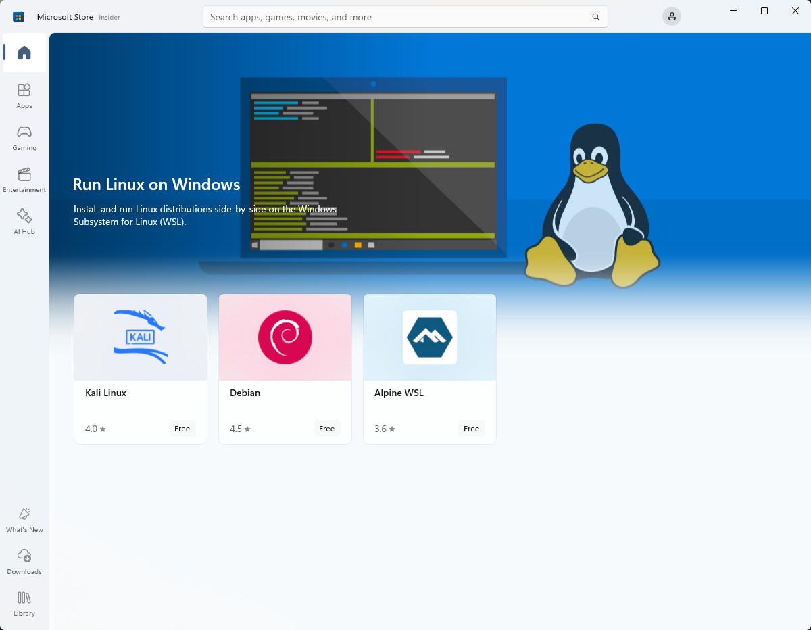
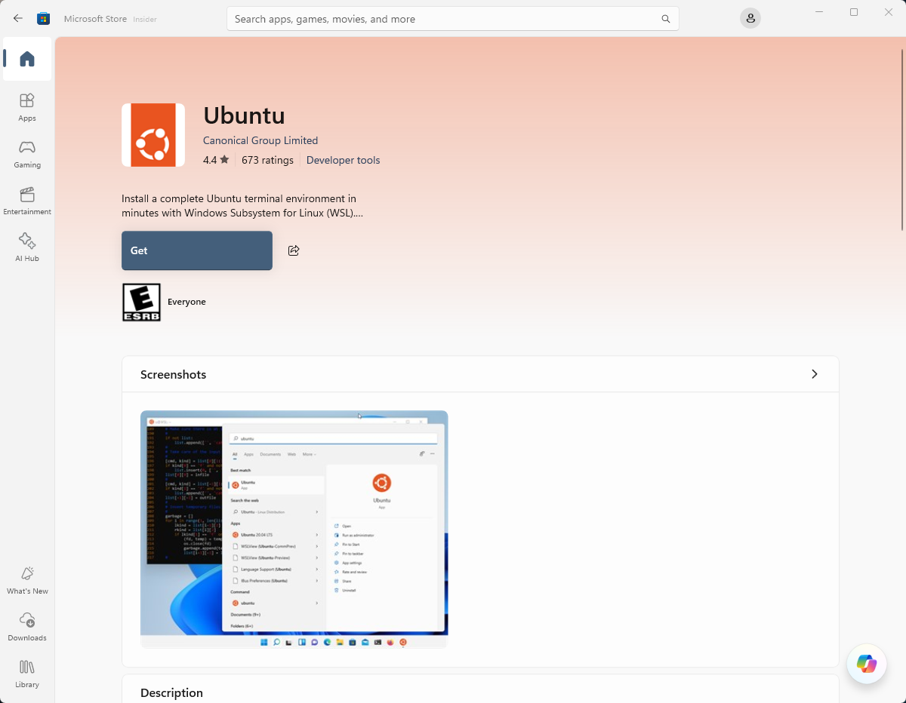
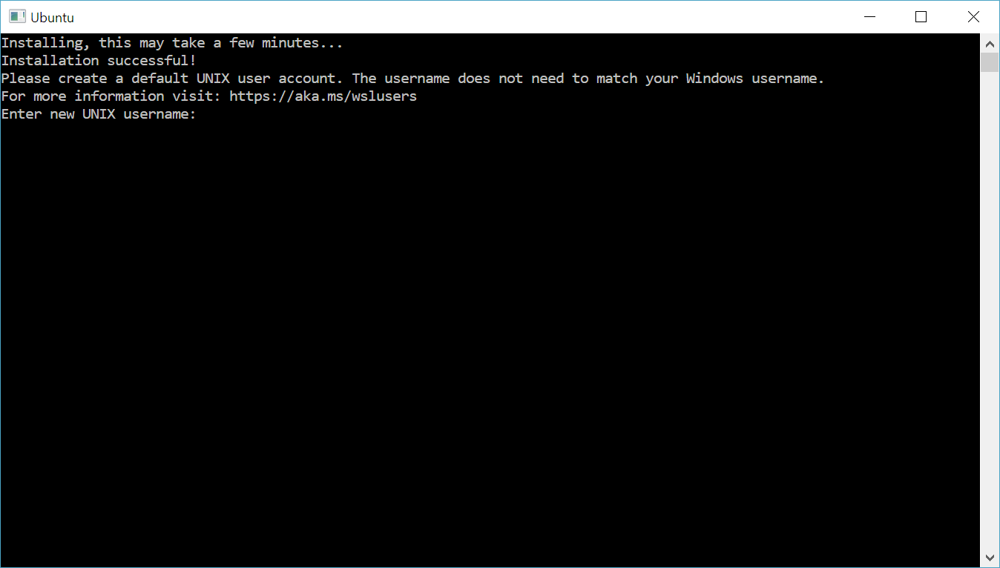
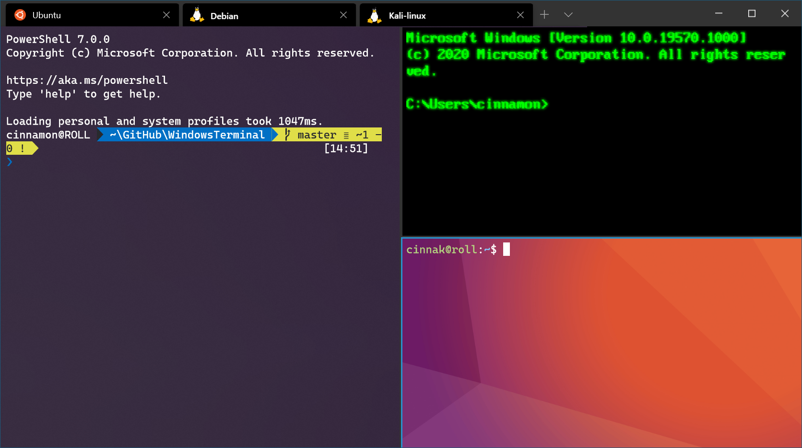

# Manual installation steps for older versions of WSL

For simplicity, we generally recommend using the [`wsl --install`](./install.md) to install Windows Subsystem for Linux, but if you're running an older build of Windows, that may not be supported. We have included the manual installation steps below. If you run into an issue during the install process, check the [installation section of the troubleshooting guide](./troubleshooting.md#installation-issues).

## Step 1 - Enable the Windows Subsystem for Linux

You must first enable the "Windows Subsystem for Linux" optional feature before installing any Linux distributions on Windows.

Open PowerShell **as Administrator (Start menu > PowerShell > right-click > Run as Administrator)** and enter this command:

```powershell
dism.exe /online /enable-feature /featurename:Microsoft-Windows-Subsystem-Linux /all /norestart
```

We recommend now moving on to step #2, updating to WSL 2, but if you wish to only install WSL 1, you can now **restart** your machine and move on to [Step 6 - Install your Linux distribution of choice](#step-6---install-your-linux-distribution-of-choice). To update to WSL 2, **wait to restart** your machine and move on to the next step.

## Step 2 - Check requirements for running WSL 2

To update to WSL 2, you must be running Windows 10...

- For x64 systems: **Version 1903** or later, with **Build 18362.1049** or later.
- For ARM64 systems: **Version 2004** or later, with **Build 19041** or later.

or Windows 11.
> [!NOTE]
> Builds lower than 18362 do not support WSL 2. Use the [Windows Update Assistant](https://www.microsoft.com/software-download/windows10) to update your version of Windows. The Windows version 1903 support is also only for x64 systems. If you are using an Arm64 version of Windows, you will need to upgrade to Windows 10 version 2004 or later for full access to WSL 2. For more info, see [WSL 2 support coming to Windows 10 Versions 1903 and 1909](https://devblogs.microsoft.com/commandline/wsl-2-support-is-coming-to-windows-10-versions-1903-and-1909).

To check your version and build number, select **Windows logo key + R**, type **winver**, select **OK**. [Update to the latest Windows version](ms-settings:windowsupdate) in the Settings menu.

> [!NOTE]
> If you are running Windows 10 version 1903 or 1909, open "Settings" from your Windows menu, navigate to "Update & Security" and select "Check for Updates". Your Build number must be 18362.1049+ or 18363.1049+, with the minor build # over .1049. Read more: [WSL 2 Support is coming to Windows 10 Versions 1903 and 1909](https://devblogs.microsoft.com/commandline/wsl-2-support-is-coming-to-windows-10-versions-1903-and-1909/).

## Step 3 - Enable Virtual Machine feature

Before installing WSL 2, you must enable the **Virtual Machine Platform** optional feature. Your machine will require [virtualization capabilities](./troubleshooting.md#error-0x80370102-the-virtual-machine-could-not-be-started-because-a-required-feature-is-not-installed) to use this feature.

Open PowerShell as Administrator and run:

```powershell
dism.exe /online /enable-feature /featurename:VirtualMachinePlatform /all /norestart
```

**Restart** your machine to complete the WSL install and update to WSL 2.

## Step 4 - Download the Linux kernel update package

The Linux kernel update package installs the most recent version of the [WSL 2 Linux kernel](https://github.com/microsoft/WSL2-Linux-Kernel) for running WSL inside the Windows operating system image. (To run [WSL from the Microsoft Store](/windows/wsl/compare-versions#wsl-in-the-microsoft-store), with more frequently pushed updates, use `wsl.exe --install` or `wsl.exe --update`.). 

1. Download the latest package:
    - [WSL2 Linux kernel update package for x64 machines](https://wslstorestorage.blob.core.windows.net/wslblob/wsl_update_x64.msi)

    > [!NOTE]
    > If you're using an ARM64 machine, please download the [ARM64 package](https://wslstorestorage.blob.core.windows.net/wslblob/wsl_update_arm64.msi) instead. If you're not sure what kind of machine you have, open Command Prompt or PowerShell and enter: `systeminfo | find "System Type"`. **Caveat:** On non-English Windows versions, you might have to modify the search text, translating the "System Type" string. You may also need to escape the quotations for the find command. For example, in German `systeminfo | find '"Systemtyp"'`.

2. Run the update package downloaded in the previous step. (Double-click to run - you will be prompted for elevated permissions, select ‘yes’ to approve this installation.)

Once the installation is complete, move on to the next step - setting WSL 2 as your default version when installing new Linux distributions. (Skip this step if you want your new Linux installs to be set to WSL 1).

> [!NOTE]
> For more information, read the article [changes to updating the WSL2 Linux kernel](https://devblogs.microsoft.com/commandline/wsl2-will-be-generally-available-in-windows-10-version-2004), available on the [Windows Command Line Blog](https://aka.ms/cliblog).

## Step 5 - Set WSL 2 as your default version

Open PowerShell and run this command to set WSL 2 as the default version when installing a new Linux distribution:

```powershell
wsl --set-default-version 2
```

## Step 6 - Install your Linux distribution of choice

1. Open the [Microsoft Store](https://aka.ms/wslstore) and select your favorite Linux distribution.

    

    The following links will open the Microsoft store page for each distribution:

    - [Ubuntu 18.04 LTS](https://www.microsoft.com/store/apps/9N9TNGVNDL3Q)
    - [Ubuntu 20.04 LTS](https://www.microsoft.com/store/apps/9n6svws3rx71)
    - [Ubuntu 22.04 LTS](https://www.microsoft.com/store/apps/9PN20MSR04DW)
    - [openSUSE Leap 15.1](https://www.microsoft.com/store/apps/9NJFZK00FGKV)
    - [SUSE Linux Enterprise Server 12 SP5](https://www.microsoft.com/store/apps/9MZ3D1TRP8T1)
    - [SUSE Linux Enterprise Server 15 SP1](https://www.microsoft.com/store/apps/9PN498VPMF3Z)
    - [Kali Linux](https://www.microsoft.com/store/apps/9PKR34TNCV07)
    - [Debian GNU/Linux](https://www.microsoft.com/store/apps/9MSVKQC78PK6)
    - [Fedora Remix for WSL](https://www.microsoft.com/store/apps/9n6gdm4k2hnc)
    - [Pengwin](https://www.microsoft.com/store/apps/9NV1GV1PXZ6P)
    - [Pengwin Enterprise](https://www.microsoft.com/store/apps/9N8LP0X93VCP)
    - [Alpine WSL](https://www.microsoft.com/store/apps/9p804crf0395)
    - [Raft(Free Trial)](https://www.microsoft.com/store/apps/9msmjqd017x7)
    - [Alma Linux](https://apps.microsoft.com/search?query=alma+linux)

2. From the distribution's page, select "Get".

    

The first time you launch a newly installed Linux distribution, a console window will open and you'll be asked to wait for a minute or two for files to de-compress and be stored on your PC. All future launches should take less than a second.

You will then need to [create a user account and password for your new Linux distribution](./setup/environment.md#set-up-your-linux-username-and-password).



**CONGRATULATIONS! You've successfully installed and set up a Linux distribution that is completely integrated with your Windows operating system!**

## Troubleshooting installation

If you run into an issue during the install process, check the [installation section of the troubleshooting guide](./troubleshooting.md#installation-issues).

## Downloading distributions

There are some scenarios in which you may not be able (or want) to, install WSL Linux distributions using the Microsoft Store. You may be running a Windows Server or Long-Term Servicing (LTSC) desktop OS SKU that doesn't support Microsoft Store, or your corporate network policies and/or admins do not permit Microsoft Store usage in your environment. In these cases, while WSL itself is available, you may need to download Linux distributions directly.

If the Microsoft Store app is not available, you can download and manually install Linux distributions using these links:

- [Ubuntu](https://aka.ms/wslubuntu)
- [Ubuntu 24.04](https://wslstorestorage.blob.core.windows.net/wslblob/Ubuntu2404-240425.AppxBundle)
- [Ubuntu 22.04 LTS](https://aka.ms/wslubuntu2204)
- [Ubuntu 20.04](https://aka.ms/wslubuntu2004)
- [Ubuntu 20.04 ARM](https://aka.ms/wslubuntu2004arm)
- [Ubuntu 18.04](https://aka.ms/wsl-ubuntu-1804)
- [Ubuntu 18.04 ARM](https://aka.ms/wsl-ubuntu-1804-arm)
- [Ubuntu 16.04](https://aka.ms/wsl-ubuntu-1604)
- [Debian GNU/Linux](https://aka.ms/wsl-debian-gnulinux)
- [Kali Linux](https://aka.ms/wsl-kali-linux-new)
- [SUSE Linux Enterprise Server 12](https://aka.ms/wsl-sles-12)
- [SUSE Linux Enterprise Server 15 SP2](https://aka.ms/wsl-SUSELinuxEnterpriseServer15SP2)
- [SUSE Linux Enterprise Server 15 SP3](https://aka.ms/wsl-SUSELinuxEnterpriseServer15SP3)
- [openSUSE Tumbleweed](https://aka.ms/wsl-opensuse-tumbleweed)
- [openSUSE Leap 15.3](https://aka.ms/wsl-opensuseleap15-3)
- [openSUSE Leap 15.2](https://aka.ms/wsl-opensuseleap15-2)
- [Oracle Linux 8.5](https://aka.ms/wsl-oraclelinux-8-5)
- [Oracle Linux 7.9](https://aka.ms/wsl-oraclelinux-7-9)
- [Fedora Remix for WSL](https://github.com/WhitewaterFoundry/WSLFedoraRemix/releases/)

This will cause the `<distro>.appx` packages to download to a folder of your choosing.

If you prefer, you can also download your preferred distribution(s) via the command line, you can use PowerShell with the [Invoke-WebRequest](/powershell/module/microsoft.powershell.utility/invoke-webrequest) cmdlet. For example, to download Ubuntu 20.04:

```powershell
Invoke-WebRequest -Uri https://aka.ms/wslubuntu2004 -OutFile Ubuntu.appx -UseBasicParsing
```

> [!TIP]
> If the download is taking a long time, turn off the progress bar by setting `$ProgressPreference = 'SilentlyContinue'`

You also have the option to use the [curl command-line utility](https://curl.se/) for downloading. To download Ubuntu 20.04 with curl:

```console
curl.exe -L -o ubuntu-2004.appx https://aka.ms/wslubuntu2004
```

In this example, `curl.exe` is executed (not just `curl`) to ensure that, in PowerShell, the real curl executable is invoked, not the PowerShell curl alias for [Invoke-WebRequest](/powershell/module/microsoft.powershell.utility/invoke-webrequest).

Once the distribution has been downloaded, navigate to the folder containing the download and run the following command in that directory, where `app-name` is the name of the Linux distribution .appx file.

```Powershell
Add-AppxPackage .\app_name.appx
```

Once the Appx package has finished downloading, you can start running the new distribution by double-clicking the appx file. (The command `wsl -l` will not show that the distribution is installed until this step is complete). 

If you are using Windows server, or run into problems running the command above you can find the alternate install instructions on the [Windows Server](install-on-server.md) documentation page to install the `.appx` file by changing it to a zip file.

Once your distribution is installed, follow the instructions to [create a user account and password for your new Linux distribution](./setup/environment.md#set-up-your-linux-username-and-password).

## Install Windows Terminal (optional)

Using Windows Terminal enables you to open multiple tabs or window panes to display and quickly switch between multiple Linux distributions or other command lines (PowerShell, Command Prompt, Azure CLI, etc). You can fully customize your terminal with unique color schemes, font styles, sizes, background images, and custom keyboard shortcuts. [Learn more.](/windows/terminal)

[Install Windows Terminal](/windows/terminal/get-started).

  
