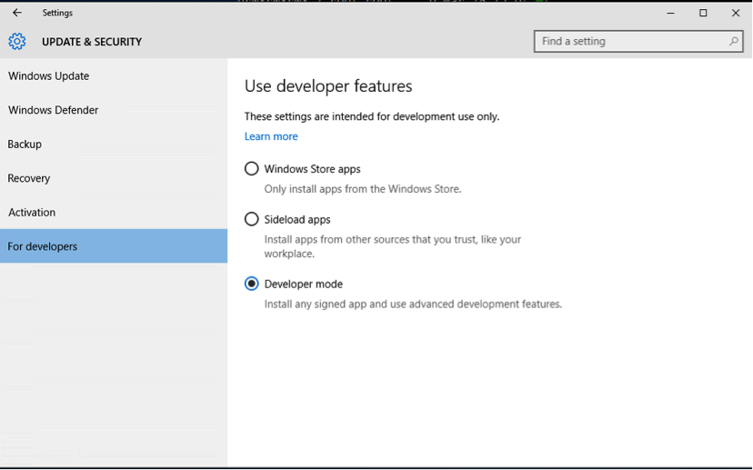
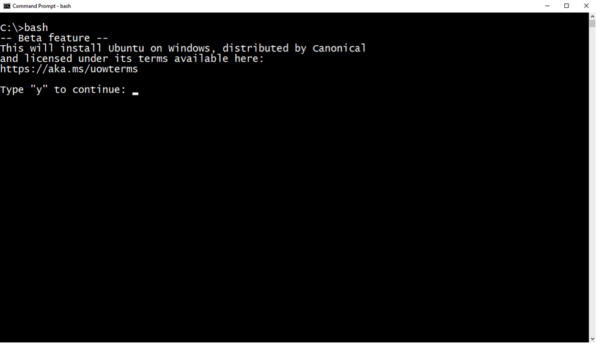
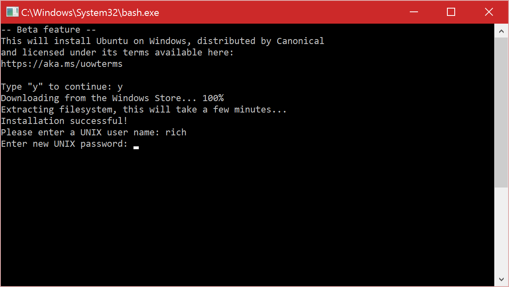

# Windows 10 Installation Guide

## Install the Windows Subsystem for Linux
Enable the "Windows Subsystem for Linux" optional feature and reboot.

1. Open PowerShell as Administrator and run:
    ``` PowerShell
    Enable-WindowsOptionalFeature -Online -FeatureName Microsoft-Windows-Subsystem-Linux
    ```

2. Restart your computer when prompted.

## Install your Linux Distribution of Choice
### Fall Creators Update and later: Install from the Microsoft Store

> This section is for Windows build 16215 or later.  Follow these steps to [check your build](troubleshooting.md#check-your-build-number).  For earlier versions of Windows 10, follow [these instructions using lxrun](install-win10.md#for-anniversary-update-and-creators-update-install-using-lxrun).

1. Open the Microsoft Store and choose your favorite Linux distribution.      
    Here are links directly to the store installers:
    * [Ubuntu](https://www.microsoft.com/store/p/ubuntu/9nblggh4msv6)
    * [OpenSUSE](https://www.microsoft.com/store/apps/9njvjts82tjx)
    * [SLES](https://www.microsoft.com/store/apps/9p32mwbh6cns)
    * [Kali Linux](https://www.microsoft.com/store/apps/9PKR34TNCV07)
    * [Debian GNU/Linux](https://www.microsoft.com/store/apps/9MSVKQC78PK6)

    

2. Select "Get"

    > **Troubleshooting: Installation failed with error 0x80070003**  
    > The Windows Subsystem for Linux only runs on your system drive (usually this is your C: drive).  Make sure that new apps are stored on your system drive.  
    > Open **Settings** -> **Storage** -> **More Storage Settings: Change where new content is saved**
    > 
    
3. Once the download has completed, select "Launch".  
    This will open a console window.  Wait for installation to complete then you will be prompted to create your LINUX user account.
    
    
    > **Troubleshooting: Installation failed with error 0x8007007e**  
    > This error occurs when your system doesn't support Linux from the store.  Make sure that:
    > * You're running Windows build 16215 or later. [Check your build](troubleshooting.md#check-your-build-number).
    > * The Windows Subsystem for Linux optional component is enabled and the computer has restarted.  [Make sure WSL is enabled](troubleshooting.md#confirm-wsl-is-enabled).


    
5. Create your LINUX username and password.  This user account has no relationship to your Windows username and password and hence can be different. [Read more](user-support.md).

You're done!  Now you can use your Linux environment.

### For Anniversary Update and Creators Update: Install using lxrun
lxrun installs Ubuntu user-mode by default on top of the Windows Subsystem for Linux.  

> Since moving to the store, we have stopped keeping this user-mode image up to date.  When you're done, run `apt-get update`.

1. Turn on Developer Mode  

    Open **Settings** -> **Update and Security** -> **For developers**

    Select the Developer Mode radio button  
    

2. Open a command prompt.  Run `bash`  
    

    After you have accepted the License, the Ubuntu user-mode image will be downloaded and extracted. A "Bash on Ubuntu on Windows" shortcut will be added to your start menu.

3. Launch a new Ubuntu shell by either:
    * Running `bash` from a command-prompt
    * Clicking the start menu shortcut

4. Create a UNIX user
    
    The first time you install the Windows Subsystem for Linux, you will be prompted to create a UNIX username and password.  
    
    
    This UNIX username and password can be different from, and has no relationship to, your Windows username and password. [Learn more about your UNIX account.](user-support.md).

After installation your Linux distribution will be located at: `%localappdata%\lxss\`.
