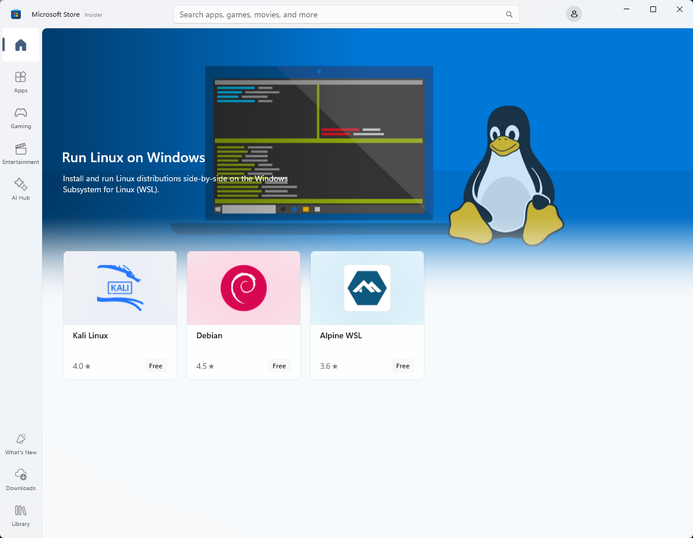

# Windows Subsystem for Linux Installation Guide for Windows 10

There are two options available for installing Windows Subsystem for Linux (WSL):

- **[Simplified install](#simplified-installation-for-windows-insiders)** *(preview release)*: `wsl --install`

    The `wsl --install` simplified install command requires that you join the [Windows Insiders Program](https://insider.windows.com/getting-started) and install a preview build of Windows 10 (OS build 20262 or higher), but eliminates the need to follow the manual install steps. All you need to do is open a command window with administrator privileges and run `wsl --install`, after a restart you will be ready to use WSL. [Click here to learn more about this command](#simplified-installation-for-windows-insiders).

- **[Manual install](#manual-installation-steps)**: Follow the six steps listed below.

    The manual install steps for WSL are listed below and can be used to install Linux on any version of Windows 10.

## Simplified Installation for Windows Insiders

The installation process for Windows Subsystem for Linux has been significantly improved in the latest Windows Insiders preview builds of Windows 10, replacing the manual steps below with a single command.

In order to use the `wsl --install` simplified install command, you must:

- Join the [Windows Insiders Program](https://insider.windows.com/getting-started)
- Install a preview build of Windows 10 (OS build 20262 or higher).
- Open a command line windows with Administrator privileges

Once those requirements are met, to install WSL:

- Enter this command in the command line you've opened in Admin mode: `wsl.exe --install`
- Restart your machine

The first time you launch a newly installed Linux distribution, a console window will open and you'll be asked to wait for files to de-compress and be stored on your PC. All future launches should take less than a second.

You will then need to [create a user account and password for your new Linux distribution](./user-support.md).

**CONGRATULATIONS! You've successfully installed and set up a Linux distribution that is completely integrated with your Windows operating system!**

The --install command performs the following actions:

- Enables the optional WSL and Virtual Machine Platform components
- Downloads and installs the latest Linux kernel
- Sets WSL 2 as the default
- Downloads and installs a Linux distribution *(reboot may be required)*

By default, the installed Linux distribution will be Ubuntu. This can be changed using `wsl --install -d <Distribution Name>`. *(Replacing `<Distribution Name>` with the name of your desired distribution.)* Additional Linux distributions may be added to your machine after the initial install using the `wsl --install -d <Distribution Name>` command.

To see a list of available Linux distributions, enter `wsl --list --online`.

## Manual Installation Steps

If you are not on a Windows Insiders build, the features required for WSL will need to be enabled manually following the steps below.

## Step 1 - Enable the Windows Subsystem for Linux

You must first enable the "Windows Subsystem for Linux" optional feature before installing any Linux distributions on Windows.

Open PowerShell as Administrator and run:

```powershell
dism.exe /online /enable-feature /featurename:Microsoft-Windows-Subsystem-Linux /all /norestart
```

We recommend now moving on to step #2, updating to WSL 2, but if you wish to only install WSL 1, you can now **restart** your machine and move on to [Step 6 - Install your Linux distribution of choice](./install-win10.md#step-6---install-your-linux-distribution-of-choice). To update to WSL 2, **wait to restart** your machine and move on to the next step.

## Step 2 - Update to WSL 2

To update to WSL 2, you must be running Windows 10.

### Requirements

- For x64 systems: **Version 1903** or higher, with **Build 18362** or higher.
- For ARM64 systems: **Version 2004** or higher, with **Build 19041** or higher.
- Builds lower than 18362 do not support WSL 2. Use the [Windows Update Assistant](https://www.microsoft.com/software-download/windows10) to update your version of Windows.

To check your version and build number, select **Windows logo key + R**, type **winver**, select **OK**. (Or enter the `ver` command in Windows Command Prompt). [Update to the latest Windows version](ms-settings:windowsupdate) in the Settings menu.

> [!NOTE]
> If you are running Windows 10 version 1903 or 1909, open "Settings" from your Windows menu, navigate to "Update & Security" and select "Check for Updates". Your Build number must be 18362.1049+ or 18363.1049+, with the minor build # over .1049. Read more: [WSL 2 Support is coming to Windows 10 Versions 1903 and 1909](https://devblogs.microsoft.com/commandline/wsl-2-support-is-coming-to-windows-10-versions-1903-and-1909/). See the [troubleshooting instructions](./troubleshooting.md#im-on-windows-10-version-1903-and-i-still-do-not-see-options-for-wsl-2).

## Step 3 - Enable Virtual Machine feature

Before installing WSL 2, you must enable the **Virtual Machine Platform** optional feature.

Open PowerShell as Administrator and run:

```powershell
dism.exe /online /enable-feature /featurename:VirtualMachinePlatform /all /norestart
```

**Restart** your machine to complete the WSL install and update to WSL 2.

## Step 4 - Download the Linux kernel update package

1. Download the latest package:
    - [WSL2 Linux kernel update package for x64 machines](https://wslstorestorage.blob.core.windows.net/wslblob/wsl_update_x64.msi)

    > [!NOTE]
    > If you're using an ARM64 machine, please download the [ARM64 package](https://wslstorestorage.blob.core.windows.net/wslblob/wsl_update_arm64.msi) instead. If you're not sure what kind of machine you have, open Command Prompt or PowerShell and enter: `systeminfo | find "System Type"`.

2. Run the update package downloaded in the previous step. (Double-click to run - you will be prompted for elevated permissions, select ‘yes’ to approve this installation.)

Once the installation is complete, move on to the next step - setting WSL 2 as your default version when installing new Linux distributions. (Skip this step if you want your new Linux installs to be set to WSL 1).

> [!NOTE]
> For more information, read the article [changes to updating the WSL2 Linux kernel](https://devblogs.microsoft.com/commandline/wsl2-will-be-generally-available-in-windows-10-version-2004), available on the [Windows Command Line Blog](https://aka.ms/cliblog).

## Step 5 - Set WSL 2 as your default version

Open PowerShell and run this command to set WSL 2 as the default version when installing a new Linux distribution:

```powershell
wsl --set-default-version 2
```

> [!NOTE]
> The update from WSL 1 to WSL 2 may take several minutes to complete depending on the size of your targeted distribution. If you are running an older (legacy) installation of WSL 1 from Windows 10 Anniversary Update or Creators Update, you may encounter an update error. Follow these instructions to [uninstall and remove any legacy distributions](./install-legacy.md#uninstallingremoving-the-legacy-distro).
>
> If `wsl --set-default-version` results as an invalid command, enter `wsl --help`. If the `--set-default-version` is not listed, it means that your OS doesn't support it and you need to update to version 1903, Build 18362 or higher.
>
> If you see this message after running the command: `WSL 2 requires an update to its kernel component. For information please visit https://aka.ms/wsl2kernel`. You still need to install the MSI Linux kernel update package.

## Step 6 - Install your Linux distribution of choice

1. Open the [Microsoft Store](https://aka.ms/wslstore) and select your favorite Linux distribution.

    

    The following links will open the Microsoft store page for each distribution:

    - [Ubuntu 16.04 LTS](https://www.microsoft.com/store/apps/9pjn388hp8c9)
    - [Ubuntu 18.04 LTS](https://www.microsoft.com/store/apps/9N9TNGVNDL3Q)
    - [Ubuntu 20.04 LTS](https://www.microsoft.com/store/apps/9n6svws3rx71)
    - [openSUSE Leap 15.1](https://www.microsoft.com/store/apps/9NJFZK00FGKV)
    - [SUSE Linux Enterprise Server 12 SP5](https://www.microsoft.com/store/apps/9MZ3D1TRP8T1)
    - [SUSE Linux Enterprise Server 15 SP1](https://www.microsoft.com/store/apps/9PN498VPMF3Z)
    - [Kali Linux](https://www.microsoft.com/store/apps/9PKR34TNCV07)
    - [Debian GNU/Linux](https://www.microsoft.com/store/apps/9MSVKQC78PK6)
    - [Fedora Remix for WSL](https://www.microsoft.com/store/apps/9n6gdm4k2hnc)
    - [Pengwin](https://www.microsoft.com/store/apps/9NV1GV1PXZ6P)
    - [Pengwin Enterprise](https://www.microsoft.com/store/apps/9N8LP0X93VCP)
    - [Alpine WSL](https://www.microsoft.com/store/apps/9p804crf0395)

2. From the distribution's page, select "Get".

    

The first time you launch a newly installed Linux distribution, a console window will open and you'll be asked to wait for a minute or two for files to de-compress and be stored on your PC. All future launches should take less than a second.

You will then need to [create a user account and password for your new Linux distribution](./user-support.md).


**CONGRATULATIONS! You've successfully installed and set up a Linux distribution that is completely integrated with your Windows operating system!**

## Install Windows Terminal (optional)

Windows Terminal enables multiple tabs (quickly switch between multiple Linux command lines, Windows Command Prompt, PowerShell, Azure CLI, etc), create custom key bindings (shortcut keys for opening or closing tabs, copy+paste, etc.), use the search feature, and custom themes (color schemes, font styles and sizes, background image/blur/transparency). [Learn more.](/windows/terminal)

[Install Windows Terminal](/windows/terminal/get-started).

  

## Set your distribution version to WSL 1 or WSL 2

You can check the WSL version assigned to each of the Linux distributions you have installed by opening the PowerShell command line and entering the command (only available in [Windows Build 18362 or higher](ms-settings:windowsupdate)): `wsl -l -v`

```powershell
wsl --list --verbose
```

To set a distribution to be backed by either version of WSL please run:

```powershell
wsl --set-version <distribution name> <versionNumber>
```

Make sure to replace `<distribution name>` with the actual name of your distribution and `<versionNumber>` with the number '1' or '2'. You can change back to WSL 1 at anytime by running the same command as above but replacing the '2' with a '1'.

Additionally, if you want to make WSL 2 your default architecture you can do so with this command:

```powershell
wsl --set-default-version 2
```

This will set the version of any new distribution installed to WSL 2.

## Troubleshooting installation

Below are related errors and suggested fixes. Refer to the [WSL troubleshooting page](troubleshooting.md) for other common errors and their solutions.

- **Installation failed with error 0x80070003**
  - The Windows Subsystem for Linux only runs on your system drive (usually this is your `C:` drive). Make sure that distributions are stored on your system drive:  
  - Open **Settings** -> **System --> **Storage** -> **More Storage Settings: Change where new content is saved**
    

- **WslRegisterDistribution failed with error 0x8007019e**
  - The Windows Subsystem for Linux optional component is not enabled:
  - Open **Control Panel** -> **Programs and Features** -> **Turn Windows Feature on or off** -> Check **Windows Subsystem for Linux** or using the PowerShell cmdlet mentioned at the beginning of this article.

- **Installation failed with error 0x80070003 or error 0x80370102**
  - Please make sure that virtualization is enabled inside of your computer's BIOS. The instructions on how to do this will vary from computer to computer, and will most likely be under CPU related options.

- **Error when trying to upgrade: `Invalid command line option: wsl --set-version Ubuntu 2`**
  - Enure that you have the Windows Subsystem for Linux enabled, and that you're using Windows Build version 18362 or higher. To enable WSL run this command in a PowerShell prompt with admin privileges: `Enable-WindowsOptionalFeature -Online -FeatureName Microsoft-Windows-Subsystem-Linux`.

- **The requested operation could not be completed due to a virtual disk system limitation. Virtual hard disk files must be uncompressed and unencrypted and must not be sparse.**
  - Deselect “Compress contents” (as well as “Encrypt contents” if that’s checked) by opening the profile folder for your Linux distribution. It should be located in a folder on your Windows file system, something like: `USERPROFILE%\AppData\Local\Packages\CanonicalGroupLimited...`
  - In this Linux distro profile, there should be a LocalState folder. Right-click this folder to display a menu of options. Select Properties > Advanced and then ensure that the “Compress contents to save disk space” and “Encrypt contents to secure data” checkboxes are unselected (not checked). If you are asked whether to apply this to just to the current folder or to all subfolders and files, select “just this folder” because you are only clearing the compress flag. After this, the `wsl --set-version` command should work.


> [!NOTE]
> In my case, the LocalState folder for my Ubuntu 18.04 distribution was located at C:\Users\<my-user-name>\AppData\Local\Packages\CanonicalGroupLimited.Ubuntu18.04onWindows_79rhkp1fndgsc
>
> Check [WSL Docs GitHub thread #4103](https://github.com/microsoft/WSL/issues/4103) where this issue is being tracked for updated information.

- **The term 'wsl' is not recognized as the name of a cmdlet, function, script file, or operable program.**
  - Ensure that the [Windows Subsystem for Linux Optional Component is installed](./install-win10.md#step-3---enable-virtual-machine-feature). Additionally, if you are using an ARM64 device and running this command from PowerShell, you will receive this error. Instead run `wsl.exe` from [PowerShell Core](/powershell/scripting/install/installing-powershell-core-on-windows), or Command Prompt.

- **Error: This update only applies to machines with the Windows Subsystem for Linux.**
  - To install the Linux kernel update MSI package, WSL is required and should be enabled first. If it fails, it you will see the message: `This update only applies to machines with the Windows Subsystem for Linux`.
  - There are three possible reason you see this message:

  1. You are still in old version of Windows which doesn't support WSL 2. See step #2 for version requirements and links to update.

  2. WSL is not enabled. You will need to return to step #1 and ensure that the optional WSL feature is enabled on your machine.

  3. After you enabled WSL, a reboot is required for it to take effect, reboot your machine and try again.

- **Error: WSL 2 requires an update to its kernel component. For information please visit https://aka.ms/wsl2kernel .**
  - If the Linux kernel package is missing in the %SystemRoot%\system32\lxss\tools folder, you will encounter this error. Resolve it by installing the Linux kernel update MSI package in step #4 of these installation instructions. You may need to uninstall the MSI from ['Add or Remove Programs'](ms-settings:appsfeatures-app), and install it again.
