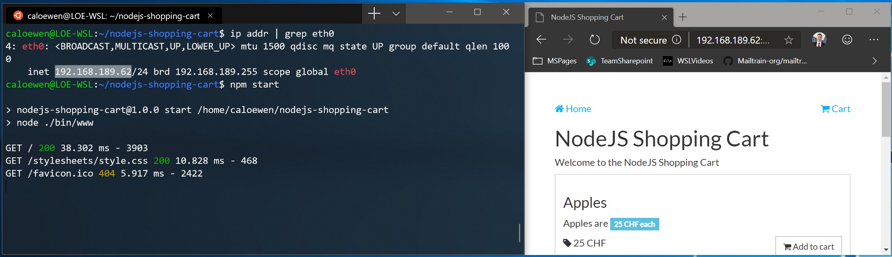

# Accessing network applications with WSL

There are a few considerations to be aware of when working with networking apps, whether you are accessing a Linux networking app from a Windows app or accessing a Windows networking app from a Linux app, you may need to identify the IP address of the virtual machine you are working with, which will be different than the IP address of your local physical machine.

## Accessing Linux networking apps from Windows (localhost)

If you are building a networking app (for example an app running on a NodeJS or SQL server) in your Linux distribution, you can access it from a Windows app (like your Edge or Chrome internet browser) using `localhost` (just like you normally would).

However, if you are running an older version of Windows (Build 18945 or less), you will need to get the IP address of the Linux host VM (or [update to the latest Windows version](ms-settings:windowsupdate)).

To find the IP address of the virtual machine powering your Linux distribution:

- From your WSL distribution (ie Ubuntu), run the command: `ip addr`
- Find and copy the address under the `inet` value of the `eth0` interface.
- If you have the grep tool installed, find this more easily by filtering the output with the command: `ip addr | grep eth0`
- Connect to your Linux server using this IP address.

```bash
ip addr | grep eth0
```

The picture below shows an example of this by connecting to a Node.js server using the Edge browser.



The IP address of the Linux host VM does not persist across sessions and across Linux distributions. 

## Accessing Windows networking apps from Linux (host IP)

If you want to access a networking app running on Windows (for example an app running on a NodeJS or SQL server) from your Linux distribution (ie Ubuntu), then you need to use the IP address of your host machine. While this is not a common scenario, you can follow these steps to make it work.

1. Obtain the IP address of your host machine by running this command from your Linux distribution: `cat /etc/resolv.conf`
2. Copy the IP address following the term: `nameserver`.
3. Connect to any Windows server using the copied IP address.

The picture below shows an example of this by connecting to a Node.js server running in Windows via curl.


## Connecting via remote IP addresses

When using remote IP addresses to connect to your applications, they will be treated as connections from the Local Area Network (LAN). This means that you will need to make sure your application can accept LAN connections.

For example, you may need to bind your application to `0.0.0.0` instead of `127.0.0.1`. In the example of a Python app using Flask, this can be done with the command: `app.run(host='0.0.0.0')`. Please keep security in mind when making these changes as this will allow connections from your LAN.

## Accessing a WSL 2 distribution from your local area network (LAN)

When using a WSL 1 distribution, if your computer was set up to be accessed by your LAN, then applications run in WSL could be accessed on your LAN as well.

This isn't the default case in WSL 2. WSL 2 has a virtualized ethernet adapter with its own unique IP address. Currently, to enable this workflow you will need to go through the same steps as you would for a regular virtual machine. (We are looking into ways to improve this experience.)

Here's an example PowerShell command to add a port proxy that listens on port 4000 on the host and connects it to port 4000 to the WSL 2 VM with IP address 192.168.101.100.

```powershell
netsh interface portproxy add v4tov4 listenport=4000 listenaddress=0.0.0.0 connectport=4000 connectaddress=192.168.101.100
```

## IPv6 access

WSL 2 distributions currently cannot reach IPv6-only addresses. We are working on adding this feature.
