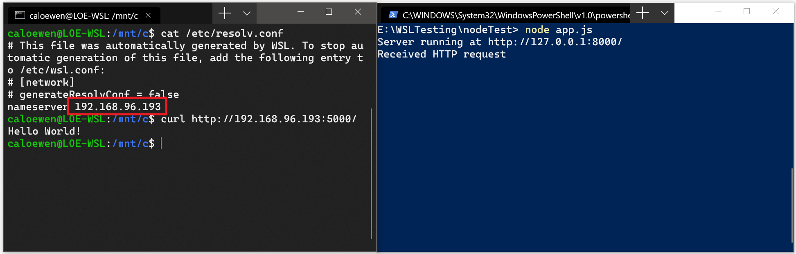

# Accessing network applications with WSL

There are a few considerations to be aware of when working with networking apps and WSL. By default WSL uses a [NAT based architecture](#default-networking-mode-nat), and we recommend trying the new [Mirrored networking mode](#mirrored-mode-networking) to get the latest features and improvements.

## Identify IP address

There are two scenarios to consider when identifying the IP address used for a Linux distribution running via WSL:

**Scenario One:** From the perspective of the Windows host, you want to query a Linux distribution's IP address running via WSL2, so that a program on Windows host can connect to a server program running inside the distribution (instance).

The Windows host can use command:

```powershell
wsl.exe --distribution <DistroName> hostname -i
```

If querying the default distribution, this part of the command designating the distribution can be omitted: `-d <DistroName>`. Be sure to use a lower-case `-i` flag.

Under the hood, host command wsl.exe launches the target instance and executes Linux command `hostname --ip-addresses`. This command then prints the IP address of the WSL instance to `STDOUT`. The `STDOUT` text content is then relayed back to wsl.exe. Finally, wsl.exe displays that output to the command line.

A typical output might be:

```powershell
172.30.98.229
```

**Scenario Two:** A program running inside a Linux distribution via WSL2 (instance) wants to know the Windows host's IP address, so that a Linux program can connect to a Windows host server program.

The WSL2 Linux user can use command:

```bash
ip route show | grep -i default | awk '{ print $3}'
```

A typical output might be:

```powershell
172.30.96.1
```

So the `172.30.96.1` is the host IP address for Windows, in this example.

> [!NOTE]
> These above IP address querying action is typically required when WSL2 is running with the default [NAT network mode](#default-networking-mode-nat).
> When the WSL2 is running with the new [mirrored mode](#mirrored-mode-networking), the Windows host and WSL2 VM can connect to each other using `localhost` (127.0.0.1) as the destination address, so the trick of using a query peer's IP address is not required.

## Default networking mode: NAT

By default, WSL uses a NAT (Network Address Translation) based architecture for networking. Keep the following considerations in mind when working with a NAT-based networking architecture:

### Accessing Linux networking apps from Windows (localhost)

If you are building a networking app (for example an app running on a NodeJS or SQL server) in your Linux distribution, you can access it from a Windows app (like your Edge or Chrome internet browser) using `localhost` (just like you normally would).

### Accessing Windows networking apps from Linux (host IP)

If you want to access a networking app running on Windows (for example an app running on a NodeJS or SQL server) from your Linux distribution (ie Ubuntu), then you need to use the IP address of your host machine. While this is not a common scenario, you can follow these steps to make it work.

1. Obtain the IP address of your host machine by running this command from your Linux distribution:

    ```bash
    ip route show | grep -i default | awk '{ print $3}'
    ```

2. Connect to any Windows server using the copied IP address.

The picture below shows an example of this by connecting to a Node.js server running in Windows via curl.



### Connecting via remote IP addresses

When using remote IP addresses to connect to your applications, they will be treated as connections from the Local Area Network (LAN). This means that you will need to make sure your application can accept LAN connections.

For example, you may need to bind your application to `0.0.0.0` instead of `127.0.0.1`. In the example of a Python app using Flask, this can be done with the command: `app.run(host='0.0.0.0')`. Keep security in mind when making these changes as this will allow connections from your LAN.

### Accessing a WSL 2 distribution from your local area network (LAN)

When using a WSL 1 distribution, if your computer was set up to be accessed by your LAN, then applications run in WSL could be accessed on your LAN as well.

This isn't the default case in WSL 2. WSL 2 has a virtualized ethernet adapter with its own unique IP address. Currently, to enable this workflow you will need to go through the same steps as you would for a regular virtual machine. (We are looking into ways to improve this experience.)

Here's an example of using the [Netsh interface portproxy](/windows-server/networking/technologies/netsh/netsh-interface-portproxy) Windows command to add a port proxy that listens on your host port and connects that port proxy to the IP address for the WSL 2 VM.

```powershell
netsh interface portproxy add v4tov4 listenport=<yourPortToForward> listenaddress=0.0.0.0 connectport=<yourPortToConnectToInWSL> connectaddress=(wsl hostname -I)
```

In this example, you will need to update `<yourPortToForward>` to a port number, for example `listenport=4000`. `listenaddress=0.0.0.0` means that incoming requests will be accepted from ANY IP address. The Listen Address specifies the IPv4 address for which to listen and can be changed to values that include: IP address, computer NetBIOS name, or computer DNS name. If an address isn't specified, the default is the local computer. You need to update the `<yourPortToConnectToInWSL>` value to a port number where you want WSL to connect, for example `connectport=4000`. Lastly, the `connectaddress` value needs to be the IP address of your Linux distribution installed via WSL 2 (the WSL 2 VM address), which can be found by entering the command: `wsl.exe hostname -I`.

So this command may look something like:

```powershell
netsh interface portproxy add v4tov4 listenport=4000 listenaddress=0.0.0.0 connectport=4000 connectaddress=192.168.101.100
```

To obtain the IP address, use:

- `wsl hostname -I` for the IP address of your Linux distribution installed via WSL 2 (the WSL 2 VM address)
- `cat /etc/resolv.conf` for the IP address of the Windows machine as seen from WSL 2 (the WSL 2 VM)

Using `listenaddress=0.0.0.0` will listen on all [IPv4 ports](https://stackoverflow.com/questions/9987409/want-to-know-what-is-ipv4-and-ipv6#:~:text=The%20basic%20difference%20is%20the,whereas%20IPv6%20has%20128%20bits.).

> [!NOTE]
> Using a lowercase "i" with the hostname command will generate a different result than using an uppercase "I". `wsl hostname -i` is your local machine (127.0.1.1 is a placeholder diagnostic address), whereas `wsl hostname -I` will return your local machine's IP address as seen by other machines and should be used to identify the `connectaddress` of your Linux distribution running via WSL 2.

## IPv6 access

- `wsl hostname -i` for the IP address of your Linux distribution installed via WSL 2 (the WSL 2 VM address)
- `ip route show | grep -i default | awk '{ print $3}'` for the IP address of the Windows machine as seen from WSL 2 (the WSL 2 VM)

Using `listenaddress=0.0.0.0` will listen on all [IPv4 ports](https://stackoverflow.com/questions/9987409/want-to-know-what-is-ipv4-and-ipv6#:~:text=The%20basic%20difference%20is%20the,whereas%20IPv6%20has%20128%20bits.).

## Mirrored mode networking

On machines running Windows 11 22H2 and higher you can [set `networkingMode=mirrored` under `[wsl2]` in the `.wslconfig` file](./wsl-config.md#configuration-settings-for-wslconfig) to enable mirrored mode networking. Enabling this changes WSL to an entirely new networking architecture which has the goal of 'mirroring' the network interfaces that you have on Windows into Linux, to add new networking features and improve compatibility.

Here are the current benefits to enabling this mode:

- IPv6 support
- Connect to Windows servers from within Linux using the localhost address `127.0.0.1`. IPv6 localhost address `::1` is not supported
- Improved networking compatibility for VPNs
- Multicast support
- Connect to WSL directly from your local area network (LAN)

> [!NOTE]
> Run the following command in PowerShell window with admin privileges to [Configure Hyper-V firewall](/windows/security/operating-system-security/network-security/windows-firewall/hyper-v-firewall) settings to allow inbound connections:
>
> ```powershell
> Set-NetFirewallHyperVVMSetting -Name '{40E0AC32-46A5-438A-A0B2-2B479E8F2E90}' -DefaultInboundAction Allow
> ```
>
> or
>
> ```powershell
> New-NetFirewallHyperVRule -Name "MyWebServer" -DisplayName "My Web Server" -Direction Inbound -VMCreatorId '{40E0AC32-46A5-438A-A0B2-2B479E8F2E90}' -Protocol TCP -LocalPorts 80
> ```

This new mode addresses networking issues seen with using a NAT (Network Address Translation) based architecture. Find known issues or file feedback on any bugs identified in the [WSL product repo on GitHub](https://github.com/microsoft/WSL).

## DNS Tunneling

On machines running Windows 11 22H2 and higher the `dnsTunneling` feature is on by default (which can be found [under `[wsl2]` in the `.wslconfig` file](./wsl-config.md#configuration-settings-for-wslconfig)) and it uses a virtualization feature to answer DNS requests from within WSL, instead of requesting them over a networking packet. This feature is aimed to improve compatibility with VPNs, and other complex networking set ups.

## Auto Proxy

On machines running Windows 11 22H2 and higher, setting [`autoProxy=true` under `[wsl2]` in the `.wslconfig` file](./wsl-config.md#configuration-settings-for-wslconfig) enforces WSL to use Windows' HTTP proxy information. If you have a proxy already set up in Windows, enabling this feature will make that proxy be set automatically in WSL as well.

## WSL and firewall

On machines running Windows 11 22H2 and higher, with WSL 2.0.9 and higher, the Hyper-V firewall feature will be turned on by default. This will ensure that:

- See [Windows Defender Firewall with Advanced Security](/windows/security/operating-system-security/network-security/windows-firewall/windows-firewall-with-advanced-security) to learn more about Windows security features that will automatically apply to WSL.
- See [Configure Hyper-V firewall](/windows/security/operating-system-security/network-security/windows-firewall/hyper-v-firewall) to learn more about applying these rules and settings both locally and via online tools like Intune.
