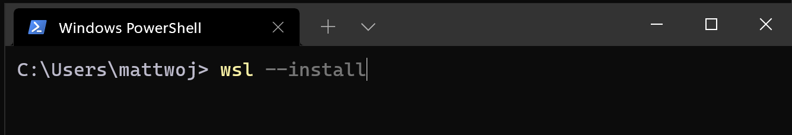
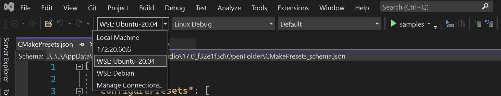
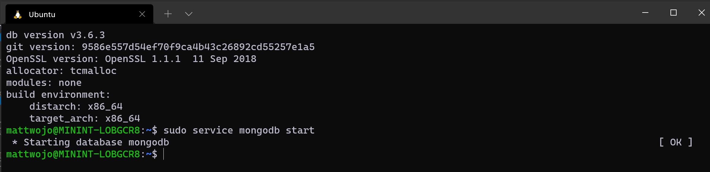

# Set up a WSL development environment

A step-by-step guide to the best practices for setting up a WSL development environment. Learn how to run the command to install the default Bash shell that uses Ubuntu or can be set to install other Linux distributions, use basic WSL commands, set up Visual Studio Code or Visual Studio, Git, Windows Credential Manager, databases like MongoDB, Postgres, or MySQL, set up GPU acceleration, run GUI apps, and more.

## Get started

Windows Subsystem for Linux comes with the Windows operating system, but you must enable it and install a Linux distribution before you can begin using it.

To use the simplified --install command, you must be running a recent build of Windows (Build 20262+). To check your version and build number, select **Windows logo key + R**, type **winver**, select **OK**. You can update using the [Settings menu](ms-settings:windowsupdate) or [Windows Update Assistant](https://www.microsoft.com/software-download/).

If you prefer to install a Linux distribution other than Ubuntu, or would prefer to complete these steps manually, see the [WSL installation page](../install.md) for more details.

Open PowerShell (or Windows Command Prompt) and enter:

```powershell
wsl --install
```

The --install command performs the following actions:

- Enables the optional WSL and Virtual Machine Platform components
- Downloads and installs the latest Linux kernel
- Sets WSL 2 as the default
- Downloads and installs the Ubuntu Linux distribution (reboot may be required)

You will need to restart your machine during this installation process.



Check the [troubleshooting installation](../troubleshooting.md) article if you run into any issues.

## Set up your Linux username and password

Once the process of installing your Linux distribution with WSL is complete, open the distribution (Ubuntu by default) using the Start menu. You will be asked to create a **User Name** and **Password** for your Linux distribution.

- This **User Name** and **Password** is specific to each separate Linux distribution that you install and has no bearing on your Windows user name.

- Please note that whilst entering the **Password**, nothing will appear on screen. This is called blind typing. You won't see what you are typing, this is completely normal.

- Once you create a **User Name** and **Password**, the account will be your default user for the distribution and automatically sign-in on launch.

- This account will be considered the Linux administrator, with the ability to run `sudo` (Super User Do) administrative commands.

- Each Linux distribution running on WSL has its own Linux user accounts and passwords.  You will have to configure a Linux user account every time you add a distribution, reinstall, or reset.

> [!NOTE]
> Linux distributions installed with WSL are a per-user installation and can't be shared with other Windows user accounts. Encountering a username error? [StackExchange: What characters should I use or not use in usernames on Linux?](https://serverfault.com/questions/73084/what-characters-should-i-use-or-not-use-in-usernames-on-linux)


To change or reset your password, open the Linux distribution and enter the command: `passwd`. You will be asked to enter your current password, then asked to enter your new password, and then to confirm your new password.

If you forgot the password for your Linux distribution:

1. Open PowerShell and enter the root of your default WSL distribution using the command: `wsl -u root`

    > If you need to update the forgotten password on a distribution that is not your default, use the command: `wsl -d Debian -u root`, replacing `Debian` with the name of your targeted distribution.

2. Once your WSL distribution has been opened at the root level inside PowerShell, you can use this command to update your password: `passwd <username>` where `<username>` is the username of the account in the distribution whose password you've forgotten.

3. You will be prompted to enter a new UNIX password and then confirm that password. Once you're told that the password has updated successfully, close WSL inside of PowerShell using the command: `exit`.

## Update and upgrade packages

We recommend that you regularly update and upgrade your packages using the preferred package manager for the distribution. For Ubuntu or Debian, use the command:

```bash
sudo apt update && sudo apt upgrade
```

Windows does not automatically update or upgrade your Linux distribution(s). This is a task that most Linux users prefer to control themselves.

## Add additional distributions

To add additional Linux distributions, you can install via the [Microsoft Store](https://aka.ms/wslstore), via the [--import command](../use-custom-distro.md), or by [sideloading your own custom distribution](../build-custom-distro.md). You may also want to [set up custom WSL images for distribution across your enterprise company](../enterprise.md).

## Set up Windows Terminal

Windows Terminal can run any application with a command line interface. Its main features include multiple tabs, panes, Unicode and UTF-8 character support, a GPU accelerated text rendering engine, and the ability to create your own themes and customize text, colors, backgrounds, and shortcuts.

Whenever a new WSL Linux distribution is installed, a new instance will be created for it inside the Windows Terminal that can be customized to your preferences.

We recommend using WSL with Windows Terminal, especially if you plan to work with multiple command lines. See the Windows Terminal docs for help with setting it up and customizing your preferences, including:

- [Install Windows Terminal or Windows Terminal (Preview)](/windows/terminal/get-started) from the Microsoft Store
- [Use the Command Palette](/windows/terminal/get-started#invoke-the-command-palette)
- Set up [custom actions](/windows/terminal/#custom-actions) like keyboard shortcuts to make the terminal feel natural to your preferences
- Set up the [default startup profile](/windows/terminal/customize-settings/startup)
- Customize the appearance: [theme](/windows/terminal/customize-settings/appearance#theme), [color schemes](/windows/terminal/customize-settings/color-schemes), [name and starting directory](/windows/terminal/customize-settings/profile-general), [background image](/windows/terminal/customize-settings/profile-appearance#background-image), etc.
- Learn how to use [command line arguments](/windows/terminal/command-line-arguments?tabs=windows) like opening a terminal with multiple command lines split into window panes or tabs
- Learn about the [search feature](/windows/terminal/search)
- Find [tips and tricks](/windows/terminal/tips-and-tricks), like how to rename or color a tab, use mouse interactions, or enable "Quake mode"
- Find tutorials on how to set up [a customized command prompt](/windows/terminal/tutorials/custom-prompt-setup), [SSH profiles](/windows/terminal/tutorials/ssh), or [tab titles](/windows/terminal/tutorials/tab-title)
- Find a [custom terminal gallery](/windows/terminal/custom-terminal-gallery/custom-schemes) and a [troubleshooting guide](/windows/terminal/troubleshooting)


## File storage

- To open your WSL project in Windows File Explorer, enter: `explorer.exe .` <br> *Be sure to add the period at the end of the command to open the current directory.*

- [Store your project files on the same operating system as the tools you plan to use](../filesystems.md#file-storage-and-performance-across-file-systems). <br>For the fastest performance speed, store your files in the WSL file system if you are working on them with Linux tools in a Linux command line (Ubuntu, OpenSUSE, etc). If you're working in a Windows command line (PowerShell, Command Prompt) with Windows tools, store your files in the Windows file system. Files can be accessed across the operating systems, but it may significantly slow down performance.

For example, when storing your WSL project files:

- Use the Linux file system root directory: `\\wsl$\<DistroName>\home\<UserName>\Project`
- Not the Windows file system root directory: `C:\Users\<UserName>\Project` or `/mnt/c/Users/<UserName>/Project$`


## Set up your favorite code editor

We recommend using Visual Studio Code or Visual Studio, as they directly support remote development and debugging with WSL. Visual Studio Code allows you to use WSL as a full-featured development environment. Visual Studio offers native WSL support for C++ cross-platform development. 

### Use Visual Studio Code

Follow this step-by-step guide to [Get started using Visual Studio Code with WSL](../tutorials/wsl-vscode.md), which includes installing the [Remote Development extension pack](https://marketplace.visualstudio.com/items?itemName=ms-vscode-remote.vscode-remote-extensionpack). This extension enables you to run WSL, SSH, or a development container for editing and debugging with the full set of Visual Studio Code features. Quickly swap between different, separate development environments and make updates without worrying about impacting your local machine.

Once VS Code is installed and set up, you can open your WSL project with a VS Code remote server by entering: `code .`

*Be sure to add the period at the end of the command to open the current directory.*


### Use Visual Studio

Follow this step-by-step guide to [Get started using Visual Studio with WSL for C++ cross-platform development](/cpp/build/walkthrough-build-debug-wsl2). Visual Studio 2022 enables you to build and debug CMake projects on Windows, WSL distributions, and SSH connections from the same instance of Visual Studio. 



## Set up version management with Git

Follow this step-by-step guide to [Get started using Git on WSL](../tutorials/wsl-git.md) and connect your project to the Git version control system, along with using the credential manager for authentication, using Git Ignore files, understanding Git line endings, and using the Git commands built-in to VS Code.


## Set up remote development containers with Docker

Follow this step-by-step guide to [Get started with Docker remote containers on WSL 2](../tutorials/wsl-containers.md) and connect your project to a remote development container with Docker Desktop for Windows.


## Set up a database

Follow this step-by-step guide to [Get started with databases on WSL](../tutorials/wsl-database.md) and connect your project to a database in the WSL environment. Get started with MySQL, PostgreSQL, MongoDB, Redis, Microsoft SQL Server, or SQLite.



## Set up GPU acceleration for faster performance
<!-- We should probably update this to be not just for "machine learning training", yes? -->
Follow this step-by-step guide to set up [GPU accelerated machine learning training in WSL](../tutorials/gpu-compute.md) and leverage your computer's GPU (graphics processing unit) to accelerate performance heavy workloads.


## Basic WSL commands

The Linux distributions that you install via WSL are best managed using PowerShell or Windows Command Prompt (CMD). See the [WSL command reference guide](../basic-commands.md) for a list of basic commands to be familiar with when using WSL.

In addition, many commands are interoperable between Windows and Linux. Here are a couple of examples:

- [Run Linux tools from a Windows command line](../filesystems.md#run-linux-tools-from-a-windows-command-line): Open PowerShell and display the directory contents of `C:\temp>` using the Linux `ls -la` command by entering: `wsl ls -la`

- [Mix Linux and Windows commands](../filesystems.md#mixing-linux-and-windows-commands): In this example, the Linux command `ls -la` is used to list files in the directory, then the PowerShell command `findstr` is used to filter the results for words containing "git": `wsl ls -la | findstr "git"`. This could also be done mixing the Windows `dir` command with the Linux `grep` command: `dir | wsl grep git`.

- [Run a Windows tool directly from the WSL command line](../filesystems.md#run-windows-tools-from-linux): `<tool-name>.exe`
    For example, to open your .bashrc file (the shell script that runs whenever your Linux command line is started), enter: `notepad.exe .bashrc`

- [Run the Windows ipconfig.exe tool with the Linux Grep tool](../filesystems.md#run-windows-tools-from-linux): From Bash enter the command `ipconfig.exe | grep IPv4 | cut -d: -f2` or from PowerShell enter `ipconfig.exe | wsl grep IPv4 | wsl cut -d: -f2`
    This example demonstrates the ipconfig tool on the Windows file system being used to display the current TCP/IP network configuration values and then being filtered to only the IPv4 result with grep, a Linux tool.

## Mount an external drive or USB

Follow this step-by-step guide to [Get started mounting a Linux disk in WSL 2](../wsl2-mount-disk.md).


## Run Linux GUI apps

Follow this tutorial to learn how to set up and [run Linux GUI apps on WSL](../tutorials/gui-apps.md).

## Additional resources

- [Set up your development environment on Windows](/windows/dev-environment/): Learn more about setting up your development environment for your preferred language or framework, such as React, Python, NodeJS, Vue, etc.
- [Troubleshooting](../troubleshooting.md): Find common issues, where to report bugs, where to request new features, and how to contribute to the docs.
- [FAQs](../faq.yml): Find a list of frequently asked questions.
- [Release Notes](../release-notes.md): Review the WSL Release Notes for a history of past build updates. You can also find the [release notes for the WSL Linux Kernel](../kernel-release-notes.md).
