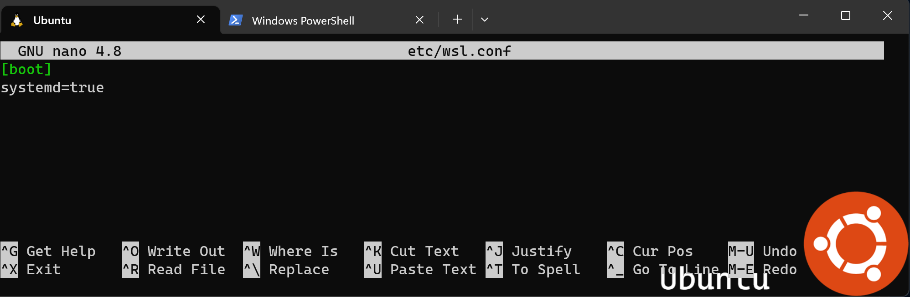

# Use systemd to manage Linux services with WSL

Windows Subsystem for Linux (WSL) now supports systemd, an init system and service manager used by many popular Linux distributions such as Ubuntu, Debian, and more. ([What is systemd?](#what-is-systemd-in-linux)).

The init system default has recently changed from SystemV, with [systemd now the default for the current version of Ubuntu](https://canonical.com/blog/ubuntu-desktop-23-04-release-roundup#:~:text=Systemd%20becomes%20the%20default%20for%20Ubuntu%20on%20WSL) that will be installed using the [`wsl --install` command](./install.md) default. Linux distributions other than the current version of Ubuntu may still use the WSL init, similar to SystemV init. To change to systemd, see [How to enable systemd](#how-to-enable-systemd).

## What is systemd in Linux?

According to [systemd.io](https://systemd.io): "systemd is a suite of basic building blocks for a Linux system. It provides a system and service manager that runs as PID 1 and starts the rest of the system."

Primarily an init system and service manager, systemd includes features like on-demand starting of daemons, mount and automount point maintenance, snapshot support, and processes tracking using Linux control groups.

Most major Linux distributions now run systemd, so enabling it on WSL brings the experience even closer to using bare-metal Linux. See the [video announcement with systemd demos](#systemd-demo-video) or [examples of using systemd](#systemd-examples) below to learn more about what systemd has to offer.

## How to enable systemd?

Systemd is [now the default for the current version of Ubuntu](https://canonical.com/blog/ubuntu-desktop-23-04-release-roundup#:~:text=Systemd%20becomes%20the%20default%20for%20Ubuntu%20on%20WSL) that will be installed using the [`wsl --install` command](./install.md) default.

To enable systemd for any other Linux distributions running on WSL 2 (changing the default from using the systemv init):

1. Ensure that your WSL version is 0.67.6 or newer. (To check, run `wsl --version`. To update, run `wsl --update` or [download the latest version from the Microsoft Store](https://aka.ms/wslstorepage).)

2. Open a command line for your Linux distribution and enter `cd /` to access the root directory, then `ls` to list the files. You will see a directory named "etc" that contains the WSL configuration file for the distribution. Open this file so that you can make an update with the Nano text editor by entering: `nano /etc/wsl.conf`.

3. Add these lines in the `wsl.conf` file that you now have open to change the init used to systemd:

    ```bash
    [boot]
    systemd=true
    ```

4. Exit the Nano text editor (Ctrl + X, select Y to save your change). You will then need to close the Linux distribution. You can use the command `wsl.exe --shutdown` in PowerShell to restart all WSL instances.



Once your Linux distribution restarts, systemd will be running. You can confirm using the command: `systemctl list-unit-files --type=service`, which will show the status of any services associated with your Linux distribution.

Learn more about [Advanced settings configuration in WSL](wsl-config.md), including the difference between the `wsl.conf` (distribution-specific) and `.wslconfig` (global) config files, how to update automount settings, etc.

## Systemd demo video

Microsoft partnered with Canonical to bring systemd support to WSL. See Craig Loewen (PM for WSL at Microsoft) and Oliver Smith (PM for Ubuntu on WSL at Canonical) announce systemd support and show some demos of what it enables.

> [!VIDEO https://learn-video.azurefd.net/vod/player?show=tabs-vs-spaces&ep=wsl-partnering-with-canonical-to-support-systemd]

- [Systemd support blog announcement](https://devblogs.microsoft.com/commandline/systemd-support-is-now-available-in-wsl/)

- [Oliver's tutorials based on these demos on the Ubuntu blog](https://ubuntu.com/blog/ubuntu-wsl-enable-systemd) - includes "Use snap to create a Nextcloud instance in minutes on WSL", "Manage your web projects with LXD", and ["Run a .Net Echo Bot as a systemd service on Ubuntu WSL"](https://ubuntu.com/tutorials/run-dotnet-echo-bot-with-systemd-on-ubuntu-wsl#1-overview)

- [Craig's microk8s demo on GitHub](https://github.com/craigloewen-msft/microk8sdemo)

## Systemd examples

A few examples of Linux applications that depend on systemd are:

- [snap](https://snapcraft.io/): a software packaging and deployment system developed by Canonical for operating systems that use the Linux kernel and the systemd init system. The packages are called "snaps", the command line tool for building snaps is called "Snapcraft", the central repository where snaps can be downloaded/installed is called the "Snap Store", and the daemon required to run snaps (download from the store, mount into place, confine, and run apps out of them) is called "snapd". The entire system is sometimes referred to as "snappy." Try running the command: `snap install spotify`.

- [microk8s](https://microk8s.io/): an open-source, low-ops, minimal production Kubernetes that automates deployment, scaling, and management of containerized apps. Follow the instructions to [Install MicroK8s on WSL2](https://microk8s.io/docs/install-wsl2), check out the [Get Started Tutorial](https://microk8s.io/docs/getting-started), or watch the video on [Kubernetes on Windows with MicroK8s and WSL 2](https://ubuntu.com/blog/kubernetes-on-windows-with-microk8s-and-wsl-2).

- [systemctl](https://www.linode.com/docs/guides/introduction-to-systemctl/): a command-line utility used to control and inspect systemd and to help you interact with services on your Linux distribution. Try the command: `systemctl list-units --type=service` to see which services are available and their status.

A few related tutorials demonstrating ways to use systemd:

- [Understanding and Using Systemd](https://www.linux.com/training-tutorials/understanding-and-using-systemd/)

- [Systemd Essentials: Working with the Services, Units, and the Journal](https://www.digitalocean.com/community/tutorials/systemd-essentials-working-with-services-units-and-the-journal)

- [How To Sandbox Processes With Systemd On Ubuntu 20.04](https://www.digitalocean.com/community/tutorials/how-to-sandbox-processes-with-systemd-on-ubuntu-20-04)

## How does enabling systemd affect WSL architecture?

Enabling support for systemd required changes to the WSL architecture. As systemd requires PID 1, the WSL init process started within the Linux distribution becomes a child process of the systemd. Because the WSL init process is responsible for providing the infrastructure for communication between the Linux and Windows components, changing this hierarchy required rethinking some of the assumptions made with the WSL init process. Additional modifications had to be made to ensure a clean shutdown (as that shutdown is controlled by systemd now) and to have compatibility with [WSLg](tutorials/gui-apps.md), the component of WSL that runs Linux Graphical User Interfaces (GUIs), or the Linux apps that display in windows rather than the command line.

It is also important to note that with these changes, systemd services will NOT keep your WSL instance alive. Your WSL instance will stay alive in the same way it did previous to this update, which you can read more about in this [Background Task Support blog post from 2017](https://devblogs.microsoft.com/commandline/background-task-support-in-wsl/).
