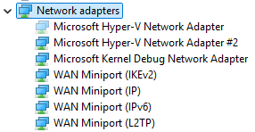

# Troubleshooting Windows Subsystem for Linux

We have covered some common troubleshooting scenarios associated with WSL below, but please consider searching the issues filed in the [WSL product repo on GitHub](https://github.com/Microsoft/wsl/issues) as well.

## File an issue, bug report, feature request

The [WSL product repo issues](https://github.com/Microsoft/wsl/issues) enables you to:

- **Search existing issues** to see if there are any associated with a problem that you are having. Note that in the search bar, you can remove "is:open" to include issues that have already been resolved in your search. Please consider commenting or giving a thumbs up to any open issues that you would like to express your interest in moving forward as a priority.
- **File a new issue**. If you have found a problem with WSL and there does not appear to be an existing issue, you can select the green *New issue* button and then choose *WSL - Bug Report*. You will need to include a title for the issue, your Windows build number (run `cmd.exe /c ver` to see your current build #), whether you're running WSL 1 or 2, your current Linux Kernel version # (run `wsl.exe --status` or `cat /proc/version`), the version # of your distribution (run `lsb_release -r`), any other software versions involved, the repro steps, expected behavior, actual behavior, and diagnostic logs if available and appropriate. For more info, see [contributing to WSL](https://github.com/microsoft/WSL/blob/master/CONTRIBUTING.md).
- **File a feature request** by selecting the green *New issue* button and then select *Feature request*. You will need to address a few questions describing your request.

You can also:

- **File a documentation issue** using the [WSL docs repo](https://github.com/MicrosoftDocs/wsl/issues). To contribute to the WSL docs, see the [Microsoft Docs contributor guide](/contribute).
- **File a Windows Terminal** issue using the [Windows Terminal product repo](https://github.com/microsoft/terminal/issues) if your problem is related more to the Windows Terminal, Windows Console, or the command-line UI.

## Installation issues

- **Installation failed with error 0x80070003**
  - The Windows Subsystem for Linux only runs on your system drive (usually this is your `C:` drive). Make sure that distributions are stored on your system drive:  
  - On Windows 10 open **Settings** -> **System** -> **Storage** -> **More Storage Settings: Change where new content is saved**
    
  - On Windows 11 open **Settings** -> **System** -> **Storage** -> **Advanced storage settings** -> **Where new content is saved**
      

- **WslRegisterDistribution failed with error 0x8007019e**
  - The Windows Subsystem for Linux optional component is not enabled:
  - Open **Control Panel** -> **Programs and Features** -> **Turn Windows Feature on or off** -> Check **Windows Subsystem for Linux** or using the PowerShell cmdlet mentioned at the beginning of this article.

- **Installation failed with error 0x80070003 or error 0x80370102**
  - Please make sure that virtualization is enabled inside of your computer's BIOS. The instructions on how to do this will vary from computer to computer, and will most likely be under CPU related options.
  - WSL2 requires that your CPU supports the Second Level Address Translation (SLAT) feature, which was introduced in Intel Nehalem processors (Intel Core 1st Generation) and AMD Opteron. Older CPUs (such as the Intel Core 2 Duo) will not be able to run WSL2, even if the Virtual Machine Platform is successfully installed. 

- **Error when trying to upgrade: `Invalid command line option: wsl --set-version Ubuntu 2`**
  - Ensure that you have the Windows Subsystem for Linux enabled, and that you're using Windows Build version 18362 or later. To enable WSL run this command in a PowerShell prompt with admin privileges: `Enable-WindowsOptionalFeature -Online -FeatureName Microsoft-Windows-Subsystem-Linux`.

- **The requested operation could not be completed due to a virtual disk system limitation. Virtual hard disk files must be uncompressed and unencrypted and must not be sparse.**
  - Deselect "Compress contents" (as well as "Encrypt contents" if that’s checked) by opening the profile folder for your Linux distribution. It should be located in a folder on your Windows file system, something like: `%USERPROFILE%\AppData\Local\Packages\CanonicalGroupLimited...`
  - In this Linux distro profile, there should be a LocalState folder. Right-click this folder to display a menu of options. Select Properties > Advanced and then ensure that the "Compress contents to save disk space" and "Encrypt contents to secure data" checkboxes are unselected (not checked). If you are asked whether to apply this to just to the current folder or to all subfolders and files, select "just this folder" because you are only clearing the compress flag. After this, the `wsl --set-version` command should work.


> [!NOTE]
> In my case, the LocalState folder for my Ubuntu 18.04 distribution was located at C:\Users\<my-user-name>\AppData\Local\Packages\CanonicalGroupLimited.Ubuntu18.04onWindows_79rhkp1fndgsc
>
> Check [WSL Docs GitHub thread #4103](https://github.com/microsoft/WSL/issues/4103) where this issue is being tracked for updated information.

- **The term 'wsl' is not recognized as the name of a cmdlet, function, script file, or operable program.**
  - Ensure that the [Windows Subsystem for Linux Optional Component is installed](./install-manual.md#step-3---enable-virtual-machine-feature). Additionally, if you are using an ARM64 device and running this command from PowerShell, you will receive this error. Instead run `wsl.exe` from [PowerShell Core](/powershell/scripting/install/installing-powershell-core-on-windows), or Command Prompt.

- **Error: Windows Subsystem for Linux has no installed distributions.**
  - If you receive this error after you have already installed WSL distributions:
  1. Run the distribution at least once before invoking it from the command line.
  2. Check whether you may be running separate user accounts. Running your primary user account with elevated permissions (in admin mode) should not result in this error, but you should ensure that you aren't accidentally running the built-in Administrator account that comes with Windows. This is a separate user account and will not show any installed WSL distributions by design. For more info, see [Enable and Disable the Built-in Administrator Account](/windows-hardware/manufacture/desktop/enable-and-disable-the-built-in-administrator-account).
  3. The WSL executable is only installed to the native system directory. When you’re running a 32-bit process on 64-bit Windows (or on ARM64, any non-native combination), the hosted non-native process actually sees a different System32 folder. (The one a 32-bit process sees on x64 Windows is stored on disk at \Windows\SysWOW64.) You can access the "native" system32 from a hosted process by looking in the virtual folder: `\Windows\sysnative`. It won’t actually be present on disk, mind you, but the filesystem path resolver will find it.

- **Error: This update only applies to machines with the Windows Subsystem for Linux.**
  - To install the Linux kernel update MSI package, WSL is required and should be enabled first. If it fails, it you will see the message: `This update only applies to machines with the Windows Subsystem for Linux`.
  - There are three possible reason you see this message:

  1. You are still in old version of Windows which doesn't support WSL 2. See step #2 for version requirements and links to update.

  2. WSL is not enabled. You will need to return to step #1 and ensure that the optional WSL feature is enabled on your machine.

  3. After you enabled WSL, a reboot is required for it to take effect, reboot your machine and try again.

- **Error: WSL 2 requires an update to its kernel component. For information please visit https://aka.ms/wsl2kernel .**
  - If the Linux kernel package is missing in the %SystemRoot%\system32\lxss\tools folder, you will encounter this error. Resolve it by installing the Linux kernel update MSI package in step #4 of these installation instructions. You may need to uninstall the MSI from ['Add or Remove Programs'](ms-settings:appsfeatures-app), and install it again.

## Common issues

### I'm on Windows 10 version 1903 and I still do not see options for WSL 2

This is likely because your machine has not yet taken the backport for WSL 2. The simplest way to resolve this is by going to Windows Settings and clicking 'Check for Updates' to install the latest updates on your system. See [the full instructions on taking the backport](https://devblogs.microsoft.com/commandline/wsl-2-support-is-coming-to-windows-10-versions-1903-and-1909/#how-do-i-get-it).

If you hit 'Check for Updates' and still do not receive the update you can [install KB KB4566116 manually](https://www.catalog.update.microsoft.com/Search.aspx?q=KB4566116).  

### Error: 0x1bc when `wsl --set-default-version 2`

This may happen when 'Display Language' or 'System Locale' setting is not English.

```powershell
wsl --set-default-version 2
Error: 0x1bc
For information on key differences with WSL 2 please visit https://aka.ms/wsl2
```

The actual error for `0x1bc` is:

```powershell
WSL 2 requires an update to its kernel component. For information please visit https://aka.ms/wsl2kernel
```

For more information, please refer to issue [5749](https://github.com/microsoft/WSL/issues/5749)

### Cannot access WSL files from Windows

A 9p protocol file server provides the service on the Linux side to allow Windows to access the Linux file system. If you cannot access WSL using `\\wsl$` on Windows, it could be because 9P did not start correctly.

To check this, you can check the start up logs using: `dmesg |grep 9p`, and this will show you any errors. A successful output looks like the following:

```bash
[    0.363323] 9p: Installing v9fs 9p2000 file system support
[    0.363336] FS-Cache: Netfs '9p' registered for caching
[    0.398989] 9pnet: Installing 9P2000 support
```

Please see [this GitHub thread](https://github.com/microsoft/wsl/issues/5307) for further discussion on this issue.

### Can't start WSL 2 distribution and only see 'WSL 2' in output

If your display language is not English, then it is possible you are seeing a truncated version of an error text.

```powershell
C:\Users\me>wsl
WSL 2
```

To resolve this issue, please visit `https://aka.ms/wsl2kernel` and install the kernel manually by following the directions on that doc page. 

### `command not found` when executing Windows .exe in Linux

Users can run Windows executables like notepad.exe directly from Linux. Sometimes, you may hit "command not found" like below: 

```Bash
$ notepad.exe
-bash: notepad.exe: command not found
```

If there are no Win32 paths in your $PATH, interop isn't going to find the .exe.
You can verify it by running `echo $PATH` in Linux. It's expected that you will see a Win32 path (for example, /mnt/c/Windows) in the output.
If you can't see any Windows paths then most likely your PATH is being overwritten by your Linux shell. 

Here is an example that /etc/profile on Debian contributed to the problem:

```Bash
if [ "`id -u`" -eq 0 ]; then
  PATH="/usr/local/sbin:/usr/local/bin:/usr/sbin:/usr/bin:/sbin:/bin"
else
  PATH="/usr/local/bin:/usr/bin:/bin:/usr/local/games:/usr/games"
fi
```

The correct way on Debian is to remove above lines.
You may also append $PATH during the assignment like below, but this lead to some [other problems](https://salsa.debian.org/debian/WSL/-/commit/7611edba482fd0b3f67143aa0fc1e2cc1d4100a6) with WSL and VSCode..

```Bash
if [ "`id -u`" -eq 0 ]; then
  PATH="/usr/local/sbin:/usr/local/bin:/usr/sbin:/usr/bin:/sbin:/bin:$PATH"
else
  PATH="/usr/local/bin:/usr/bin:/bin:/usr/local/games:/usr/games:$PATH"
fi
```

For more information, see issue [5296](https://github.com/microsoft/WSL/issues/5296) and issue [5779](https://github.com/microsoft/WSL/issues/5779).

### "Error: 0x80370102 The virtual machine could not be started because a required feature is not installed."

Please enable the Virtual Machine Platform Windows feature and ensure virtualization is enabled in the BIOS.

1. Check the [Hyper-V system requirements](/windows-server/virtualization/hyper-v/system-requirements-for-hyper-v-on-windows#:~:text=on%20Windows%20Server.-,General%20requirements,the%20processor%20must%20have%20SLAT.)

2. If your machine is a VM, enable [nested virtualization](./faq.yml#can-i-run-wsl-2-in-a-virtual-machine-) manually. Launch powershell with admin, and run the following command, replacing `<VMName>` with the name of the virtual machine on your host system (you can find the name in your Hyper-V Manager):

    ```powershell
    Set-VMProcessor -VMName <VMName> -ExposeVirtualizationExtensions $true
    ```

3. Please follow guidelines from your PC's manufacturer on how to enable virtualization. In general, this can involve using the system BIOS to ensure that these features are enabled on your CPU. Instructions for this process can vary from machine to machine, please see [this article](https://www.bleepingcomputer.com/tutorials/how-to-enable-cpu-virtualization-in-your-computer-bios/) from Bleeping Computer for an example.

4. Restart your machine after enabling the `Virtual Machine Platform` optional component.

5. Make sure that the hypervisor launch is enabled in your boot configuration. You can validate this by running (elevated powershell):

	```powershell
	bcdedit /enum | findstr -i hypervisorlaunchtype
	```

	If you see `hypervisorlaunchtype    Off`, then the hypervisor is disabled. To enable it run in an elevated powershell:

	```
	bcdedit /set hypervisorlaunchtype Auto
	```

6. Additionally, if you have 3rd party hypervisors installed (Such as VMware or VirtualBox) then please ensure you have these on the latest versions which can support HyperV ([VMware 15.5.5+](https://blogs.vmware.com/workstation/2020/05/vmware-workstation-now-supports-hyper-v-mode.html) and [VirtualBox 6+](https://www.virtualbox.org/wiki/Changelog-6.0)) or are turned off.

7. If you are receiving this error on an Azure Virtual Machine, check to ensure that [Trusted Launch](/azure/virtual-machines/trusted-launch) is disabled. [Nested Virtualization is not supported on Azure virtual machines](/azure/virtual-machines/trusted-launch#unsupported-features).

Learn more about how to [Configure Nested Virtualization](/virtualization/hyper-v-on-windows/user-guide/nested-virtualization#configure-nested-virtualization) when running Hyper-V in a Virtual Machine.

### WSL has no network connection on my work machine or in an Enterprise environment

Business or Enterprise environments may have [Windows Defender Firewall settings configured](/windows/security/threat-protection/windows-firewall/best-practices-configuring) to block unauthorized network traffic. If [local rule merging](/openspecs/windows_protocols/ms-gpfas/2c979624-900a-4b6e-b4ef-09b387cd62ab) is set to "No" then WSL networking will not work by default, and your administrator will need to add a firewall rule to allow it. 

You can confirm local rule merging's setting by following these steps:


1. Open "Windows Defender Firewall with advanced security" *(this is different than "Windows Defender Firewall" in the Control Panel)*
2. Right-click on the "Windows Defender Firewall with advanced security on Local Computer" tab
3. Select "Properties"
4. Select the "Public Profile" tab on the new Window that opens
5. Select "Customize" under the "Settings" section 
6. Check in the "Customize Settings for the Public Profile" window that opens to see if "Rule Merging" is set to "No". This will block access to WSL.

You can find instructions on how to change this Firewall setting in [Configure Hyper-V firewall](/windows/security/operating-system-security/network-security/windows-firewall/hyper-v-firewall).

### WSL has no network connectivity once connected to a VPN

If after connecting to a VPN on Windows, bash loses network connectivity, try this workaround from within bash. This workaround will allow you to manually override the DNS resolution through `/etc/resolv.conf`.

1. Take a note of the DNS server of the VPN from doing `ipconfig.exe /all`
2. Make a copy of the existing resolv.conf
   `sudo cp /etc/resolv.conf /etc/resolv.conf.new`
3. Unlink the current resolv.conf
   `sudo unlink /etc/resolv.conf`
4. `sudo mv /etc/resolv.conf.new /etc/resolv.conf`
5. Edit `/etc/wsl.conf` and add this content to the file. (More info on this set up can be found in [Advanced settings configuration](./wsl-config.md))
```
[network]
generateResolvConf=false
```
6. Open `/etc/resolv.conf` and <br/>
   a. Delete the first line from the file which has a comment describing automatic generation<br/>
   b. Add the DNS entry from (1) above as the very first entry in the list of DNS servers. <br/>
   c. Close the file. <br/>

Once you have disconnected the VPN, you will have to revert the changes to `/etc/resolv.conf`. To do this, do:

1. `cd /etc`
2. `sudo mv resolv.conf resolv.conf.new`
3. `sudo ln -s ../run/resolvconf/resolv.conf resolv.conf`

### Cisco Anyconnect VPN issues with WSL in NAT mode

The Cisco AnyConnect VPN modifies routes in a way which prevents NAT from working. There is a workaround specific to WSL 2: See [Cisco AnyConnect Secure Mobility Client Administrator Guide, Release 4.10 - Troubleshoot AnyConnect](https://www.cisco.com/c/en/us/td/docs/security/vpn_client/anyconnect/anyconnect410/administration/guide/b-anyconnect-admin-guide-4-10/troubleshoot-anyconnect.html#Cisco_Task_in_List_GUI.dita_3a9a8101-f034-4e9b-b24a-486ee47b5e9f).

### WSL connectivity issues with VPNs when Mirrored networking mode is on

Mirrored networking mode is currently an [experimental setting in the WSL Configuration](/windows/wsl/wsl-config#experimental-settings). The traditional NAT networking architecture of WSL can be updated to an entirely new networking mode called “Mirrored networking mode”. When the experimental `networkingMode` is set to `mirrored`, the network interfaces that you have on Windows are mirrored into Linux to improve compatibility. Learn more in the Command Line blog: [WSL September 2023 update](https://devblogs.microsoft.com/commandline/windows-subsystem-for-linux-september-2023-update/#new-networking-mode-mirrored).

Some VPNs have been tested and confirmed to be incompatible with WSL, including:

- "Bitdefender" version 26.0.2.1
- "OpenVPN" version 2.6.501
- "Mcafee Safe Connect" version 2.16.1.124

### Considerations when using autoProxy for HttpProxy Mirroring in WSL

HTTP/S proxy mirroring can be configured using the `autoProxy` setting in the [experimental section of the WSL Configuration file](/windows/wsl/wsl-config#experimental-settings). When applying this setting, note these considerations:

- **PAC Proxy**: WSL will configure the setting in Linux by Setting the "WSL_PAC_URL" environment variable. Linux does not support PAC proxies by default. 
- **Interactions with WSLENV**: User defined environment variables take precedence over those specified by this feature.

When enabled, the following apply to proxy settings on your Linux distributions:

- The Linux environment variable, `HTTP_PROXY`, is set to the one or more HTTP proxies found installed in the Windows HTTP proxy configuration.
- The Linux environment variable, `HTTPS_PROXY`, is set to the one or more HTTP**S** proxies found installed in the Windows HTTP proxy configuration.
- The Linux environment variable, `NO_PROXY`, is set to bypass any HTTP/S proxies found in the Windows configuration targets.
- Every environment variable, except `WSL_PAC_URL`, is set to both lower case and upper case. For example: `HTTP_PROXY` and `http_proxy`.

There is a known issue caused by ZScaler configurations, where ZScaler repeatedly enables and disables Windows proxy configurations, leading to WSL repeatedly showing the "An Http proxy change has been detected on the host" notification.

Learn more in the Command Line blog: [WSL September 2023 update](https://devblogs.microsoft.com/commandline/windows-subsystem-for-linux-september-2023-update/#autoproxy).

### Networking considerations with DNS tunneling

When WSL can’t connect to the internet, it might be because the DNS call to the Windows host is blocked. This is because the networking packet for DNS sent by the WSL VM to the Windows host is blocked by the existing networking configuration. DNS tunneling fixes this by using a virtualization feature to communicate with Windows directly, allowing the DNS name to be resolved without sending a networking packet. This feature should improve network compatibility and allow you to get better internet connectivity even if you have a VPN, specific firewall setup, or other networking configurations.

DNS Tunneling can be configured using the `dnsTunneling` setting in the [experimental section of the WSL Configuration file](/windows/wsl/wsl-config#experimental-settings). When applying this setting, note these considerations:

- If you use a VPN with WSL, turn on DNS tunneling. Many VPNs use NRPT policies, which are only applied to WSL DNS queries when DNS tunneling is enabled.
- The `/etc/resolv.conf` file in your Linux distribution has a 3 DNS servers maximum limitation, while Windows may use more than 3 DNS servers. Using DNS tunneling removes this limitation – all Windows DNS servers can now be used by Linux.
- WSL will use Windows DNS suffixes in the following order (similar to the order used by the Windows DNS client): 
  1. Global DNS suffixes 
  2. Supplemental DNS suffixes 
  3. Per-interface DNS suffixes
  4. If DNS encryption (DoH, DoT) is enabled on Windows, encryption will be applied to DNS queries from WSL. If users want to enable DoH, DoT inside Linux, they need to disable DNS tunneling.
- DNS queries from Docker containers managed by Docker Desktop will bypass DNS tunneling. Docker Desktop has its own way (different from DNS tunneling) of applying host DNS settings and policies to DNS queries from Docker containers.
- In order for DNS tunneling to be succesfully enabled, the generateResolvConf option in the wsl.conf file should not be disabled.
- When DNS tunneling is enabled, the generateHosts option in the wsl.conf file is ignored (the Windows DNS hosts file is not copied in the Linux /etc/hosts file). The policies in the Windows hosts file will be applied to DNS queries from Linux, without the need for the file to be copied in Linux.

Learn more in the Command Line blog: [WSL September 2023 update](https://devblogs.microsoft.com/commandline/windows-subsystem-for-linux-september-2023-update/#dns-tunneling).

### Issues with steering the inbound traffic received by the Windows host to the WSL Virtual Machine

When using Mirrored networking mode (the experimental `networkingMode` set to `mirrored`), some inbound traffic received by the Windows host will never be steered to the Linux VM. This traffic is as follows:

- UDP port 68 (DHCP)
- TCP port 135 (DCE endpoint resolution)
- TCP port 1900 (UPnP)
- TCP port 2869 (SSDP)
- TCP port 5004 (RTP)
- TCP port 3702 (WSD)
- TCP port 5357 (WSD)
- TCP port 5358 (WSD)

WSL will automatically configure certain Linux networking settings when using mirrored networking mode. Any user configurations of these settings while using mirrored networking mode is not supported. Here is the list of settings WSL will configure:

| Setting Name | Value |
| --- | --- |
|  https://sysctl-explorer.net/net/ipv4/accept_local/ | Enabled (1) |
|  https://sysctl-explorer.net/net/ipv4/route_localnet/ | Enabled (1) |
|  https://sysctl-explorer.net/net/ipv4/rp_filter/ | Disabled (0) |
|  https://sysctl-explorer.net/net/ipv6/accept_ra/ | Disabled (0) |
|  https://sysctl-explorer.net/net/ipv6/autoconf/ | Disabled (0) |
|  https://sysctl-explorer.net/net/ipv6/use_tempaddr/ | Disabled (0) |
|  addr_gen_mode| Disabled (0) |
|  disable_ipv6| Disabled (0) |
|  https://sysctl-explorer.net/net/ipv4/arp_filter/ | Enabled (1) |
 
### Docker container issues in WSL2 with Mirrored networking mode enabled when running under the default networking namespace

There is a known issue in which Docker Desktop containers with published ports (docker run –publish/-p) will fail to be created. The WSL team is working with the Docker Desktop team to address this issue. To work around the issue, use the host’s networking namespace in the Docker container. Set the network type via the "--network host" option used in the "docker run" command. An alternative workaround is to list the published port number in the `ignoredPorts` setting of the [experimental section in the WSL Configuration file](/windows/wsl/wsl-config#experimental-settings). 

### Docker container issues when its Network Manager is running

There is a known issue with Docker containers which have the Network Manager service running. Symptoms include failures when trying to make loopback connections to the host.
It is recommended to stop the Network Manager service for WSL networking to be configured properly.

```Bash
sudo systemctl disable network-manager.service
```

### Resolve .local names in WSL

To resolve hostnames to IP addresses within a local network without the need for a conventional DNS server, .local names are often used. This is achieved through the mDNS (Multicast DNS) protocol, which relies on multicast traffic to function.

**networkingMode set to NAT:**

Currently, this feature is not supported when DNS tunneling is enabled. To enable the resolution of .local names, we recommend the following solutions:

- Disable DNS tunneling.
- Use mirrored networking mode.

**networkingMode set to Mirrored:**

Note: You need to be on WSL build 2.3.17 or higher in order to have the functionality below.

Since Mirrored mode supports multicast traffic, the mDNS (Multicast DNS) protocol can be used to resolve .local names. Linux must be configured to support mDNS, as it does not do so by default. One way to configure it is using the following these two steps:

1) Install the "libnss-mdns" package 

```Bash
sudo apt-get install libnss-mdns
```

*The "libnss-mdns" package is a plugin for the GNU Name Service Switch (NSS) functionality of the GNU C Library (glibc) that provides hostname resolution via Multicast DNS (mDNS). This package effectively allows common Unix/Linux programs to resolve names in the ad-hoc mDNS domain .local.

2) Configure the `/etc/nsswitch.conf` file to enable the "mdns_minimal" setting in the "hosts" section. Example content of the file:

```Bash
cat /etc/nsswitch.conf
# /etc/nsswitch.conf
#
# Example configuration of GNU Name Service Switch functionality.
# If you have the `glibc-doc-reference' and `info' packages installed, try:
# `info libc "Name Service Switch"' for information about this file.

passwd:         compat systemd
group:          compat systemd
shadow:         compat
gshadow:        files

hosts:          files mdns_minimal [NOTFOUND=return] dns
networks:       files

protocols:      db files
services:       db files
ethers:         db files
rpc:            db files

netgroup:       nis
```

### DNS suffixes in WSL

Depending on the configurations in the .wslconfig file, WSL will have the following behavior wrt DNS suffixes:

**When networkingMode is set to NAT:**

Case 1) By default
no DNS suffix is configured in Linux

Case 2) If DNS tunneling is enabled (dnsTunneling is set to true in .wslconfig)
All Windows DNS suffixes are configured in Linux, in the "search" setting of /etc/resolv.conf

The suffixes are configured in /etc/resolv.conf in the following order, similar to the order in which Windows DNS client tries suffixes when resolving a name: global DNS suffixes first, then supplemental DNS suffixes, then per-interface DNS suffixes.

When there is a change in the Windows DNS suffixes, that change will be automatically reflected in Linux

Case 3) If DNS tunneling is disabled and SharedAccess DNS proxy is disabled (dnsTunneling is set to false and dnsProxy is set to false in .wslconfig)
A single DNS suffix is configured in Linux, in the "domain" setting of /etc/resolv.conf

When there is a change in the Windows DNS suffixes, that change is not reflected in Linux

The single DNS suffix configured in Linux is chosen from the per-interface DNS suffixes (global and supplemental suffixes are ignored)

if Windows has multiple interfaces, a heuristic is used to choose the single DNS suffix that will be configured in Linux. For example if there is a VPN interface on Windows, the suffix is chosen from that interface. If no VPN interface is present, the suffix is chosen from the interface that is most likely to give Internet connectivity.

**When networkingMode is set to Mirrored:**

All Windows DNS suffixes are configured in Linux, in the "search" setting of /etc/resolv.conf

The suffixes are configured in /etc/resolv.conf in the same order as in case 2) from NAT mode

When there is a change in the Windows DNS suffixes, that change will be automatically reflected in Linux

Note: supplemental DNS suffixes can be configured in Windows using
[SetInterfaceDnsSettings - Win32 apps | Microsoft Learn](/windows/win32/api/netioapi/nf-netioapi-setinterfacednssettings), with the flag **DNS_SETTING_SUPPLEMENTAL_SEARCH_LIST set in the Settings parameter**

### Troubleshooting DNS in WSL

The default DNS configuration when WSL starts a container in NAT mode is to have the NAT device on the Windows Host serve as the DNS ‘server’ for the WSL container. When DNS queries are sent from the WSL container to that NAT device on the Windows Host, the DNS packet is forwarded from the NAT device to the shared access service on the Host; the response is sent in the reverse direction back to the WSL container. This packet forwarding process to shared access requires a Firewall rule to allow that inbound DNS packet, which is created by the HNS service when WSL initially asks HNS to create the NAT virtual network for its WSL container.

Due to this NAT - shared access design, there are a few known configurations which can break name resolution from WSL.

**1.	An Enterprise can push policy that does not allow locally defined Firewall rules, only allowing Enterprise-policy defined rules.**

When this is set by an Enterprise, the HNS-created Firewall rule is ignored, as it’s a locally defined rule.
For this configuration to work the Enterprise must create a Firewall rule to allow UDP port 53 to the shared access service, or WSL can be set to use DNS Tunneling.
One can see if this is configured to not allow locally defined Firewall rules by running the following. Note that this will show settings for all 3 profiles: Domain, Private, and Public. If it’s set on any profile, then packets will be blocked if the WSL vNIC is assigned that profile (default is Public). This is only a snippet of the first Firewall profile that is returned in Powershell:

```PowerShell
PS C:\> Get-NetFirewallProfile -PolicyStore ActiveStore
Name                            : Domain
Enabled                         : True
DefaultInboundAction            : Block
DefaultOutboundAction           : Allow
AllowInboundRules               : True
AllowLocalFirewallRules         : False
```

```AllowLocalFirewallRules:False means the locally defined firewall rules, like that by HNS, will not be applied or used.```

**2.	And Enterprise can push down Group Policy and MDM policy settings that block all inbound rules.**

These settings override any Allow-Inbound Firewall rule. This setting will thus block the HNS-created UDP Firewall rule, and thus will prevent WSL from resolving names.
For this configuration to work, **WSL must be set to use DNS Tunneling.** This setting will always block the NAT DNS proxy.

**From Group Policy:**

Computer Configuration \\ Administrative Templates \\ Network \\ Network Connections \\ Windows Defender Firewall \\ Domain Profile | Standard Profile

"Windows Defender Firewall: Do not allow exceptions" - Enabled

**From MDM Policy:**

./Vendor/MSFT/Firewall/MdmStore/PrivateProfile/Shielded

./Vendor/MSFT/Firewall/MdmStore/DomainProfile/Shielded

./Vendor/MSFT/Firewall/MdmStore/PublicProfile/Shielded

One can see if this is configured to not allow any inbound Firewall rules by running the following (see above caveats on Firewall Profiles). This is only a snippet of the first Firewall profile that is returned in Powershell:
```powerShell

PS C:\> Get-NetFirewallProfile -PolicyStore ActiveStore
Name                            : Domain
Enabled                         : True
DefaultInboundAction            : Block
DefaultOutboundAction           : Allow
AllowInboundRules               : False
```

```AllowInboundRules: False means that no inbound Firewall rules will be applied.```

**3.	A user goes through the Windows Security setting apps and checks the control for "Blocks all incoming connections, including those in the list of allowed apps."**

Windows supports a user-opt-in for the same setting that can be applied by an Enterprise referenced in #2 above. Users can open the “Windows Security” settings page, selects the “Firewall & network protection” option, selects the Firewall Profile they want to configure (Domain, Private, or Public), and under “Incoming connections” check the control labeled "Blocks all incoming connections, including those in the list of allowed apps."

If this is set for the Public profile (this is the default profile for the WSL vNIC), the Firewall rule created by HNS to allow the UDP packets to shared access will be blocked.

This must be unchecked for the NAT DNS proxy configuration to work from WSL, **or WSL can be set to use DNS Tunneling.**

**4.	The HNS Firewall rule to allow the DNS packets to shared access can become invalid, referencing a previous WSL interface identifier.**
This is a flaw within HNS which has been fixed with the latest Windows 11 release. On earlier releases, if this occurs, it’s not easily discoverable, but it has a simple work around:
- Stop WSL
  
  ```wsl.exe –shutdown```
- Delete the old HNS Firewall rule. This Powershell command should work in most cases:

  ```Get-NetFirewallRule -Name "HNS*" | Get-NetFirewallPortFilter | where Protocol -eq UDP | where LocalPort -eq 53 | Remove-NetFirewallRule```
- Remove all HNS endpoints. Note: if HNS is used to manage other containers, such as MDAG or Windows Sandbox, those should also be stopped.

  ```hnsdiag.exe delete all```
- Reboot or restart the HNS service

  ```Restart-Service hns```
- When WSL is restarted, HNS will create new Firewall rules, correctly targeting the WSL interface.

### Troubleshooting Network Access Issues on Windows

If you have no network access, it might be due to a misconfiguration. Please see if the FSE driver is running: ‘sc queryex FSE’. If that does not show FSE running, please check if the PortTrackerEnabledMode registry value exits under this registry key: reg query HKLM\System\CurrentControlSet\Services\Tcpip\Parameters. If FSE is not running or installed, and PortTrackerEnabledMode exists, please delete that registry value and reboot

### Manual way to delete phantom adapters

*Ghost adapters*, or phantom Plug and Play (PnP) devices, refer to hardware components that appear in your system but are not physically connected. These “ghost” devices can cause confusion and clutter in your system settings. If you see ghost adapters when running WSL in a Virtual Machine (VM), follow these manual steps to find and delete these Phantom PnP devices. Microsoft is working on an automated solution that will not require manual intervention. More information will be coming soon.

1. Open Device Manager
2. View > Show hidden devices


3. Open Network adapters



4. Right-click over the Ghosted network adapter and select **Uninstall Device**


### Starting WSL or installing a distribution returns an error code

Follow the instructions to [Collect WSL logs](https://github.com/Microsoft/WSL/blob/master/CONTRIBUTING.md#8-detailed-logs) in the WSL repo on GitHub to collect detailed logs and file an issue on our GitHub.

### Updating WSL

There are two components of Windows Subsystem for Linux that can require updating.

1. To update the Windows Subsystem for Linux itself, use the command `wsl --update` in PowerShell or CMD.

2. To update the specific Linux distribution user binaries, use the command: `apt-get update | apt-get upgrade` in the Linux distribution that you are seeking to update.
  
### Apt-get upgrade errors

Some packages use features that we haven't implemented yet. `udev`, for example, isn't supported yet and causes several `apt-get upgrade` errors.

To fix issues related to `udev`, follow the following steps:

1. Write the following to `/usr/sbin/policy-rc.d` and save your changes.
  
   ```bash
   #!/bin/sh
   exit 101
   ```
  
2. Add execute permissions to `/usr/sbin/policy-rc.d`:

   ```bash
   chmod +x /usr/sbin/policy-rc.d
   ```
  
3. Run the following commands:

   ```bash
   dpkg-divert --local --rename --add /sbin/initctl
   ln -s /bin/true /sbin/initctl
   ```
  
### "Error: 0x80040306" on installation

This has to do with the fact that we do not support legacy console.
To turn off legacy console:

1. Open cmd.exe
1. Right click title bar -> Properties -> Uncheck Use legacy console
1. Click OK

### "Error: 0x80040154" after Windows update

The Windows Subsystem for Linux feature may be disabled during a Windows update. If this happens the Windows feature must be re-enabled. Instructions for enabling the Windows Subsystem for Linux can be found in the [Manual Installation Guide](./install-manual.md).

### Changing the display language

WSL install will try to automatically change the Ubuntu locale to match the locale of your Windows install. If you do not want this behavior you can run this command to change the Ubuntu locale after install completes.  You will have to relaunch bash.exe for this change to take effect.

The below example changes to locale to `en-US`:

```bash
sudo update-locale LANG=en_US.UTF8
```

### Installation issues after Windows system restore

1. Delete the `%windir%\System32\Tasks\Microsoft\Windows\Windows Subsystem for Linux` folder. <br/>
  **Note: Do not do this if your optional feature is fully installed and working.**
2. Enable the WSL optional feature (if not already)
3. Reboot
4. lxrun /uninstall /full
5. Install bash

### No internet access in WSL

Some users have reported issues with specific firewall applications blocking internet access in WSL.  The firewalls reported are:

1. Kaspersky
2. AVG
3. Avast
4. Symantec Endpoint Protection

In some cases turning off the firewall allows for access.  In some cases simply having the firewall installed looks to block access.

If you are using Microsoft Defender Firewall, unchecking "Blocks all incoming connections, including those in the list of allowed apps." allows for access.

### Permission Denied error when using ping

For [Windows Anniversary Update, version 1607](./release-notes.md#build-14388-to-windows-10-anniversary-update),
**administrator privileges** in Windows are required to run ping in WSL.  To run ping, run Bash on Ubuntu on Windows as an administrator, or run bash.exe from a CMD/PowerShell prompt with administrator privileges.

For later versions of Windows, [Build 14926+](./release-notes.md#build-14926), administrator privileges are no longer required.

### Bash is hung

If while working with bash, you find that bash is hung (or deadlocked) and not responding to inputs, help us diagnose the issue by collecting and reporting a memory dump. Note that these steps will crash your system. Do not do this if you are not comfortable with that or save your work prior to doing this.

To collect a memory dump

1. Change the memory dump type to "complete memory dump". While changing the dump type, take a note of your current type.

2. Use the [steps](https://techcommunity.microsoft.com/t5/Core-Infrastructure-and-Security/How-to-Force-a-Diagnostic-Memory-Dump-When-a-Computer-Hangs/ba-p/257809) to configure crash using keyboard control.

3. Repro the hang or deadlock.

4. Crash the system using the key sequence from (2).

5. The system will crash and collect the memory dump.

6. Once the system reboots, report the memory.dmp to secure@microsoft.com. The default location of the dump file is %SystemRoot%\memory.dmp or C:\Windows\memory.dmp if C: is the system drive. In the email, note that the dump is for the WSL or Bash on Windows team.

7. Restore the memory dump type to the original setting.

### Check your build number

To find your PC's architecture and Windows build number, open  
**Settings** > **System** > **About**

Look for the **OS Build** and **System Type** fields.  
    

To find your Windows Server build number, run the following in PowerShell:  

``` PowerShell
systeminfo | Select-String "^OS Name","^OS Version"
```

### Confirm WSL is enabled

You can confirm that the Windows Subsystem for Linux is enabled by running the following in an elevated PowerShell window:  

``` PowerShell
Get-WindowsOptionalFeature -Online -FeatureName Microsoft-Windows-Subsystem-Linux
```

### OpenSSH-Server connection issues

Trying to connect your SSH server is failed with the following error: "Connection closed by 127.0.0.1 port 22".

1. Make sure your OpenSSH Server is running:

   ```bash
   sudo service ssh status
   ```

   and you've followed this tutorial:
   https://ubuntu.com/server/docs/service-openssh

2. Stop the sshd service and start sshd in debug mode:

   ```bash
   sudo service ssh stop
   sudo /usr/sbin/sshd -d
   ```

3. Check the startup logs and make sure HostKeys are available and you don't see log messages such as:

   ```BASH
   debug1: sshd version OpenSSH_7.2, OpenSSL 1.0.2g  1 Mar 2016
   debug1: key_load_private: incorrect passphrase supplied to decrypt private key
   debug1: key_load_public: No such file or directory
   Could not load host key: /etc/ssh/ssh_host_rsa_key
   debug1: key_load_private: No such file or directory
   debug1: key_load_public: No such file or directory
   Could not load host key: /etc/ssh/ssh_host_dsa_key
   debug1: key_load_private: No such file or directory
   debug1: key_load_public: No such file or directory
   Could not load host key: /etc/ssh/ssh_host_ecdsa_key
   debug1: key_load_private: No such file or directory
   debug1: key_load_public: No such file or directory
   Could not load host key: /etc/ssh/ssh_host_ed25519_key
   ```

If you do see such messages and the keys are missing under `/etc/ssh/`, you will have to regenerate the keys or just purge&install openssh-server:

```BASH
sudo apt-get purge openssh-server
sudo apt-get install openssh-server
```

### "The referenced assembly could not be found." when enabling the WSL optional feature

This error is related to being in a bad install state. Please complete the following steps to try and fix this issue:

- If you are running the enable WSL feature command from PowerShell, try using the GUI instead by opening the start menu, searching for 'Turn Windows features on or off' and then in the list select 'Windows Subsystem for Linux' which will install the optional component.

- Update your version of Windows by going to Settings, Updates, and clicking 'Check for Updates'

- If both of those fail and you need to access WSL please consider upgrading in place by reinstalling Windows using installation media and selecting 'Keep Everything' to ensure your apps and files are preserved. You can find instructions on how to do so at the [Reinstall Windows 10 page](https://support.microsoft.com/help/4000735/windows-10-reinstall).

### Correct (SSH related) permission errors

If you're seeing this error:

```bash
@@@@@@@@@@@@@@@@@@@@@@@@@@@@@@@@@@@@@@@@@@@@@@@@@@@@@@@@@@@
@         WARNING: UNPROTECTED PRIVATE KEY FILE!          @
@@@@@@@@@@@@@@@@@@@@@@@@@@@@@@@@@@@@@@@@@@@@@@@@@@@@@@@@@@@
Permissions 0777 for '/home/user/.ssh/private-key.pem' are too open.
```

To fix this, append the following to the ```/etc/wsl.conf``` file:

```bash
[automount]
enabled = true
options = metadata,uid=1000,gid=1000,umask=0022
```

Please note that adding this command will include metadata and modify the file permissions on the Windows files seen from WSL. Please see the [File System Permissions](./file-permissions.md) for more information.


### Fails to use WSL remotely by using OpenSSH on Windows

If you are using openssh-server on Windows and trying to access WSL remotely, you many see this error:

```cmd
The file cannot be accessed by the system.
```

It's a [known issue](./store-release-notes.md#known-issues), 
when using the Store version of WSL. You can work around this today by using WSL 1, or by using the in-Windows version of WSL. See https://aka.ms/wslstoreinfo for more info.


### Running Windows commands fails inside a distribution

Some distributions [available in Microsoft Store](install-manual.md#step-6---install-your-linux-distribution-of-choice) are yet not fully compatible to run Windows commands out of the box. If you get an error `-bash: powershell.exe: command not found` running `powershell.exe /c start .` or any other Windows command, you can resolve it following these steps:

1. In your WSL distribution run `echo $PATH`.  
   If it does not include: `/mnt/c/Windows/system32` something is redefining the standard PATH variable.
2. Check profile settings with `cat /etc/profile`.  
   If it contains assignment of the PATH variable, edit the file to comment out PATH assignment block with a **#** character.
3. Check if wsl.conf is present `cat /etc/wsl.conf` and make sure it does not contain `appendWindowsPath=false`, otherwise comment it out.
4. Restart distribution by typing `wsl -t ` followed by distribution name or run `wsl --shutdown` either in cmd or PowerShell.

### Unable to boot after installing WSL 2

We are aware of an issue affecting users where they are unable to boot after installing WSL 2. While we fully diagnose those issue, users have reported that [changing the buffer size](https://github.com/microsoft/WSL/issues/4784#issuecomment-639219363) or [installing the right drivers](https://github.com/microsoft/WSL/issues/4784#issuecomment-675702244) can help address this. Please view this [GitHub issue](https://github.com/microsoft/WSL/issues/4784) to see the latest updates on this issue. 

### WSL 2 errors when ICS is disabled

Internet Connection Sharing (ICS) is a required component of WSL 2. The ICS service is used by the Host Network Service (HNS) to create the underlying virtual network which WSL 2 relies on for NAT, DNS, DHCP, and host connection sharing.

Disabling the ICS service (SharedAccess) or disabling ICS through group policy will prevent the WSL HNS network from being created. This will result in failures when creating a new WSL version 2 image, and the following error when trying to convert a version 1 image to version 2.

```console
There are no more endpoints available from the endpoint mapper.
```

Systems that require WSL 2 should leave the ICS service (SharedAccess) in it's default start state, Manual (Trigger Start), and any policy that disables ICS should be overwritten or removed. While disabling the ICS service will break WSL 2, and we do not recommend disabling ICS, portions of ICS can be disabled [using these instructions](https://aka.ms/DisableIPNat)

## Using older versions of Windows and WSL

There are several differences to note if you're running an older version of Windows and WSL, like the Windows 10 Creators Update (Oct 2017, Build 16299) or Anniversary Update (Aug 2016, Build 14393). We recommend that you [update to the latest Windows version](ms-settings:windowsupdate), but if that's not possible, we have outlined some of the differences below.

Interoperability command differences:

- `bash.exe` has been replaced with `wsl.exe`. Linux commands can be run from the Windows Command Prompt or from PowerShell, but for early Windows versions, you may need to use the `bash` command. For example: `C:\temp> bash -c "ls -la"`. The WSL commands passed into `bash -c` are forwarded to the WSL process without modification.  File paths must be specified in the WSL format and care must be taken to escape relevant characters. For example: `C:\temp> bash -c "ls -la /proc/cpuinfo"` or `C:\temp> bash -c "ls -la \"/mnt/c/Program Files\""`.
- To see what commands are available for a particular distribution, run `[distro.exe] /?`. For example, with Ubuntu: `C:\> ubuntu.exe /?`.
- Windows path is included in the WSL `$PATH`.
- When calling a Windows tool from a WSL distribution in an earlier version of Windows 10, you will need to specify the directory path. For example, to call the Windows Notepad app from your WSL command line, enter: `/mnt/c/Windows/System32/notepad.exe`
- To change the default user to `root` use this command in PowerShell: `C:\> lxrun /setdefaultuser root` and then run Bash.exe to log in: `C:\> bash.exe`. Reset your password using the distributions password command: `$ passwd username` and then close the Linux command line: `$ exit`. From Windows command prompt or Powershell, reset your default user back to your normal Linux user account: `C:\> lxrun.exe /setdefaultuser username`.

## Uninstall legacy version of WSL

If you originally installed WSL on a version of Windows 10 prior to Creators update (Oct 2017, Build 16299), we recommend that you migrate any necessary files, data, etc. from the older Linux distribution you installed, to a newer distribution installed via the Microsoft Store. To remove the legacy distribution from your machine, run the following from a Command Line or PowerShell instance: `wsl --unregister Legacy`. You also have the option to manually remove the older legacy distribution by deleting the `%localappdata%\lxss\` folder (and all it's sub-contents) using Windows File Explorer or with PowerShell: `rm -Recurse $env:localappdata/lxss/`.
