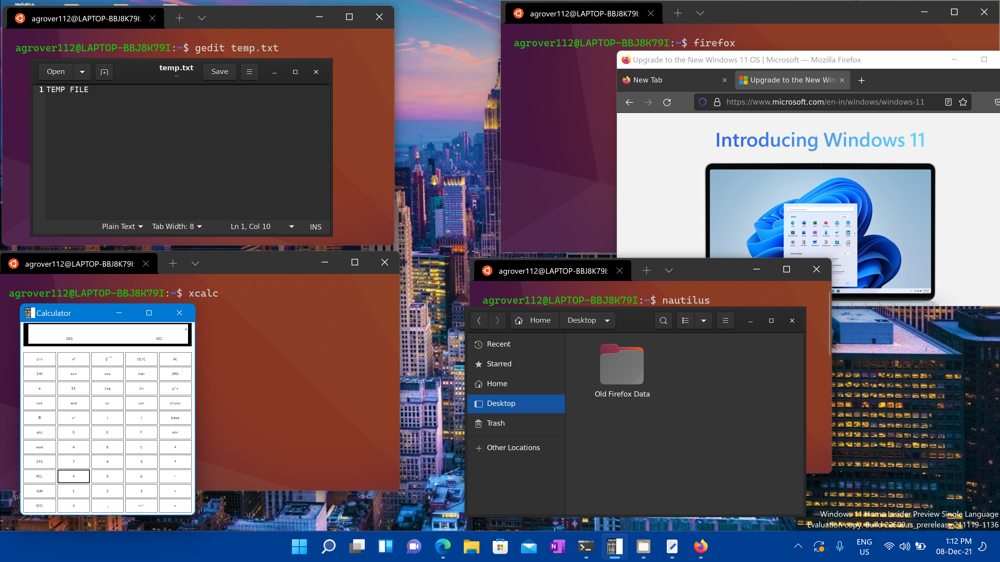

# Run Linux GUI apps on the Windows Subsystem for Linux

You can now preview Windows Subsystem for Linux (WSL) support for running Linux GUI applications (X11 and Wayland) on Windows in a fully integrated desktop experience.

WSL 2 enables Linux GUI applications to feel native and natural to use on Windows.

- Launch Linux apps from the Windows Start menu
- Pin Linux apps to the Windows task bar
- Use alt-tab to switch between Linux and Windows apps
- Cut + Paste across Windows and Linux apps

You can now integrate both Windows and Linux applications into your workflow for a seamless desktop experience.



## Install support for Linux GUI apps

### Prerequisites

- You will need to be on **Windows 11 Build 22000 or later** to access this feature.

- **Installed driver for vGPU**

    To run Linux GUI apps, you should first install the driver matching your system below. This will enable you to use a virtual GPU (vGPU) so you can benefit from hardware accelerated OpenGL rendering.

  - [**Intel** GPU driver for WSL](https://www.intel.com/content/www/us/en/download/19344/intel-graphics-windows-dch-drivers.html)
  - [**AMD** GPU driver for WSL](https://www.amd.com/en/support/kb/release-notes/rn-rad-win-wsl-support)
  - [**NVIDIA** GPU driver for WSL](https://developer.nvidia.com/cuda/wsl)

### Fresh install - No prior WSL installation

If you have not already done so, [install WSL](../install.md) and set up a user name and password for your Linux distribution.

1. Open a command prompt with administrator privileges.

    *Select **Start**, type **PowerShell**, right-click **Windows PowerShell**, and then select **Run as administrator**.*

2. Run this command and reboot your machine when prompted:

    ```powershell
    wsl --install -d Ubuntu
    ```

3. Once your machine has finished rebooting, installation will continue and you will be asked to enter a username and password. This will be your Linux credential for the Ubuntu distribution.

You're now ready to begin using Linux GUI apps on WSL!

### Existing WSL install

If you already have WSL installed on your machine, you can update to the latest version that includes Linux GUI support by running the update command from an elevated command prompt.

1. Select **Start**, type **PowerShell**, right-click **Windows PowerShell**, and then select **Run as administrator**.

2. Enter the WSL update command:

    ```powershell
    wsl --update
    ```

3. You will need to restart WSL for the update to take effect. You can restart WSL by running the shutdown command in PowerShell.

    ```powershell
    wsl --shutdown
    ```

> [!NOTE]
> Linux GUI apps are only supported with WSL 2 and will not work with a Linux distribution configured for WSL 1. Read about [how to change your distribution from WSL 1 to WSL 2](../basic-commands.md#set-wsl-version-to-1-or-2).

## Run Linux GUI apps

You can run the following commands from your Linux terminal to download and install these popular Linux applications. If you are using a different distribution than Ubuntu, it may use a different package manager than apt. Once the Linux application is installed, you can find it in your **Start** menu under the distribution name. For example: `Ubuntu -> Microsoft Edge`.

> [!NOTE]
> Support for GUI apps on WSL does not provide a full desktop experience. It relies on Windows desktop, so installing desktop-focused tools or apps may not be supported. To request additional support, you can file an issue in the [WSLg repo on GitHub](https://github.com/microsoft/wslg/issues).

### Update the packages in your distribution

```bash
sudo apt update
```

### Install Gedit

Gedit is the default text editor of the GNOME desktop environment.

```bash
sudo apt install gedit -y
```

To launch your bashrc file in the editor, enter: `gedit ~/.bashrc`

### Install GIMP

GIMP is a free and open-source raster graphics editor used for image manipulation and image editing, free-form drawing, transcoding between different image file formats, and more specialized tasks.

```bash
sudo apt install gimp -y
```

To launch, enter: `gimp`

### Install Nautilus

Nautilus, also known as GNOME Files, is the file manager for the GNOME desktop. (Similar to Windows File Explorer).

```bash
sudo apt install nautilus -y
```

To launch, enter: `nautilus`

### Install VLC

VLC is a free and open source cross-platform multimedia player and framework that plays most multimedia files.

```bash
sudo apt install vlc -y
```

To launch, enter: `vlc`

### Install X11 apps

X11 is the Linux windowing system and this is a miscellaneous collection of apps and tools that ship with it, such as the xclock, xcalc calculator, xclipboard for cut and paste, xev for event testing, etc. See the [x.org docs](https://www.x.org/wiki/UserDocumentation/GettingStarted/) for more info.

```bash
sudo apt install x11-apps -y
```

To launch, enter the name of the tool you would like to use. For example:

- `xcalc`, `xclock`, `xeyes`

### Install Google Chrome for Linux

To install the Google Chrome for Linux:

1. Change directories into the temp folder: `cd /tmp`
2. Use wget to download it: `sudo wget https://dl.google.com/linux/direct/google-chrome-stable_current_amd64.deb`
3. Get the current stable version: `sudo dpkg -i google-chrome-stable_current_amd64.deb`
4. Fix the package: `sudo apt install --fix-broken -y`
5. Configure the package: `sudo dpkg -i google-chrome-stable_current_amd64.deb`

To launch, enter: `google-chrome`

### Install Microsoft Teams for Linux

To install Microsoft Teams for Linux:

1. Change directories into the temp folder: `cd /tmp`
2. Use curl to download the package: `sudo curl -L -o "./teams.deb" "https://teams.microsoft.com/downloads/desktopurl?env=production&plat=linux&arch=x64&download=true&linuxArchiveType=deb"`
3. Use apt to install it: `sudo apt install ./teams.deb -y`

To launch, enter: `teams`

### Install Microsoft Edge browser for Linux

Find information on how to [install the Microsoft Edge browser for Linux using the command line on the Edge Insider site](https://www.microsoftedgeinsider.com/download/?platform=linux-deb). Select **Get instructions** under the Command line installation section of the page.

To launch, enter: `microsoft-edge`
