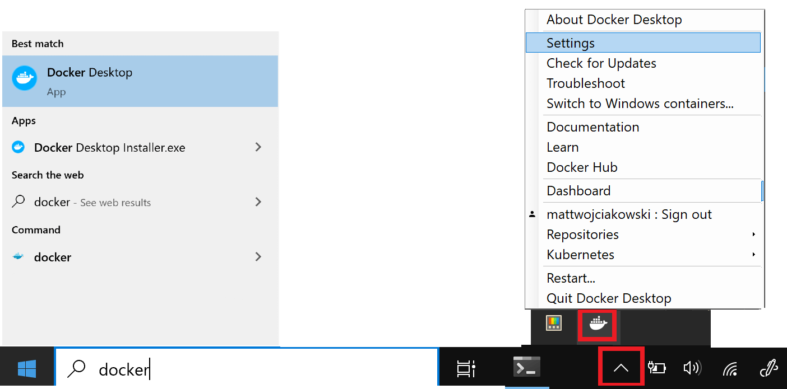
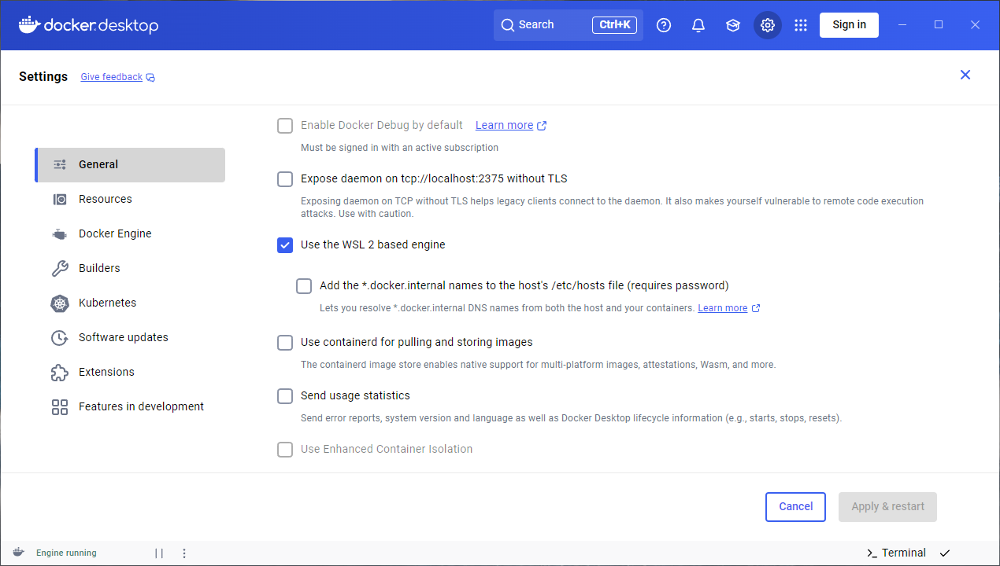
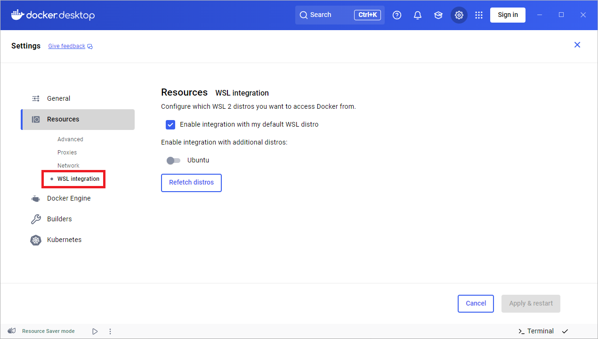
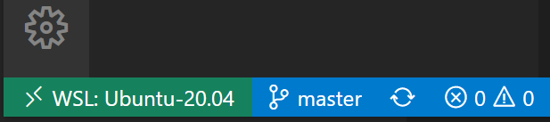
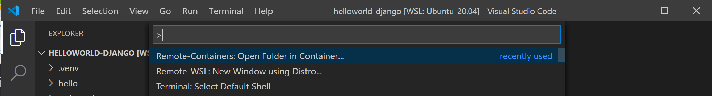
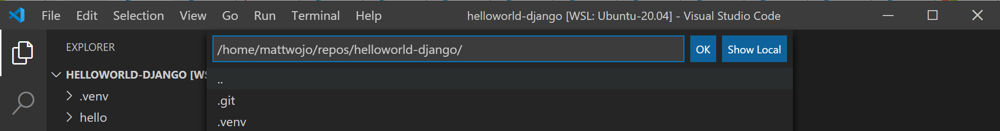
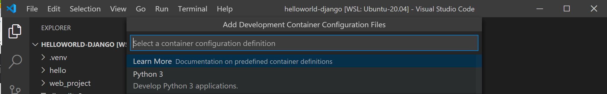
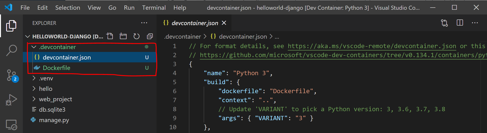
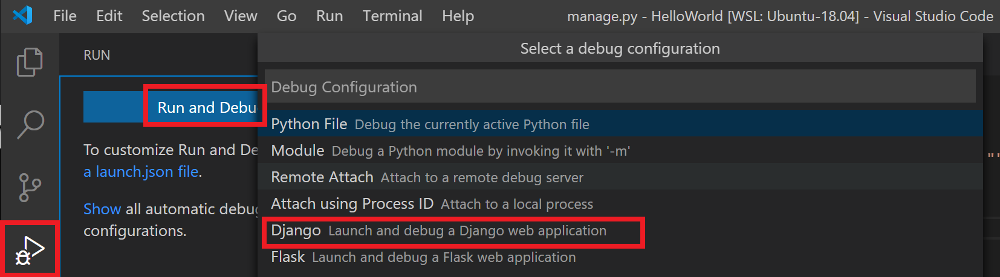
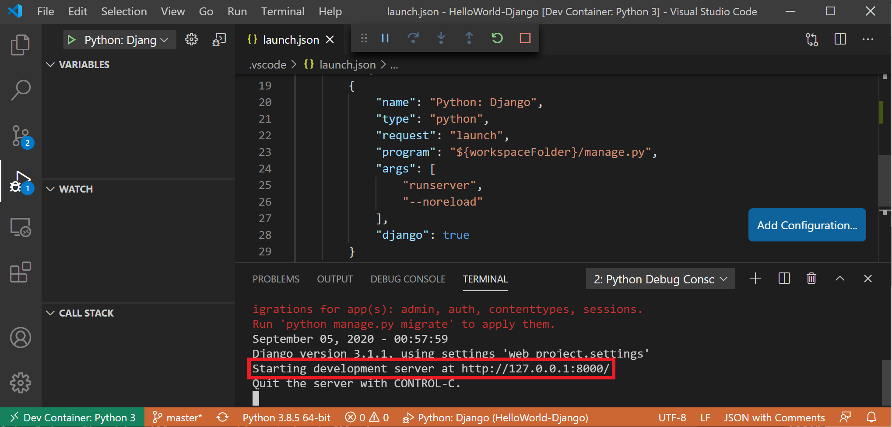

# Get started with Docker remote containers on WSL 2

This step-by-step guide will help you get started developing with remote containers by **setting up Docker Desktop for Windows with WSL 2** (Windows Subsystem for Linux, version 2).

Docker Desktop for Windows provides a development environment for building, shipping, and running dockerized apps. By enabling the WSL 2 based engine, you can run both Linux and Windows containers in Docker Desktop on the same machine. (Docker Desktop is free for personal use and small businesses, for info on Pro, Team, or Business pricing, see the [Docker site FAQs](https://www.docker.com/pricing/faq)).

> [!NOTE]
> We recommend using Docker Desktop due to its [integration with Windows and Windows Subsystem for Linux](https://docs.docker.com/desktop/windows/wsl/). However, while Docker Desktop supports running both Linux and Windows containers, you can **not** run both simultaneously. To run Linux and Windows containers simultaneously, you would need to install and run a separate Docker instance in WSL. If you need to run simultaneous containers or just prefer to install a container engine directly in your Linux distribution, follow the Linux installation instructions for that container service, such as [Install Docker Engine on Ubuntu](https://docs.docker.com/engine/install/ubuntu/) or [Install Podman for running Linux containers](https://podman.io/getting-started/installation#windows).

## Overview of Docker containers

Docker is a tool used to create, deploy, and run applications using containers. Containers enable developers to package an app with all of the parts it needs (libraries, frameworks, dependencies, etc) and ship it all out as one package. Using a container ensures that the app will run the same regardless of any customized settings or previously installed libraries on the computer running it that could differ from the machine that was used to write and test the app's code. This permits developers to focus on writing code without worrying about the system that code will be run on.

Docker containers are similar to virtual machines, but don't create an entire virtual operating system. Instead, Docker enables the app to use the same Linux kernel as the system that it's running on. This allows the app package to only require parts not already on the host computer, reducing the package size and improving performance.

Continuous availability, using Docker containers with tools like [Kubernetes](/azure/aks/), is another reason for the popularity of containers. This enables multiple versions of your app container to be created at different times. Rather than needing to take down an entire system for updates or maintenance, each container (and its specific microservices) can be replaced on the fly. You can prepare a new container with all of your updates, set up the container for production, and just point to the new container once it's ready. You can also archive different versions of your app using containers and keep them running as a safety fallback if needed.

To learn more, check out [Introduction to Docker containers](/training/modules/intro-to-docker-containers/).

## Prerequisites

- WSL version 1.1.3.0 or later.
- Windows 11 64-bit: Home or Pro version 21H2 or higher, or Enterprise or Education version 21H2 or higher.
- Windows 10 64-bit (Recommended): Home or Pro 22H2 (build 19045) or higher, or Enterprise or Education 22H2 (build 19045) or higher. (Minimum): Home or Pro 21H2 (build 19044) or higher, or Enterprise or Education 21H2 (build 19044) or higher. [Update Windows](ms-settings:windowsupdate)
- 64-bit processor with [Second Level Address Translation (SLAT)](https://en.wikipedia.org/wiki/Second_Level_Address_Translation).
- 4GB system RAM.
- Enable hardware virtualization in BIOS.
- [Install WSL and set up a user name and password for your Linux distribution running in WSL 2](../install.md).
- [Install Visual Studio Code](https://code.visualstudio.com/download) *(optional)*. This will provide the best experience, including the ability to code and debug inside a remote Docker container and connected to your Linux distribution.
- [Install Windows Terminal](/windows/terminal/get-started) *(optional)*. This will provide the best experience, including the ability to customize and open multiple terminals in the same interface (including Ubuntu, Debian, PowerShell, Azure CLI, or whatever you prefer to use).
- [Sign up for a Docker ID at Docker Hub](https://hub.docker.com/signup) *(optional)*.
- See the [Docker Desktop license agreement](https://docs.docker.com/subscription/#docker-desktop-license-agreement) for updates on the terms of use.

For more information, see the [Docker docs System requirements to Install Docker Desktop on Windows](https://docs.docker.com/desktop/install/windows-install/).

To learn how to install Docker on Windows Server, see [Get started: Prep Windows for containers](/virtualization/windowscontainers/quick-start/set-up-environment).

> [!NOTE]
> WSL can run distributions in both WSL version 1 or WSL 2 mode. You can check this by opening PowerShell and entering: `wsl -l -v`. Ensure that the your distribution is set to use WSL 2 by entering: `wsl --set-version  <distro> 2`. Replace `<distro>` with the distro name (e.g. Ubuntu 18.04).
> 
> In WSL version 1, due to fundamental differences between Windows and Linux, the Docker Engine couldn't run directly inside WSL, so the Docker team developed an alternative solution using Hyper-V VMs and LinuxKit. However, since WSL 2 now runs on a Linux kernel with full system call capacity, Docker can fully run in WSL 2. This means that Linux containers can run natively without emulation, resulting in better performance and interoperability between your Windows and Linux tools.

## Install Docker Desktop

With the WSL 2 backend supported in Docker Desktop for Windows, you can work in a Linux-based development environment and build Linux-based containers, while using Visual Studio Code for code editing and debugging, and running your container in the Microsoft Edge browser on Windows.

To install Docker (after already [installing WSL](../install.md)):

1. Download [Docker Desktop](https://docs.docker.com/docker-for-windows/wsl/#download) and follow the installation instructions.

2. Once installed, start Docker Desktop from the Windows Start menu, then select the Docker icon from the hidden icons menu of your taskbar. Right-click the icon to display the Docker commands menu and select "Settings".
    

3. Ensure that "Use the WSL 2 based engine" is checked in **Settings** > **General**.
    

4. Select from your installed WSL 2 distributions which you want to enable Docker integration on by going to: **Settings** > **Resources** > **WSL Integration**.
    

5. To confirm that Docker has been installed, open a WSL distribution (e.g. Ubuntu) and display the version and build number by entering: `docker --version`

6. Test that your installation works correctly by running a simple built-in Docker image using: `docker run hello-world`

> [!TIP]
> Here are a few helpful Docker commands to know:
>
> - List the commands available in the Docker CLI by entering: `docker`
> - List information for a specific command with: `docker <COMMAND> --help`
> - List the docker images on your machine (which is just the hello-world image at this point), with: `docker image ls --all`
> - List the containers on your machine, with: `docker container ls --all` or `docker ps -a` (without the -a show all flag, only running containers will be displayed)
> - List system-wide information regarding the Docker installation, including statistics and resources (CPU & memory) available to you in the WSL 2 context, with: `docker info`

## Develop in remote containers using VS Code

To get started developing apps using Docker with WSL 2, we recommend using VS Code, along with the WSL, Dev Containers, and Docker extensions.

- [Install the VS Code WSL extension](https://marketplace.visualstudio.com/items?itemName=ms-vscode-remote.remote-wsl). This extension enables you to open your Linux project running on WSL in VS Code (no need to worry about pathing issues, binary compatibility, or other cross-OS challenges).

- [Install the VS Code Dev Containers extension](https://marketplace.visualstudio.com/items?itemName=ms-vscode-remote.remote-containers). This extension enables you to open your project folder or repo inside of a container, taking advantage of Visual Studio Code's full feature set to do your development work within the container.

- [Install the VS Code Docker extension](https://marketplace.visualstudio.com/items?itemName=ms-azuretools.vscode-docker). This extension adds the functionality to build, manage, and deploy containerized applications from  inside VS Code. (You need the Dev Containers extension to actually use the container as your dev environment.)

Let's use Docker to create a development container for an existing app project.

1. For this example, I'll use the source code from my [Hello World tutorial for Django](/windows/python/web-frameworks#hello-world-tutorial-for-django) in the Python development environment set up docs. You can skip this step if you prefer to use your own project source code. To download my HelloWorld-Django web app from GitHub, open a WSL terminal (Ubuntu for example) and enter: `git clone https://github.com/mattwojo/helloworld-django.git`

    > [!NOTE]
    > Always store your code in the same file system that you're using tools in. This will result in faster file access performance. In this example, we are using a Linux distro (Ubuntu) and want to store our project files on the WSL file system `\\wsl\`. Storing project files on the Windows file system would significantly slow things down when using Linux tools in WSL to access those files.

2. From your WSL terminal, change directories to the source code folder for this project:

    ```bash
    cd helloworld-django
    ```

3. Open the project in VS Code running on the local WSL extension server by entering:

    ```bash
    code .
    ```

    Confirm that you are connected to your WSL Linux distro by checking the green remote indicator in the bottom-left corner of your VS Code instance.

    

4. From the VS Code command palette (Ctrl + Shift + P), enter: **Dev Containers: Reopen in Container** as we are using a folder already opened using the WSL extension. Alternatively, use **Dev Containers: Open Folder in Container...** to choose a WSL folder using the local `\\wsl$` share (from the Windows side). See the Visual Studio Code [Quick start: Open an existing folder in a container](https://code.visualstudio.com/docs/devcontainers/containers#_quick-start-open-an-existing-folder-in-a-container) for more details. If these commands don't display as you begin to type, check to ensure that you've installed the Dev Containers extension linked above. 

    

5. Select the project folder that you wish to containerize. In my case, this is `\\wsl\Ubuntu-20.04\home\mattwojo\repos\helloworld-django\`

    

6. A list of container definitions will appear, since there is no dev container configuration in the project folder (repo) yet. The list of container configuration definitions that appears is filtered based on your project type. For my Django project, I'll select Python 3.

    

7. A new instance of VS Code will open, begin building our new image, and once the build completed, will start our container. You will see that a new `.devcontainer` folder has appeared with container configuration information inside a `Dockerfile` and `devcontainer.json` file.  

    

8. To confirm that your project is still connected to both WSL and within a container, open the VS Code integrated terminal (Ctrl + Shift + ~). Check the operating system by entering: `uname` and the Python version with: `python3 --version`. You can see that the uname came back as "Linux", so you are still connected to the WSL 2 engine, and Python version number will be based on the container config that may differ from the Python version installed on your WSL distribution.

9. To run and debug your app inside of the container using Visual Studio Code, first open the **Run** menu (Ctrl+Shift+D or select the tab on the far left menu bar). Then select **Run and Debug** to select a debug configuration and choose the configuration that best suits your project (in my example, this will be "Django"). This will create a `launch.json` file in the `.vscode` folder of your project with instructions on how to run your app.

    

10. From inside VS Code, select **Run** > **Start debugging** (or just press the **F5** key). This will open a terminal inside VS Code and you should see a result saying something like: "Starting development server at http://127.0.0.1:8000/ Quit the server with CONTROL-C." Hold down the Control key and select the address displayed to open your app in your default web browser and see your project running inside of its container.

    

You have now successfully configured a remote development container using Docker Desktop, powered by the WSL 2 backend, that you can code in, build, run, deploy, or debug using VS Code!

## Troubleshooting

### WSL docker context deprecated

If you were using an  early Tech Preview of Docker for WSL, you may have a Docker context called "wsl" that is now deprecated and no longer used. You can check with the command: `docker context ls`. You can remove this "wsl" context to avoid errors with the command: `docker context rm wsl` as you want to use the default context for both Windows and WSL2.

Possible errors you might encounter with this deprecated wsl context include: `docker wsl open //./pipe/docker_wsl: The system cannot find the file specified.` or `error during connect: Get http://%2F%2F.%2Fpipe%2Fdocker_wsl/v1.40/images/json?all=1: open //./pipe/docker_wsl: The system cannot find the file specified.`

For more on this issue, see [How to set up Docker within Windows System for Linux (WSL2) on Windows 10](https://www.hanselman.com/blog/HowToSetUpDockerWithinWindowsSystemForLinuxWSL2OnWindows10.aspx).

### Trouble finding docker image storage folder

Docker creates two distro folders to store data:
- \\wsl$\docker-desktop
- \\wsl$\docker-desktop-data

You can find these folders by opening your WSL Linux distribution and entering: `explorer.exe .` to view the folder in Windows File Explorer. Enter: `\\wsl\<distro name>\mnt\wsl` replacing `<distro name>` with the name of your distribution (ie. Ubuntu-20.04) to see these folders.

Find more on locating docker storage locations in WSL, see this [issue from the WSL repo](https://github.com/microsoft/WSL/issues/4176) or this [StackOverflow post](https://stackoverflow.com/questions/62380124/where-docker-image-is-stored-with-docker-desktop-for-windows).

For more help with general troubleshooting issues in WSL, see the [Troubleshooting](../troubleshooting.md) doc.

## Additional resources

- [Docker docs: Best practices for Docker Desktop with WSL 2](https://docs.docker.com/docker-for-windows/wsl/#best-practices)
- [Feedback for Docker Desktop for Windows: File an issue](https://github.com/docker/for-win/issues)
- [VS Code Blog: Guidelines for choosing a development environment](https://code.visualstudio.com/docs/containers/choosing-dev-environment#_guidelines-for-choosing-a-development-environment)
- [VS Code Blog: Using Docker in WSL 2](https://code.visualstudio.com/blogs/2020/03/02/docker-in-wsl2)
- [VS Code Blog: Using Remote Containers in WSL 2](https://code.visualstudio.com/blogs/2020/07/01/containers-wsl)
- [Hanselminutes Podcast: Making Docker lovely for Developers with Simon Ferquel](https://hanselminutes.com/736/making-docker-lovely-for-developers-with-simon-ferquel)
