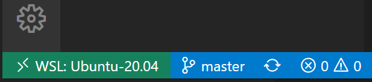

# Get started with WSL container

This step-by-step guide will help you get started building and running Linux containers on Windows using **`wslc.exe`**, the container CLI that ships built in with WSL. 

`wslc.exe` provides a familiar CLI for building, shipping, and running containerized apps.

## Overview of WSL containers

A container is a tool used to create, deploy, and run applications. Containers enable developers to package an app with all of the parts it needs (libraries, frameworks, dependencies, etc) and ship it all out as one package. Using a container ensures that the app will run the same regardless of any customized settings or previously installed libraries on the computer running it that could differ from the machine that was used to write and test the app's code. This permits developers to focus on writing code without worrying about the system that code will be run on.

## Prerequisites

- WSL installed. Run `wsl --update` to ensure you have the latest version.
- [Install Visual Studio Code](https://code.visualstudio.com/download) *(optional)*. This will provide the best experience, including the ability to code and debug your containerized projects connected to your Linux distribution.
- [Install Windows Terminal](/windows/terminal/get-started) *(optional)*. This will provide the best experience, including the ability to customize and open multiple terminals in the same interface (including Ubuntu, Debian, PowerShell, Azure CLI, or whatever you prefer to use).

## Install and verify wslc

`wslc.exe` is included with WSL, so there's no separate engine to install. To make sure you have a version of WSL that includes it:

1. [Install WSL](../install.md) if you haven't already, then update to the latest version by opening PowerShell and entering:

    ```powershell
    wsl --update
    ```

2. Confirm that `wslc.exe` is available and check its version by entering:

    ```powershell
    wslc version
    ```

3. Test that everything works correctly by running a simple built-in image. The image is automatically pulled if it isn't already present locally:

    ```powershell
    wslc run --rm hello-world
    ```

    You should see a "Hello" message confirming that your installation appears to be working correctly.

> [!TIP]
> Here are a few helpful `wslc` commands to know:
>
> - List the commands available in the `wslc` CLI by entering: `wslc --help`
> - List information for a specific command with: `wslc <COMMAND> --help`
> - List the images on your machine, with: `wslc image list`
> - List the running containers on your machine, with: `wslc container list` or list all containers (including stopped ones) with: `wslc container list --all`
> - Display resource usage statistics for your running containers, with: `wslc stats`

## Run your first containers

With `wslc.exe` you can pull images, run containers in the foreground or background, publish ports, and interact with running containers. Try a few of these commands from PowerShell:

```powershell
# Run a command in a throwaway container
wslc run --rm -it ubuntu:latest bash -c "echo Hello world from WSL container!"

# Run a web server in the background and publish port 8080 to the container's port 80
wslc run -d --rm -p 8080:80 --name web nginx

# Request content from the running web server
curl localhost:8080

# List the running container
wslc container list

# Run an additional command inside the running container
wslc exec web cat /etc/os-release

# Stop the container
wslc container stop web
```

Because the `nginx` container was started with `--rm`, it is removed automatically once it stops.

## Build and run your own container image

To get started developing apps with `wslc.exe`, we recommend using VS Code, along with the [WSL extension](https://marketplace.visualstudio.com/items?itemName=ms-vscode-remote.remote-wsl) so you can edit your project on the Linux file system and run `wslc` commands from the integrated terminal.

Let's build a container image for an existing app project.

1. For this example, we'll use the source code from the [Hello World tutorial for Django](/windows/python/web-frameworks#hello-world-tutorial-for-django) in the Python development environment set up docs. You can skip this step if you prefer to use your own project source code. To download the HelloWorld-Django web app from GitHub, open a WSL terminal (Ubuntu for example) and enter:

    ```bash
    git clone https://github.com/<username>/helloworld-django.git
    ```

    > [!NOTE]
    > Always store your code in the same file system that you're using tools in. This will result in faster file access performance. In this example, we are using a Linux distro (Ubuntu) and want to store our project files on the WSL file system `\\wsl$`. Storing project files on the Windows file system would significantly slow things down when using Linux tools in WSL to access those files.

2. From your WSL terminal, change directories to the source code folder for this project:

    ```bash
    cd helloworld-django
    ```

3. Open the project in VS Code running on the local WSL extension server by entering:

    ```bash
    code .
    ```

    Confirm that you are connected to your WSL Linux distro by checking the green remote indicator in the bottom-left corner of your VS Code instance.

    

4. Add a `Containerfile` to the root of your project that describes how to build the image. For the Django example, a minimal `Containerfile` might look like this:

    ```dockerfile
    FROM python:3
    WORKDIR /app
    COPY requirements.txt .
    RUN pip install --no-cache-dir -r requirements.txt
    COPY . .
    EXPOSE 8000
    CMD ["python", "manage.py", "runserver", "0.0.0.0:8000"]
    ```

5. From the project folder (the directory containing your `Containerfile`), build the image with `wslc build`, tagging it with a name you can reference later:

    ```powershell
    wslc build -t helloworld-django .
    ```

6. Confirm that the image was created by listing your images:

    ```powershell
    wslc image list
    ```

7. Run your newly built image as a container, publishing the app's port so you can reach it from Windows:

    ```powershell
    wslc run -d --rm -p 8000:8000 --name django helloworld-django
    ```

8. To confirm that your container is running, list the running containers and check its logs:

    ```powershell
    wslc container list
    wslc container logs django
    ```

9. Open a browser on Windows and navigate to `http://localhost:8000/` to see your app running inside its container. You can also confirm that the app is running on Linux by executing a command inside the container:

    ```powershell
    wslc exec django uname
    ```

    The `uname` result of "Linux" confirms that the container is running on the WSL 2 Linux kernel.

10. When you're finished, stop the container:

    ```powershell
    wslc container stop django
    ```

You have now successfully built and run a Linux container on Windows using `wslc.exe`, powered by WSL 2, that you can build, run, deploy, or debug alongside VS Code!

## Troubleshooting

### Inspect a container or image

When a container behaves unexpectedly, the `inspect` and `logs` commands provide detailed information to help you diagnose the issue:

```powershell
wslc container inspect <container-id>
wslc container logs <container-id>
wslc image inspect <image>
```

### Reclaim disk space

Images and stopped containers consume disk space. To clean up resources you're no longer using:

```powershell
# Remove all stopped containers
wslc container prune

# Remove unused images
wslc image prune
```

For more help with general troubleshooting issues in WSL, see the [Troubleshooting](../troubleshooting.md) doc.

## Additional resources

- [WSL container overview](../wsl-container.md)
- [WSL container API samples](https://aka.ms/wslc-samples)
- [Microsoft Learn: Introduction to containers](/training/modules/intro-to-docker-containers/)
- [VS Code Docs: Developing in WSL](https://code.visualstudio.com/docs/remote/wsl)
