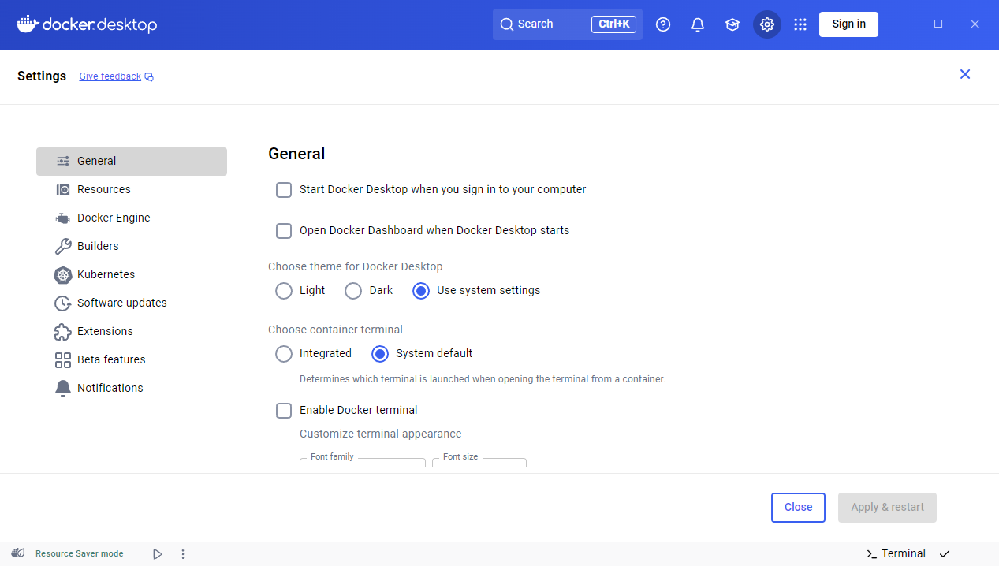
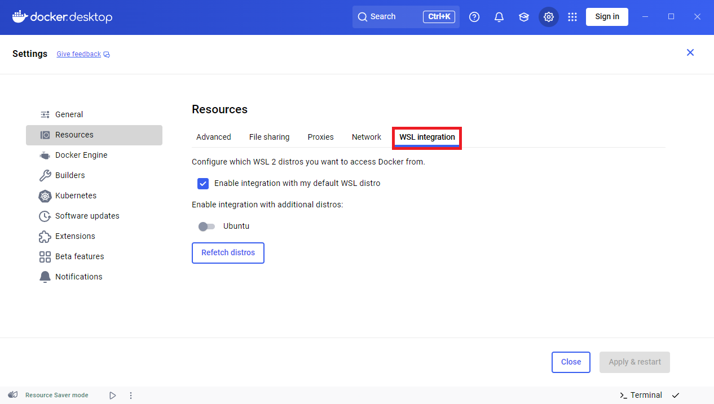

# Get started with Docker remote containers on WSL 2

This step-by-step guide will help you get started developing with remote containers by setting up Docker on WSL 2 (Windows Subsystem for Linux, version 2). By installing Docker Desktop running on WSL 2, you can share your Docker context across Windows and Linux on the same machine.

## Prerequisites

- Ensure your machine is running Windows 10, [updated to version 2004](ms-settings:windowsupdate), **Build 19041** or higher.
- [Enable WSL, update to WSL 2, install a Linux distribution, and set that distro to WSL 2](https://docs.microsoft.com/windows/wsl/install-win10). WSL can run distributions in both WSL version 1 or WSL 2 mode. You can check this by opening PowerShell and entering: `wsl -l -v`. Ensure that the your distribution is set to use WSL 2 by entering: `wsl --set-version  <distro> 2`. Replace `<distro>` with the distro name (e.g. Ubuntu 18.04).
- [Download and install the Linux kernel update package](https://docs.microsoft.com/windows/wsl/wsl2-kernel).
- [Install Visual Studio Code](https://code.visualstudio.com/download).
- [Install the VS Code Remote-WSL extension](https://marketplace.visualstudio.com/items?itemName=ms-vscode-remote.remote-wsl).

## Overview of Docker containers

**Docker** is a tool used to create, deploy, and run applications using containers. Containers enable developers to package an app with all of the parts it needs (libraries, frameworks, dependencies, etc) and ship it all out as one package. Using a container ensures that the app will run the same regardless of any customized settings or previously installed libraries on the computer running it that could differ from the machine that was used to write and test the app's code. This permits developers to focus on writing code without worrying about the system that code will be run on.

Docker containers are similar to virtual machines, but don't create an entire virtual operating system. Instead, Docker enables the app to use the same Linux kernel as the system that it's running on. This allows the app package to only require parts not already on the host computer, reducing the package size and improving performance.

Continuous availability, using Docker containers with tools like [Kubernetes](https://docs.microsoft.com/azure/aks/), is another reason for the popularity of containers. This enables multiple versions of your app container to be created at different times. Rather than needing to take down an entire system for updates or maintenance, each container (and it's specific microservices) can be replaced on the fly. You can prepare a new container with all of your updates, set up the container for production, and just point to the new container once it's ready. You can also archive different versions of your app using containers and keep them running as a safety fallback if needed.

To learn more, checkout the [Introduction to Docker containers](https://docs.microsoft.com/learn/modules/intro-to-docker-containers/) on Microsoft Learn.

## Install Docker Desktop

WSL 2 runs on a full Linux kernel, allowing Linux containers to run natively without emulation and Docker Desktop to use WSL 2 instead of Hyper-V to provide better performance and interoperability between your Windows and Linux tools. Docker Desktop will prompt you to enable WSL 2 during installation.

> [!NOTE]
> If you don't yet have a Docker ID, you may want to set one up by visiting: https://hub.docker.com/signup.

1. Download [Docker Desktop](https://docs.docker.com/docker-for-windows/wsl/#download) and follow the installation instructions.

2. Once installed, start Docker Desktop from the Windows Start menu, then select the Docker icon from the hidden icons menu of your taskbar. Right-click the icon to display the Docker commands menu and select "Dashboard". Ensure that "Use the WSL 2 based engine" is checked in **Settings** > **General**.
    

3. From the dashboard, go to **Settings** > **Resources** > **WSL Integration**.
    

4. 

## Additional resources

- [How does the Docker architecture work with WSL](https://code.visualstudio.com/blogs/2020/03/02/docker-in-wsl2#_how-it-works)
- 
- 
- [Hanselminutes Podcast: Making Docker lovely for Developers with Simon Ferquel](https://hanselminutes.com/736/making-docker-lovely-for-developers-with-simon-ferquel)
- 