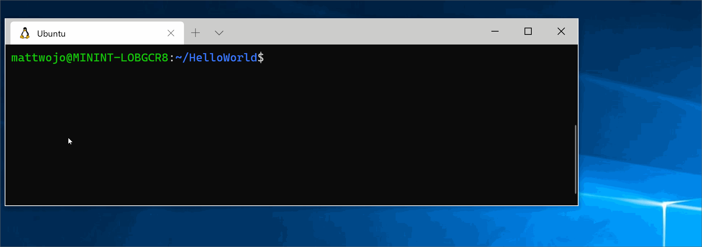
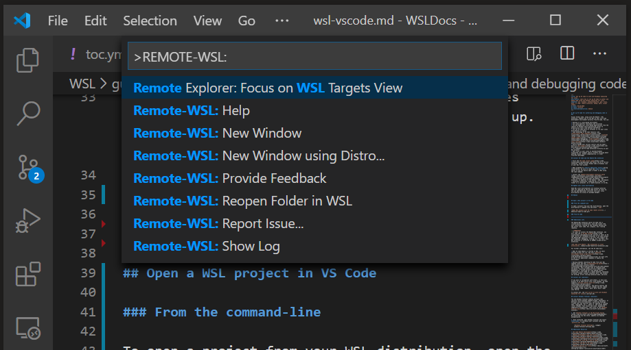
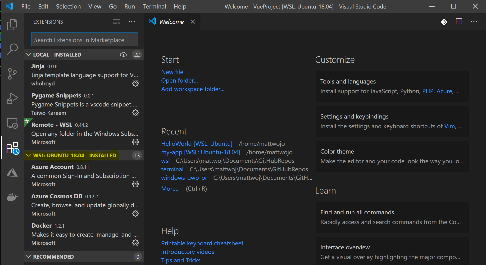

# Get started using Visual Studio Code with Windows Subsystem for Linux

Visual Studio Code, along with the WSL extension, enables you to use WSL as your full-time development environment directly from VS Code. You can:

* develop in a Linux-based environment
* use Linux-specific toolchains and utilities
* run and debug your Linux-based applications from the comfort of Windows while maintaining access to productivity tools like Outlook and Office
* use the VS Code built-in terminal to run your Linux distribution of choice
* take advantage of VS Code features like [Intellisense code completion](https://code.visualstudio.com/docs/editor/intellisense), [linting](https://code.visualstudio.com/docs/python/linting), [debug support](https://code.visualstudio.com/docs/nodejs/nodejs-debugging), [code snippets](https://code.visualstudio.com/docs/editor/userdefinedsnippets), and [unit testing](https://code.visualstudio.com/docs/python/testing)
* easily manage your version control with VS Code's built-in [Git support](https://code.visualstudio.com/docs/editor/versioncontrol#_git-support)
* run commands and VS Code extensions directly on your WSL projects
* edit files in your Linux or mounted Windows filesystem (for example /mnt/c) without worrying about pathing issues, binary compatibility, or other cross-OS challenges

## Install VS Code and the WSL extension

* Visit the [VS Code install page](https://code.visualstudio.com/download) and select the 32 or 64 bit installer. Install Visual Studio Code on Windows (not in your WSL file system).

* When prompted to **Select Additional Tasks** during installation, be sure to check the **Add to PATH** option so you can easily open a folder in WSL using the code command.

* Install the [Remote Development extension pack](https://marketplace.visualstudio.com/items?itemName=ms-vscode-remote.vscode-remote-extensionpack). This extension pack includes the WSL extension, in addition to the Remote - SSH, and Dev Containers extensions, enabling you to open any folder in a container, on a remote machine, or in WSL.

> [!IMPORTANT]
> In order to install the WSL extension, you will need the [1.35 May release](https://code.visualstudio.com/updates/v1_35) version or later of VS Code. We do not recommend using WSL in VS Code without the WSL extension as you will lose support for auto-complete, debugging, linting, etc. Fun fact: this WSL extension is installed in $HOME/.vscode/extensions (enter the command `ls $HOME\.vscode\extensions\` in PowerShell).

## Update your Linux distribution

Some WSL Linux distributions are lacking libraries that are required by the VS Code server to start up. You can add additional libraries into your Linux distribution by using its package manager.

For example, to update Debian or Ubuntu, use:

```bash
sudo apt-get update
```

To add wget (to retrieve content from web servers) and ca-certificates (to allow SSL-based applications to check for the authenticity of SSL connections), enter:

```bash
sudo apt-get install wget ca-certificates
```

## Open a WSL project in Visual Studio Code

### From the command-line

To open a project from your WSL distribution, open the distribution's command line and enter: `code .`



### From VS Code

You can also access more VS Code WSL options by using the shortcut: `CTRL+SHIFT+P` in VS Code to bring up the command palette. If you then type `WSL` you will see a list of the options available, allowing you to reopen the folder in a WSL session, specify which distribution you want to open in, and more.



## Extensions inside of VS Code WSL

The WSL extension splits VS Code into a “client-server” architecture, with the client (the user interface) running on your Windows machine and the server (your code, Git, plugins, etc) running "remotely" in your WSL distribution.

When running the WSL extension, selecting the 'Extensions' tab will display a list of extensions split between your local machine and your WSL distribution.

Installing a local extension, like a [theme](https://marketplace.visualstudio.com/search?target=VSCode&category=Themes&sortBy=Installs),  only needs to be installed once.

Some extensions, like the [Python extension](https://marketplace.visualstudio.com/items?itemName=ms-python.python) or anything that handles things like linting or debugging, must be installed separately on each WSL distribution. VS Code will display a warning icon ⚠, along with a green "Install in WSL" button, if you have an extension locally installed that is not installed on your WSL distribution.



For further information, see the VS Code docs:

* When VS Code is started in WSL, no shell startup scripts are run. See this [advanced environment setup script article](https://code.visualstudio.com/docs/remote/wsl#_advanced-environment-setup-script) for more info on how to run additional commands or modify the environment.

* Having problems launching VS Code from your WSL command line? This [troubleshooting guide](https://code.visualstudio.com/docs/remote/troubleshooting#_fixing-problems-with-the-code-command-not-working) includes tips on changing path variables, resolving extension errors about missing dependencies, resolving Git line ending issues, installing a local VSIX on a remote machine, launching a browser window, blocker localhost port, web sockets not working, errors storing extension data, and more.

## Install Git (optional)

If you plan to collaborate with others, or host your project on an open-source site (like GitHub), VS Code supports [version control with Git](https://code.visualstudio.com/docs/editor/versioncontrol#_git-support). The Source Control tab in VS Code tracks all of your changes and has common Git commands (add, commit, push, pull) built right into the UI.

To install Git, see [set up Git to work with Windows Subsystem for Linux](./wsl-git.md).

## Install Windows Terminal (optional)

The new Windows Terminal enables multiple tabs (quickly switch between Command Prompt, PowerShell, or multiple Linux distributions), custom key bindings (create your own shortcut keys for opening or closing tabs, copy+paste, etc.), emojis ☺, and custom themes (color schemes, font styles and sizes, background image/blur/transparency). Learn more in the [Windows Terminal docs](/windows/terminal).

1. Get [Windows Terminal in the Microsoft Store](https://www.microsoft.com/store/apps/9n0dx20hk701): By installing via the store, updates are handled automatically.

2. Once installed, open Windows Terminal and select **Settings** to customize your terminal using the `profile.json` file.

## Additional Resources

* [VS Code WSL documentation](https://code.visualstudio.com/docs/remote/wsl)
* [VS Code WSL tutorial](https://code.visualstudio.com/docs/remote/wsl-tutorial)
* [Remote development tips and tricks](https://code.visualstudio.com/docs/remote/troubleshooting)
* [Using Docker with WSL 2 and VS Code](https://code.visualstudio.com/blogs/2020/03/02/docker-in-wsl2)
* [Using C++ and WSL in VS Code](https://code.visualstudio.com/docs/cpp/config-wsl)
* [Remote R Service for Linux](/visualstudio/rtvs/setting-up-remote-r-service-on-linux)

A few additional extensions you may want to consider include:

* [Keymaps from other editors](https://marketplace.visualstudio.com/search?target=VSCode&category=Keymaps&sortBy=Downloads): These extensions can help your environment feel right at home if you're transitioning from another text editor (like Atom, Sublime, Vim, eMacs, Notepad++, etc).
* [Settings Sync](https://marketplace.visualstudio.com/items?itemName=Shan.code-settings-sync): Enables you to synchronize your VS Code settings across different installations using GitHub. If you work on different machines, this helps keep your environment consistent across them.
