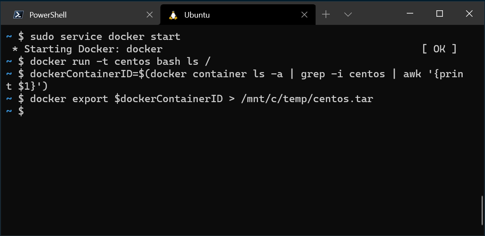

You can use any Linux distribution inside of the Windows Subsystem for Linux, even ones that aren't available in the Microsoft store. This article shows how to use CentOS as a distribution inside of WSL. 

## Get your distribution's tar file

First you'll need to obtain a tar file that contains all the Linux binaries for your distribution. This can be accomplished through a variety of ways, such as downloading a minimal root file system like what [Alpine Linux has on their downloads page](https://alpinelinux.org/downloads/). In this example we'll use Docker inside of a WSL distro to obtain this tar file for CentOS.

To do this step you'll need to have a [WSL 2 distro enabled](https://docs.microsoft.com/windows/wsl/install-win10#step-2---check-requirements-for-running-wsl-2) with [Docker](https://docs.docker.com/engine/install/ubuntu/) enabled inside of it. Then inside of your distro run these commands:

```bash
sudo service docker start
docker run -t centos bash ls /
dockerContainerID=$(docker container ls -a | grep -i centos | awk '{print $1}')
docker export $dockerContainerID > /mnt/c/temp/centos.tar
```



After this we'll have a working tar file ready to import!

## Import the distribution into WSL

To import the distribution into WSL, open PowerShell and ensure that you have a folder ready where you'd like the distribution to be stored. We'll be using the `wsl --import <DistroName> <InstallLocation> <InstallTarFile>` command. 

```PowerShell
cd C:\temp
mkdir E:\wslDistroStorage\CentOS
wsl --import CentOS E:\wslDistroStorage\CentOS .\centos.tar
```

From here you can use `wsl -l -v` to check which distros you have installed, and then use `wsl -d CentOS` to run your distro. 


## Add WSL specific components like a default user

By default when using --import, you are always started as the root user. If you'd like to have a user account you can set that up, but each set up will be slightly different depending on your distribution of choice. This example will show how to do this with the CentOS distribution described above. First open PowerShell and boot into the CentOS distro:

```PowerShell
wsl -d CentOS
```

Then we will install sudo and password setting tools into CentOS, create a user account and set it as the default user, in this example the username will be 'caloewen'. 

```bash
yum update -y && yum install passwd sudo -y
myUsername=caloewen
adduser -G wheel $myUsername
echo -e "[user]\ndefault=$myUsername" >> /etc/wsl.conf
passwd $myUsername
```

Then you can quit out of that instance, ensure that all WSL instances are terminated, and then start up your distribution again to see your new default user. In PowerShell run:

```PowerShell
wsl --shutdown
wsl -d CentOS
```

And you'll see in the example above: `[caloewen@loewen-dev]$` as the output! This lets you run your custom distro with the same experience as a distro in the store. 


For more WSL settings that you can configure please check out our [Launch commands & configurations](https://docs.microsoft.com/windows/wsl/wsl-config#configure-per-distro-launch-settings-with-wslconf) doc page.

## Finished!

From there you should be able to fully access your new distro and use it however you like.

You can also create your own WSL distro packaged as a UWP app that will behave exactly like a WSL distro seen in the Microsoft Store, the instructions to do this are on our [Build a custom distro](https://docs.microsoft.com/windows/wsl/build-custom-distro) doc page.