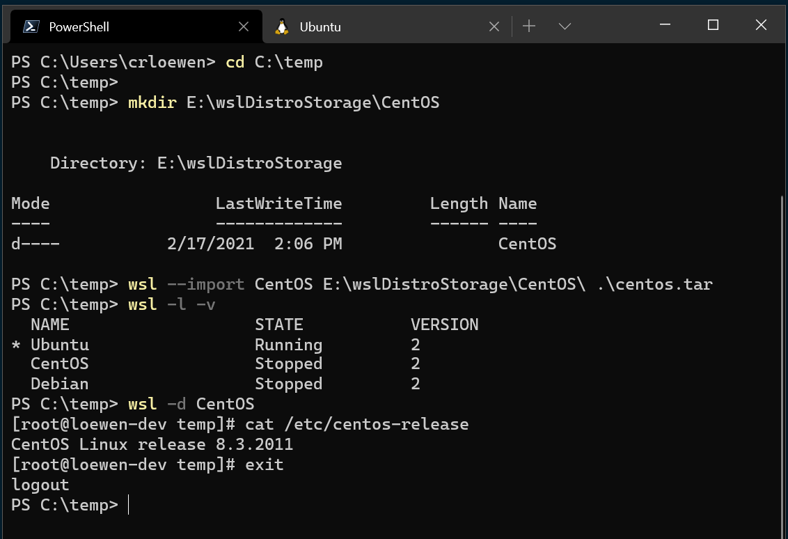
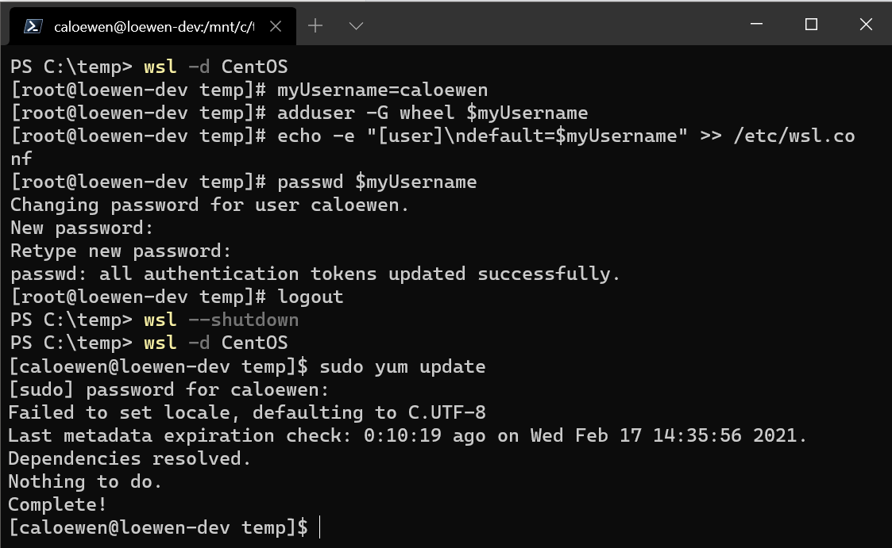

# Import any Linux distribution to use with WSL

You can use any Linux distribution inside of the Windows Subsystem for Linux (WSL), even if it is not available in the [Microsoft Store](https://www.microsoft.com/en-us/search/shop/apps?q=linux), by importing it with a tar file. 

This article shows how to import the Linux distribution, [CentOS](https://www.centos.org/), for use with WSL by obtaining its tar file using a Docker container. This process can be applied to import any Linux distribution.

## Obtain a tar file for the distribution

First you'll need to obtain a tar file that contains all the Linux binaries for the distribution.

You can obtain a tar file in a variety of ways, two of which include:

- Download a provided tar file. You can find an example for Alpine in the "Mini Root Filesystem" section of the [Alpine Linux downloads](https://alpinelinux.org/downloads/) site.
- Find a Linux distribution container and export an instance as a tar file. The example below will show this process using the [CentOS container](https://hub.docker.com/_/centos).

### Obtaining a tar file for CentOS example

In this example, we'll use Docker inside of a WSL distribution to obtain the tar file for CentOS.

#### Prerequisites

- You must have [WSL enabled with a Linux distribution installed running WSL 2](./install-manual.md).
- You must have [Docker Desktop for Windows installed with the WSL 2 engine enabled and integration checked](./tutorials/wsl-containers.md#install-docker-desktop) See the [Docker Desktop license agreement](https://docs.docker.com/subscription/#docker-desktop-license-agreement) for updates on the terms of use.

#### Export the tar from a container

1. Open the command line (Bash) for a Linux distribution that you've already installed from the Microsoft Store (Ubuntu in this example).

2. Start the Docker service:

    ```bash
    sudo service docker start
    ```

3. Run the CentOS container inside Docker:

    ```bash
    docker run -t centos bash ls /
    ```

4. Grab the CentOS container ID using grep and awk:

    ```bash
    dockerContainerID=$(docker container ls -a | grep -i centos | awk '{print $1}')
    ```

5. Export the container ID to a tar file on your mounted c-drive:

    ```bash
    docker export $dockerContainerID > /mnt/c/temp/centos.tar
    ```


This process exports the CentOS tar file from the Docker container so that we can now import it for use locally with WSL.


#### Packaging the rootfs of a Linux distribution into a tar archive

The Linux distributions such as Debian, Fedora, Gentoo, Arch, OpenSUSE and even Ubuntu, in addition to having a set of distribution installation tools, also have a set of rootfs build tools. We can use the rootfs build tools to generate a rootfs directory without the Linux kernel, and by packaging the entire rootfs directory we will get a tar archive image that conforms to the OCI standard. This compressed package is not only suitable for Linux container engines like Docker/Podman or Containerd, but also suitable as a WSL2 distribution.

Open the command line (Bash) for a Linux distribution that you've already installed from the Microsoft Store (Debian and ArchLinux in this example).

If you are using the Debian distribution, you need to install and use debootstrap to install the root filesystem to a newly created directory and package it. You can choose an open source software mirror repository that is geographically close to you and has the fastest download speed:

```bash
sudo apt-get update -y && sudo apt-get install debootstrap -y

mkdir -p bookworm

sudo debootstrap --variant=minbase --arch amd64 --include=apt-transport-https,ca-certificates,systemd,locales bookworm bookworm/ https://mirrors.tuna.tsinghua.edu.cn/debian

cd bookworm

sudo tar cJf bookworm-rootfs.tar.xz *

sudo mv bookworm-rootfs.tar.xz /mnt/c/
```

 - If you are using the ArchLinux distribution, you need to install and use pacstrap:

```bash
sudo pacman -Syyu && pacman -Syyu --noconfirm arch-install-scripts

mkdir -p rootfs

pacstrap ./rootfs base base-devel systemd

echo 'Server = https://mirrors.tuna.tsinghua.edu.cn/archlinux/$repo/os/$arch' > ./rootfs/etc/pacman.d/mirrorlist

curl -o ./rootfs/etc/pacman.conf https://gitlab.archlinux.org/archlinux/packaging/packages/pacman/-/raw/main/pacman.conf?inline=false

cd ./rootfs

rm -rf var/cache/pacman/pkg/*

tar cJf ../rootfs.tar.xz *

sudo mv rootfs.tar.xz /mnt/c/
```

 - If you are using the Fedora/RHEL/Rocky distribution, you need to install and use KIWI NG:

 > KIWI NG: https://github.com/OSInside/kiwi


## Import the tar file into WSL

Once you have a tar file ready, you can import it using the command: `wsl --import <Distro> <InstallLocation> <FileName>`.

### Importing CentOS example

To import the CentOS distribution tar file into WSL:

1. Open PowerShell and ensure that you have a folder created where you'd like the distribution to be stored.

    ```PowerShell
    cd C:\temp
    mkdir E:\wslDistroStorage\CentOS
    ```

2. Use the command `wsl --import <DistroName> <InstallLocation> <InstallTarFile>` to import the tar file. 

    ```PowerShell
    wsl --import CentOS E:\wslDistroStorage\CentOS .\centos.tar
    ```

3. Use the command `wsl -l -v` to check which distributions you have installed.

    

4. Finally, use the command `wsl -d CentOS` to run your newly imported CentOS Linux distribution.

## Add WSL specific components like a default user

By default when using --import, you are always started as the root user. You can set up your own user account, but note that the set up process will vary slightly based on each different Linux distribution.

To set up user account with the CentOS distribution we just imported, first open PowerShell and boot into CentOS, using the command:

```PowerShell
wsl -d CentOS
```

Next, open your CentOS command line. Use this command to install sudo and password setting tools into CentOS, create a user account, and set it as the default user. In this example, the username will be 'caloewen'.

> [!NOTE]
> You will want to add the username to the sudoers file so that enables the user to use sudo. The command `adduser -G wheel $myUsername` adds the user `myUsername` to the wheel group. Users in the wheel group are automatically granted sudo privileges and can perform tasks requiring elevated permission.

```bash
yum update -y && yum install passwd sudo -y
myUsername=caloewen
adduser -G wheel $myUsername
echo -e "[user]\ndefault=$myUsername" >> /etc/wsl.conf
passwd $myUsername
```

You must now quit out of that instance and ensure that all WSL instances are terminated. Start your distribution again to see your new default user by running this command in PowerShell:

```PowerShell
wsl --terminate CentOS
wsl -d CentOS
```

You will now see `[caloewen@loewen-dev]$` as the output based on this example.



To learn more about configuring WSL settings, see [Configure settings with .wslconfig and wsl.conf](/windows/wsl/wsl-config#configure-settings-with-wslconfig-and-wslconf).

## Use a custom Linux distribution

You can create your own customized Linux distribution, packaged as a UWP app, that will behave exactly like the WSL distributions available in the Microsoft Store. To learn how, see [Creating a Custom Linux Distribution for WSL](./build-custom-distro.md).
