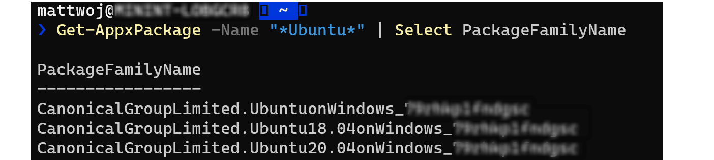

# Expand the size of your WSL 2 Virtual Hard Disk

WSL 2 uses a Virtual Hard Disk (VHD) to store your Linux files. In WSL 2, a VHD is represented on your Windows hard drive as a *.vhdx* file.

The WSL 2 VHD uses the ext4 file system. This VHD automatically resizes to meet your storage needs and has an initial maximum size of 256GB. If the storage space required by your Linux files exceeds this size you may need to expand it. If your distribution grows in size to be greater than 256GB, you will see errors stating that you've run out of disk space. You can fix this error by expanding the VHD size.

To expand your maximum VHD size beyond 256GB:

1. Terminate all WSL instances using the command: `wsl --shutdown`

2. To find your distribution installation package name ('PackageFamilyName'):
    - Using PowerShell (where 'distro' is your distribution name) enter the command:
    - `Get-AppxPackage -Name "*<distro>*" | Select PackageFamilyName`
    - For example: `Get-AppxPackage -Name "*Ubuntu*" | Select PackageFamilyName`

    

3. Use the resulting `PackageFamilyName` to locate the VHD file `fullpath` used by your WSL 2 installation, this will be your `pathToVHD`. To find the full path:
   - In your Start menu, enter: "%LOCALAPPDATA%" and select to open the %LOCALAPPDATA% file folder.
   - Next, open the "Packages" folder and search for the `PackageFamilyName` of your distribution. Open that folder (ie. CanonicalGroupLimited.Ubuntu20.04onWindows_79xxxxx).
   - Inside the `PackageFamilyName` folder, open the "LocalState" folder and find the `<disk>.vhdx` file.
   - Copy the path to that file, it should look something like:
     `%LOCALAPPDATA%\Packages\<PackageFamilyName>\LocalState\<disk>.vhdx`
   - For example, the `<pathToVHD>` for Ubuntu 20.04 should look something like: `%LOCALAPPDATA%\Packages\CanonicalGroupLimited.Ubuntu20.04onWindows_79xxxx\LocalState\ext4.vhdx`.

4. Resize your WSL 2 VHD by completing the following commands:
   - Open Windows Command Prompt with admin privileges and enter:

      ```cmd
      diskpart
      ```

      ```cmd
      DISKPART> Select vdisk file="<pathToVHD>"
      ```

      ```cmd
      DISKPART> detail vdisk
      ```

   - Examine the output of the **detail** command.  The output will include a value for **Virtual size**. This is the current maximum. Convert this value to megabytes. For example, if the **detail** output shows **Virtual size: 256 GB**, convert this to **256000**.
   - The new value you enter must be greater than this original value. As an example, to double the virtual size listed above, you could enter the value: **512000**. Once you have determined the number you would like to set for your new size (in megabytes), enter the following command in your Windows Command Prompt **diskpart** prompt:

      ```cmd
      DISKPART> expand vdisk maximum=<sizeInMegaBytes>
      ```

   - Exit **diskpart**

      ```cmd
      DISKPART> exit
      ```

5. Launch your WSL distribution (Ubuntu, for example) and make sure it is running in WSL 2 (WSL 1 is not supported). You can confirm this using the command: `wsl.exe -l -v`. 

6. Make WSL aware that it can expand its file system's size by running these commands from your WSL distribution command line.

   ```bash
      sudo mount -t devtmpfs none /dev
      mount | grep ext4
   ```

   - You may see this message in response to the first **mount** command: "/dev: none already mounted on /dev." This message can safely be ignored.
   - Copy the name of this entry, which will look like: `/dev/sdX` (with the X representing any other character).  In the following example the value of **X** is **b**:

   ```bash
      sudo resize2fs /dev/sdb <sizeInMegabytes>M
   ```

   - Using the example from above, we changed the vhd size to **512000**, so the command would be: `sudo resize2fs /dev/sdb 512000M`.

   > [!NOTE]
   > You may need to install **resize2fs**.  If so, you can use this command to install it:  `sudo apt install resize2fs`.

   The output will look similar to the following:

   ```bash
      resize2fs 1.44.1 (24-Mar-2021)
      Filesystem at /dev/sdb is mounted on /; on-line resizing required
      old_desc_blocks = 32, new_desc_blocks = 38
      The filesystem on /dev/sdb is now 78643200 (4k) blocks long.
      ```

> [!IMPORTANT]
> We recommend that you do not modify, move, or access the WSL related files located inside of your AppData folder using Windows tools or editors. Doing so could cause your Linux distribution to become corrupted. If you would like to access your Linux files from Windows, that is possible via the path `\\wsl$\<distroName>\`. Open your WSL distribution and enter `explorer.exe .` to view that folder. To learn more, see the blog post: [Accessing Linux files from Windows](https://devblogs.microsoft.com/commandline/whats-new-for-wsl-in-windows-10-version-1903/#accessing-linux-files-from-windows).
