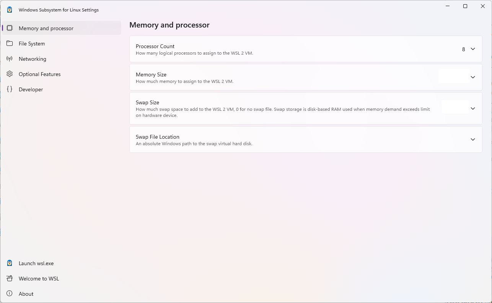

# Advanced settings configuration in WSL

The [`wsl.conf`](#wslconf) and [`.wslconfig`](#wslconfig) files are used to configure advanced settings in WSL that will be applied [on start up of the WSL VM](#the-8-second-rule-for-configuration-changes). `wsl.conf` is used to apply settings on a per WSL distro basis, and `.wslconfig` is used to apply global settings to WSL. You can read more about the differences below.

| Aspect | `.wslconfig` | `wsl.conf` |
|:---|:---|:---|
| Scope | General settings that apply to all of WSL | Settings for WSL distributions only |
| Configures | Feature enablement in WSL, settings for the virtual machine powering WSL 2 (RAM, kernel to boot, number of CPUs, etc.) | Distribution settings in WSL such as boot options, DrvFs automounts, networking, interoperability with the Windows system, systemd usage, and default user |
| Location | `%UserProfile%\.wslconfig`, outside of a WSL distribution | `/etc/wsl.conf`, while inside a WSL distribution |

Currently, all `.wslconfig` settings apply only to WSL 2 distributions. Learn [how to check which version of WSL you are running](./install.md#check-which-version-of-wsl-you-are-running).

## The 8 second rule for configuration changes

You must wait until the subsystem running your Linux distribution completely stops running and restarts for configuration setting updates to appear. This typically takes about 8 seconds after closing ALL instances of the distribution shell.

If you launch a distribution (e.g. Ubuntu), modify the configuration file, close the distribution, and then re-launch it, you might assume that your configuration changes have immediately gone into effect. This is not currently the case as the subsystem could still be running. You must wait for the subsystem to stop before relaunching in order to give enough time for your changes to be picked up. You can check to see whether your Linux distribution (shell) is still running after closing it by using PowerShell with the command: `wsl --list --running`. If no distributions are running, you will receive the response: "There are no running distributions." You can now restart the distribution to see your configuration updates applied.

The command `wsl --shutdown` is a fast path to restarting WSL 2 distributions, but it will shut down all running distributions, so use wisely. You can also use `wsl --terminate <distroName>` to terminate a specific distribution that's running instantly.

## wsl.conf

Configure **local settings** with **wsl.conf** per-distribution for each Linux distribution running on WSL 1 or WSL 2.

- Stored in the `/etc` directory of the distribution as a unix file.
- Used to configure settings on a per-distribution basis. Settings configured in this file will only be applied to the specific Linux distribution that contains the directory where this file is stored.
- Can be used for distributions run by either version, WSL 1 or WSL 2.
- To get to the `/etc` directory for an installed distribution, use the distribution's command line with `cd /` to access the root directory, then `ls` to list files or `explorer.exe .` to view in Windows File Explorer. The directory path should look something like: `/etc/wsl.conf`.

> [!NOTE]
> Adjusting per-distribution settings with the wsl.conf file is only available in Windows Build 17093 and later.

### Configuration settings for wsl.conf

The wsl.conf file configures settings on a per-distribution basis. *(For global configuration of WSL 2 distributions see [.wslconfig](#wslconfig)).*

The wsl.conf file supports four sections: `automount`, `network`, `interop`, and `user`. *(Modeled after .ini file conventions, keys are declared under a section, like .gitconfig files.)* See [wsl.conf](#wslconf) for info on where to store the wsl.conf file.

### systemd support

Many Linux distributions run "systemd" by default (including Ubuntu) and WSL has recently added support for this system/service manager so that WSL is even more similar to using your favorite Linux distributions on a bare metal machine. You will need version 0.67.6+ of WSL to enable systemd. Check your WSL version with command `wsl --version`. If you need to update, you can grab the [latest version of WSL in the Microsoft Store](https://aka.ms/wslstorepage). Learn more in [blog announcement](https://devblogs.microsoft.com/commandline/a-preview-of-wsl-in-the-microsoft-store-is-now-available/).

To enable systemd, open your `wsl.conf` file in a text editor using `sudo` for admin permissions and add these lines to the `/etc/wsl.conf`:

```bash
[boot]
systemd=true
```

You will then need to close your WSL distribution using `wsl.exe --shutdown` from PowerShell to restart your WSL instances. Once your distribution restarts, systemd should be running. You can confirm using the command: `systemctl list-unit-files --type=service`, which will show the status of your services.

### Automount settings

wsl.conf section label: `[automount]`

| Key | Value | Default | Notes |
|:----|:----|:----|:----|
| `enabled` | boolean | `true` | `true` causes fixed drives (i.e `C:/` or `D:/`) to be automatically mounted with DrvFs under `/mnt`.  `false` means drives won't be mounted automatically, but you could still mount them manually or via `fstab`. |
| `mountFsTab` | boolean | `true` | `true` sets `/etc/fstab` to be processed on WSL start. `/etc/fstab` is a file where you can declare other filesystems, like an SMB share. Thus, you can mount these filesystems automatically in WSL on start up. |
| `root` | string | `/mnt/` | Sets the directory where fixed drives will be automatically mounted. By default this is set to `/mnt/`, so your Windows file system `C:\` is mounted to `/mnt/c/`. If you change `/mnt/` to `/windir/`, you should expect to see your fixed `C:\` mounted to `/windir/c`. |
| `options` | comma-separated list of values, such as uid, gid, etc, see automount options below | Null | The automount option values are listed below and are appended to the default DrvFs mount options string. **Only DrvFs-specific options can be specified.** |

The automount options are applied as the mount options for all automatically mounted drives. To change the options for a specific drive only, use the `/etc/fstab` file instead. Options that the mount binary would normally parse into a flag are not supported. If you want to explicitly specify those options, you must include every drive for which you want to do so in `/etc/fstab`.

#### Automount options

Setting different mount options for Windows drives (DrvFs) can control how file permissions are calculated for Windows files. The following options are available:

| Key | Description | Default |
|:----|:----|:----|
| `uid` | The User ID used for the owner of all files | The default User ID of your WSL distro (on first installation this defaults to `1000`) |
| `gid` | The Group ID used for the owner of all files | The default group ID of your WSL distro (on first installation this defaults to `1000`) |
| `umask` | An octal mask of permissions to exclude for all files and directories | `022` |
| `fmask` | An octal mask of permissions to exclude for all files | `000` |
| `dmask` | An octal mask of permissions to exclude for all directories | `000` |
| `metadata` | Whether metadata is added to Windows files to support Linux system permissions | `disabled` |
| `case` | Determines directories treated as case sensitive and whether new directories created with WSL will have the flag set. See [case sensitivity](./case-sensitivity.md) for a detailed explanation of the options. Options include `off`, `dir`, or `force`. | `off` |

By default, WSL sets the `uid` and `gid` to the value of the default user. For example, in Ubuntu, the default user is `uid=1000`, `gid=1000`. If this value is used to specify a different `gid` or `uid` option, the default user value will be overwritten. Otherwise, the default value will always be appended.

The above umask, fmask, etc. options will only apply when the Windows drive is mounted with metadata. By default metadata is not enabled. You can [find more info about this here](./file-permissions.md).

> [!NOTE]
> The permission masks are put through a logical OR operation before being applied to files or directories.

#### What is DrvFs?

DrvFs is a filesystem plugin to WSL that was designed to support interop between WSL and the Windows filesystem. DrvFs enables WSL to mount drives with supported file systems under /mnt, such as /mnt/c, /mnt/d, etc. For more information about specifying the default case sensitivity behavior when mounting Windows or Linux drives or directories, see the [case sensitivity](./case-sensitivity.md) page.

### Network settings

wsl.conf section label: `[network]`

| Key | Value | Default | Notes |
|:----|:----|:----|:----|
| `generateHosts` | boolean | `true` | `true` sets WSL to generate `/etc/hosts`. The `hosts` file contains a static map of hostnames corresponding IP address. |
| `generateResolvConf` | boolean | `true` | `true` sets WSL to generate `/etc/resolv.conf`. The `resolv.conf` contains a DNS list that are capable of resolving a given hostname to its IP address. |
| `hostname` | string | Windows hostname | Sets hostname to be used for WSL distribution. |

### Interop settings

wsl.conf section label: `[interop]`

These options are available in Insider Build 17713 and later.

| Key | Value | Default | Notes |
|:----|:----|:----|:----|
| `enabled` | boolean | `true` | Setting this key will determine whether WSL will support launching Windows processes. |
| `appendWindowsPath` | boolean | `true` | Setting this key will determine whether WSL will add Windows path elements to the `$PATH` environment variable. |

### User settings

wsl.conf section label: `[user]`

These options are available in Build 18980 and later.

| Key | Value | Default | Notes |
|:----|:----|:----|:----|
| `default` | string | The initial username created on first run | Setting this key specifies which user to run as when first starting a WSL session. |

### Boot settings

The Boot setting is only available on Windows 11 and Server 2022.

wsl.conf section label: `[boot]`

| Key | Value | Default | Notes |
|:----|:----|:----|:----|
| `command` | string | Null | A string of the command that you would like to run when the WSL instance starts. This command is run as the root user. e.g: `service docker start`. |
| `protectBinfmt` | boolean | `true` | Prevents WSL from generating systemd units when systemd is enabled.  |

### GPU settings

wsl.conf section label: `[gpu]`

| Key | Value | Default | Notes |
|:----|:----|:----|:----|
| `enabled` | boolean | `true` | Allow Linux applications to access the Windows GPU via para-virtualization. |

### Time settings

wsl.conf section label: `[time]`

| Key | Value | Default | Notes |
|:----|:----|:----|:----|
| `useWindowsTimezone` | boolean | `true` | Setting this key will make WSL use and sync to the timezone set in Windows. |

### Example wsl.conf file

The `wsl.conf` sample file below demonstrates some of the configuration options available. In this example, the distribution is Ubuntu-20.04 and the file path is `\\wsl.localhost\Ubuntu-20.04\etc\wsl.conf`.

```bash
# Automatically mount Windows drive when the distribution is launched
[automount]

# Set to true will automount fixed drives (C:/ or D:/) with DrvFs under the root directory set above. Set to false means drives won't be mounted automatically, but need to be mounted manually or with fstab.
enabled=true

# Sets the directory where fixed drives will be automatically mounted. This example changes the mount location, so your C-drive would be /c, rather than the default /mnt/c.
root = /

# DrvFs-specific options can be specified.
options = "metadata,uid=1003,gid=1003,umask=077,fmask=11,case=off"

# Sets the `/etc/fstab` file to be processed when a WSL distribution is launched.
mountFsTab=true

# Network host settings that enable the DNS server used by WSL 2. This example changes the hostname, sets generateHosts to false, preventing WSL from the default behavior of auto-generating /etc/hosts, and sets generateResolvConf to false, preventing WSL from auto-generating /etc/resolv.conf, so that you can create your own (ie. nameserver 1.1.1.1).
[network]
hostname=DemoHost
generateHosts=false
generateResolvConf=false

# Set whether WSL supports interop processes like launching Windows apps and adding path variables. Setting these to false will block the launch of Windows processes and block adding $PATH environment variables.
[interop]
enabled=false
appendWindowsPath=false

# Set the user when launching a distribution with WSL.
[user]
default=DemoUser

# Set a command to run when a new WSL instance launches. This example starts the Docker container service.
[boot]
command=service docker start
```

## .wslconfig

Configure **global settings** with **.wslconfig** across all installed distributions running on WSL.

- The .wslconfig file does not exist by default. It must be created and stored in your `%UserProfile%` directory to apply these configuration settings.
- Used to configure settings globally across all installed Linux distributions running as the WSL 2 version.
- Can be used **only for distributions run by WSL 2**. Distributions running as WSL 1 will not be affected by this configuration as they are not running as a virtual machine.
- To get to your `%UserProfile%` directory, in PowerShell, use `cd ~` to access your home directory (which is typically your user profile, `C:\Users\<UserName>`) or you can open Windows File Explorer and enter `%UserProfile%` in the address bar. The directory path should look something like: `C:\Users\<UserName>\.wslconfig`.

WSL will detect the existence of these files, read the contents, and automatically apply the configuration settings every time you launch WSL. If the file is missing or malformed (improper markup formatting), WSL will continue to launch as normal without the configuration settings applied.

### Configuration settings for .wslconfig

The .wslconfig file configures settings globally for all Linux distributions running with WSL 2. *(For per-distribution configuration see [wsl.conf](#wslconf)).*

See [.wslconfig](#wslconfig) for info on where to store the .wslconfig file.

> [!NOTE]
> Configuring global settings with `.wslconfig` are only available for distributions running as WSL 2 in Windows Build 19041 and later. Keep in mind you may need to run `wsl --shutdown` to shut down the WSL 2 VM and then restart your WSL instance for these changes to take effect.
>
> [!TIP]
> It is recommended to modify WSL configurations directly in WSL Settings, rather than manually editing the .wslconfig file. WSL Settings can be found in the Start menu.
> 

This file can contain the following options that affect the VM that powers any WSL 2 distribution:

### Main WSL settings

.wslconfig section label: `[wsl2]`

| Key | Value | Default | Notes|
|:----|:----|:----|:----|
| `kernel` | path | The Microsoft built kernel provided inbox | An absolute Windows path to a custom Linux kernel. |
| `kernelModules` | path | An absolute Windows path to a custom Linux kernel modules VHD. |
| `memory` | size | 50% of total memory on Windows | How much memory to assign to the WSL 2 VM. |
| `processors` | number | The same number of logical processors on Windows | How many logical processors to assign to the WSL 2 VM. |
| `localhostForwarding` | boolean | `true` | Boolean specifying if ports bound to wildcard or localhost in the WSL 2 VM should be connectable from the host via `localhost:port`. |
| `kernelCommandLine` | string | None | Additional kernel command line arguments. |
| `safeMode` | boolean | `false` | Run WSL in "Safe Mode" which disables many features and is intended to be used to recover distributions that are in bad states. Only available for Windows 11 and WSL version 0.66.2+.  |
| `swap` | size | 25% of memory size on Windows rounded up to the nearest GB | How much swap space to add to the WSL 2 VM, 0 for no swap file. Swap storage is disk-based RAM used when memory demand exceeds limit on hardware device. |
| `swapFile` | path | `%Temp%\swap.vhdx` | An absolute Windows path to the swap virtual hard disk. |
| `guiApplications` | boolean | `true` | Boolean to turn on or off support for GUI applications ([WSLg](https://github.com/microsoft/wslg)) in WSL.|
| `debugConsole`¹ | boolean | `false` | Boolean to turn on an output console Window that shows the contents of `dmesg` upon start of a WSL 2 distro instance.|
| `maxCrashDumpCount` | number | `10` | Set the maximum number of crash dump files that will be retained for debugging purposes. The default number retained by WSL is 10. When this limit is exceeded, older crash dumps will be automatically deleted to make room for new ones. Setting a max can help with reducing the amount of disk space used by these crash files. |
| `nestedVirtualization`¹ | boolean | `true` | Boolean to turn on or off nested virtualization, enabling other nested VMs to run inside WSL 2.|
| `vmIdleTimeout`¹ | number | `60000` | The number of milliseconds that a VM is idle, before it is shut down.|
| `dnsProxy` | boolean | `true` | Only applicable to `networkingMode = NAT`. Boolean to inform WSL to configure the DNS Server in Linux to the NAT on the host. Setting to `false` will mirror DNS servers from Windows to Linux. |
| `networkingMode`¹² | string | `NAT` | Available values are: `none`, `nat`, `bridged` (deprecated), `mirrored`, and `virtioproxy`. If the value is `none`, the WSL network is disconnected. If the value is `nat` or an unknown value, NAT network mode is used (starting from WSL 2.3.25, if NAT network mode fails, it falls back to using VirtioProxy network mode). If the value is `bridged`, the bridged network mode is used (this mode has been marked as deprecated since WSL 2.4.5). If the value is `mirrored`, the mirrored network mode is used. If the value is `virtioproxy`, the VirtioProxy network mode is used. |
| `firewall`¹² | boolean | `true` | Setting this to true allows the Windows Firewall rules, as well as rules specific to Hyper-V traffic, to filter WSL network traffic. |
| `dnsTunneling`¹² | boolean | `true` | Changes how DNS requests are proxied from WSL to Windows |
| `autoProxy`¹ | boolean | `true` | Enforces WSL to use Windows’ HTTP proxy information |
| `defaultVhdSize` | size | `1099511627776` (1 TB) | Set the Virtual Hard Disk (VHD) size that stores the Linux distribution (for example, Ubuntu) file system. Can be used to limit the maximum size that a distribution file system is allowed to take up. |

Entries with the "**path**" value must be Windows paths with escaped backslashes, e.g: `C:\\Temp\\myCustomKernel`

Entries with the `size` value default to B (bytes), and the unit is omissible. To use other units, the size unit must be appended, e.g.: `8GB` or `512MB`.

¹: Only available on Windows 11.

²: Require [Windows 11 version 22H2](https://blogs.windows.com/windows-insider/2023/09/14/releasing-windows-11-build-22621-2359-to-the-release-preview-channel/) or higher.

### Experimental settings

These settings are opt-in previews of experimental features that we aim to make default in the future.

.wslconfig section label: `[experimental]`

| Key | Value | Default | Notes |
|:----|:----|:----|:----|
|`autoMemoryReclaim`| string | `dropCache` | Available values are: `disabled`, `gradual`, and `dropCache`. If the value is `disabled`, WSL automatic memory reclamation will be disabled. If the value is `gradual`, cached memory will be reclaimed slowly and automatically. If the value is `dropCache` or an unknown value, cached memory will be reclaimed immediately. |
|`sparseVhd`| bool | `false` | When set to `true`, any newly created VHD will be set to sparse automatically. |
|`bestEffortDnsParsing`¹²| bool | `false` | Only applicable when `wsl2.dnsTunneling` is set to `true`. When set to `true`, Windows will extract the question from the DNS request and attempt to resolve it, ignoring the unknown records. |
|`dnsTunnelingIpAddress`¹²| string | `10.255.255.254` | Only applicable when `wsl2.dnsTunneling` is set to `true`. Specifies the nameserver that will be configured in the Linux `resolv.conf` file when DNS tunneling is enabled. |
|`initialAutoProxyTimeout`¹| string | `1000` | Only applicable when `wsl2.autoProxy` is set to `true`. Configures how long (in milliseconds) WSL will wait for retrieving HTTP proxy information when starting a WSL container. If proxy settings are resolved after this time, the WSL instance must be restarted to use the retrieved proxy settings. |
|`ignoredPorts`¹²| string | Null | Only applicable when `wsl2.networkingMode` is set to `mirrored`. Specifies which ports Linux applications can bind to, even if that port is used in Windows. This enables applications to listen on a port for traffic purely within Linux, so those applications are not blocked even when that port is used for other purposes on Windows. For example, WSL will allow binding to port 53 in Linux for Docker Desktop, as it is listening only to requests from within the Linux container. Should be formatted in a comma separated list, e.g: `3000,9000,9090` |
|`hostAddressLoopback`¹²| bool | `false` | Only applicable when `wsl2.networkingMode` is set to `mirrored`. When set to `true`, will allow the Container to connect to the Host, or the Host to connect to the Container, by an IP address that's assigned to the Host. The `127.0.0.1` loopback address can always be used,this option allows for all additionally assigned local IP addresses to be used as well. Only IPv4 addresses assigned to the host are supported. |

¹: Only available on Windows 11.

²: Require [Windows 11 version 22H2](https://blogs.windows.com/windows-insider/2023/09/14/releasing-windows-11-build-22621-2359-to-the-release-preview-channel/) or higher.

## Example .wslconfig file

The `.wslconfig` sample file below demonstrates some of the configuration options available. In this example, the file path is `%UserProfile%\.wslconfig`.

```bash
# Settings apply across all Linux distros running on WSL 2
[wsl2]

# Limits VM memory to use no more than 4 GB, this can be set as whole numbers using GB or MB
memory=4GB

# Sets the VM to use two virtual processors
processors=2

# Specify a custom Linux kernel to use with your installed distros. The default kernel used can be found at https://github.com/microsoft/WSL2-Linux-Kernel
kernel=C:\\temp\\myCustomKernel

# Specify the modules VHD for the custum Linux kernel to use with your installed distros.
kernelModules=C:\\temp\\modules.vhdx

# Sets additional kernel parameters, in this case enabling older Linux base images such as Centos 6
kernelCommandLine = vsyscall=emulate

# Sets amount of swap storage space to 8GB, default is 25% of available RAM
swap=8GB

# Sets swapfile path location, default is %UserProfile%\AppData\Local\Temp\swap.vhdx
swapfile=C:\\temp\\wsl-swap.vhdx

# Turn on default connection to bind WSL 2 localhost to Windows localhost. Setting is ignored when networkingMode=mirrored
localhostforwarding=true

# Disables nested virtualization
nestedVirtualization=false

# Turns on output console showing contents of dmesg when opening a WSL 2 distro for debugging
debugConsole=true

# Sets the maximum number of crash dump files to retain (default is 5)
maxCrashDumpCount=10

# Enable experimental features
[experimental]
sparseVhd=true
```

## Additional resources

- [Windows Command Line Blog: Automatically Configuring WSL](https://devblogs.microsoft.com/commandline/automatically-configuring-wsl/)
- [Windows Command Line Blog: Chmod/Chown, DrvFs, file metadata](https://devblogs.microsoft.com/commandline/chmod-chown-wsl-improvements/)
