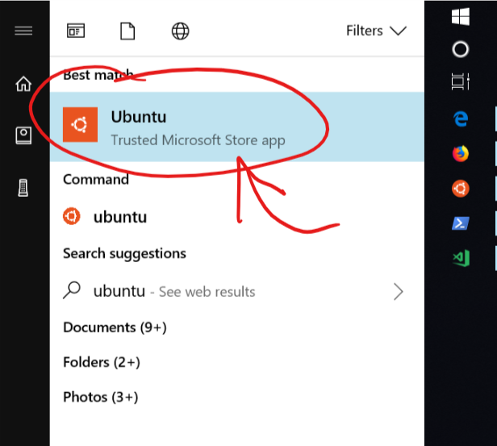
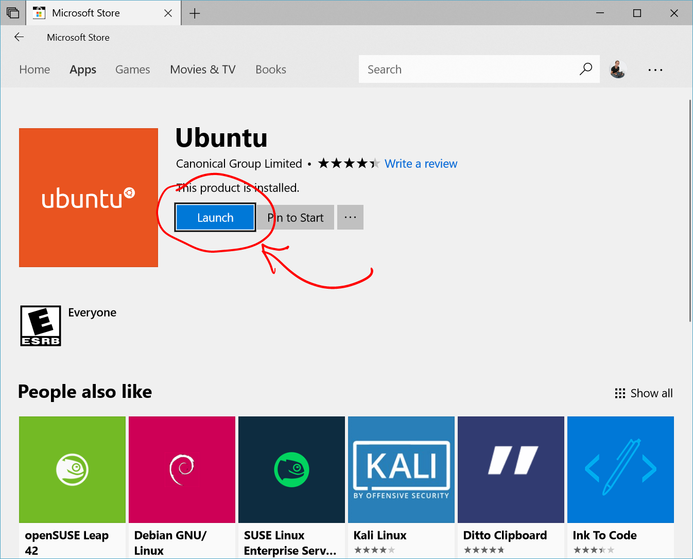

# Manage and configure WSL

> Applies to Windows 10 Fall Creators Update and later.  See our updated [installation guide](./install_guide.md) to try new management features and start running multiple Linux distributions from the Windows Store.

## Ways to run WSL

There are many ways to run Linux with the Windows Subsystem for Linux.

1. `[distro]` ie `ubuntu`
1. `wsl.exe` or `bash.exe`
1. `wsl [command]` or `bash -c [command]`

Which method you should use depends on what you're doing.

### Launch WSL by distribution

Running a distribution using it's distro-specific application launches that distribution in it's own console window.



It is the same as clicking "Launch" in the Windows Store.



You can also run the distribution from the command line by running `[distribution].exe`.

The disadvantage of running a distribution from the command line in this way is that it will automatically change your working directory from the current directory to the distribution's home directory.

**Example:**

```
PS C:\Users\sarah> pwd

Path
----
C:\Users\sarah

PS C:\Users\sarah> ubuntu

scooley@scooley-elmer:~$ pwd
/home/scooley
scooley@scooley-elmer:~$ exit
logout

PS C:\Users\sarah>
```

### wsl and wsl [command]

The best way to run WSL from the command line is using `wsl.exe`.

**Example:**

```
PS C:\Users\sarah> pwd

Path
----
C:\Users\sarah

PS C:\Users\sarah> wsl

scooley@scooley-elmer:/mnt/c/Users/sarah$ pwd
/mnt/c/Users/sarah
```

Not only does `wsl` keep the current working directory in place, it lets you run a single command along side Windows commands.

**Example:**

```
PS C:\Users\sarah> Get-Date

Sunday, March 11, 2018 7:54:05 PM

PS C:\Users\sarah> wsl
scooley@scooley-elmer:/mnt/c/Users/sarah$ date
Sun Mar 11 19:56:57 DST 2018
scooley@scooley-elmer:/mnt/c/Users/sarah$ exit
logout

PS C:\Users\sarah> wsl date
Sun Mar 11 19:55:47 DST 2018
```

**Example:**

```
PS C:\Users\sarah> Get-VM

Name            State CPUUsage(%) MemoryAssigned(M) Uptime   Status
----            ----- ----------- ----------------- ------   ------
Server17093     Off   0           0                 00:00:00 Opera...
Ubuntu          Off   0           0                 00:00:00 Opera...
Ubuntu (bionic) Off   0           0                 00:00:00 Opera...
Windows         Off   0           0                 00:00:00 Opera...


PS C:\Users\sarah> Get-VM | wsl grep "Ubuntu"
Ubuntu          Off   0           0                 00:00:00 Opera...
Ubuntu (bionic) Off   0           0                 00:00:00 Opera...
PS C:\Users\sarah>
```


## Managing multiple Linux Distributions

WSL Config (`wslconfig.exe`) is a command-line tool for managing Linux distributions running on the Windows Subsystem for Linux (WSL).  It lets you list available distributions, set a default distribution, and uninstall distributions.

While WSL Config is helpful for settings that span or coordinate distributions, each Linux distribution independently manages its own configurations.  To see distribution-specific commands, run `[distro.exe] /?`.  For example `ubuntu /?`.

To see all available options for wslconfig, run:  `wslconfig /?`

```  txt
wslconfig.exe
Performs administrative operations on Windows Subsystem for Linux

Usage:
    /l, /list [/all] - Lists registered distributions.
        /all - Optionally list all distributions, including distributions that
               are currently being installed or uninstalled.
    /s, /setdefault <DistributionName> - Sets the specified distribution as the default.
    /u, /unregister <DistributionName> - Unregisters a distribution.
```

### List distributions

`wslconfig /list`  
Lists available Linux distributions available to WSL.  If a distribution is listed, it's installed and ready to use.

`wslconfig /list /all`  
Lists all distributions, including ones that aren't currently usable.  They may be in the process of installing, uninstalling, or are in a broken state.  

### Set a default distribution

The default WSL distribution is the one that runs when you run `wsl` on a command line.

`wslconfig /setdefault <DistributionName>`

Sets the default distribution to `<DistributionName>`.

**Example:**  
`wslconfig /setdefault Ubuntu` would set my default distribution to Ubuntu.  Now when I run `wsl npm init` it will run in Ubuntu.  If I run `wsl` it will open an Ubuntu session.

### Unregister and reinstall a distribution

While Linux distributions can be installed through the Windows store, they can't be uninstalled through the store.  WSL Config allows distributions to be unregistered/uninstalled.

Unregistering also allows distributions to be reinstalled.

> **Caution:** Once unregistered, all data, settings, and software associated with that distribution will be permanently lost.  Reinstalling from the store will install a clean copy of the distribution.

`wslconfig /unregister <DistributionName>`  
Unregisters the distribution from WSL so it can be reinstalled or cleaned up.

For example:
`wslconfig /unregister Ubuntu` would remove Ubuntu from the distributions available in WSL.  When I run `wslconfig /list` it will not be listed.

To reinstall, find the distribution in the Windows Store and select "Launch".

## Set WSL launch settings

> **Available in Windows Insider Build 17093 and later**

Automatically configure certain functionality in WSL that will be applied every time you launch the subsystem using `wsl.conf`. 

Right now, this includes automount options and network configuration.

`wsl.conf` is located in each Linux distribution in `/etc/wsl.conf`. If the file is not there, you can create it yourself. WSL will detect the existence of the file and will read its contents. If the file is missing or malformed (that is, improper markup formatting), WSL will continue to launch as normal.

Here is a sample `wsl.conf` file you could add into your distros:

```
# Enable extra metadata options by default
[automount]
enabled = true
root = /windir/
options = "metadata,umask=22,fmask=11"
mountFsTab = false

# Enable DNS – even though these are turned on by default, we’ll specify here just to be explicit.
[network]
generateHosts = true
generateResolvConf = true
```

### Configuration Options

In keeping with .ini conventions, keys are declared under a section. 

WSL supports two sections: `automount` and `network`.

#### automount

Section: `[automount]`


| key        | value                          | default      | notes                                                                                                                                                                                                                                                                                                                          |
|:-----------|:-------------------------------|:-------------|:-------------------------------------------------------------------------------------------------------------------------------------------------------------------------------------------------------------------------------------------------------------------------------------------------------------------------------|
| enabled    | boolean                        | true         | `true` causes fixed drives (i.e `C:/` or `D:/`) to be automatically mounted with DrvFs under `/mnt`.  `false` means drives won’t be mounted automatically, but you could still mount them manually or via `fstab`.                                                                                                             |
| mountFsTab | boolean                        | true         | `true` sets `/etc/fstab` to be processed on WSL start. /etc/fstab is a file where you can declare other filesystems, like an SMB share. Thus, you can mount these filesystems automatically in WSL on start up.                                                                                                                |
| root       | String                         | `/mnt/`      | Sets the directory where fixed drives will be automatically mounted. For example, if you have a directory in WSL at `/windir/` and you specify that as the root, you would expect to see your fixed drives mounted at `/windir/c`                                                                                              |
| options    | comma-separated list of values | empty string | This value is appended to the default DrvFs mount options string. **Only DrvFs-specific options can be specified.** Options that the mount binary would normally parse into a flag are not supported. If you want to explicitly specify those options, you must include every drive for which you want to do so in /etc/fstab. |

By default, WSL sets the uid and gid to the value of the default user (in Ubuntu distro, the default user is created with uid=1000,gid=1000). If the user specifies a gid or uid option explicitly via this key, the associated value will be overwritten. Otherwise, the default value will always be appended.

**Note:** These options are applied as the mount options for all automatically mounted drives. To change the options for a specific drive only, use /etc/fstab instead.

#### network

Section label: `[network]`

| key | value | default | notes|
|:----|:----|:----|:----|
| generateHosts | boolean | `true` | `true` sets WSL to generate `/etc/hosts`. The `hosts` file contains a static map of hostnames corresponding IP address. |
| generateResolvConf | boolean | `true` | `true` set WSL to generate `/etc/resolv.conf`. The `resolv.conf` contains a DNS list that are capable of resolving a given hostname to its IP address. | 

#### interop

Section label: `[interop]`

These options are available in Insider Build 17713 and later.

| key | value | default | notes|
|:----|:----|:----|:----|
| enabled | boolean | `true` | Setting this key will determine whether WSL will support launching Windows processes. |
| appendWindowsPath | boolean | `true` | Setting this key will determine whether WSL will add Windows path elements to the $PATH environment variable. | 
