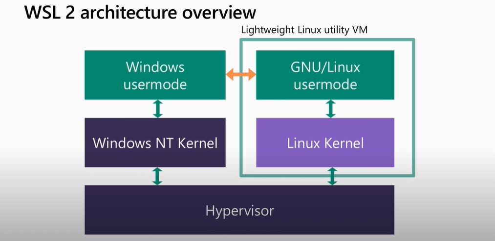
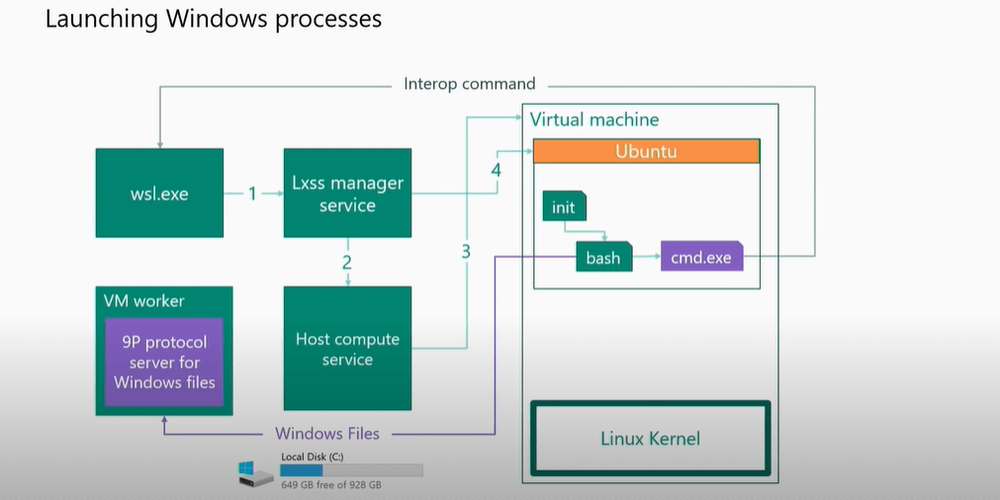

# How does WSL 2 work - Overview of WSL 2 architecture

WSL 2 is a major overhaul of the Windows Subsystem for Linux (WSL) underlying architecture. WSL 2 uses virtualization technology and a Linux kernel to enable new features. The primary goals of this update are to increase file system performance and add full system call compatibility.

The WSL 2 architecture makes the subsystem behave in ways that are slightly different from a "generic" Linux installation. For example, Linux kernel threads do not show up in a process listing (et. sim.). These differences can be unexpected if you don't know what's going on under the hood, so this article will dig in to more detail explaining the architecture underlying WSL 2.

## WSL 2 architectural flow

1. **wsl.exe**:
2. **Lxss manager service** > **Host computer service**:
3. **Virtual machine**: 
4. **Ubuntu** > **init** > **bash** > **/mnt/c** run by **Linux Kernel**:
5. **Windows Files** > **VM worker** > **9P protocol server for Windows files**:

### Interop command

Find more at: https://www.youtube.com/watch?v=lwhMThePdIo&t=1800s
