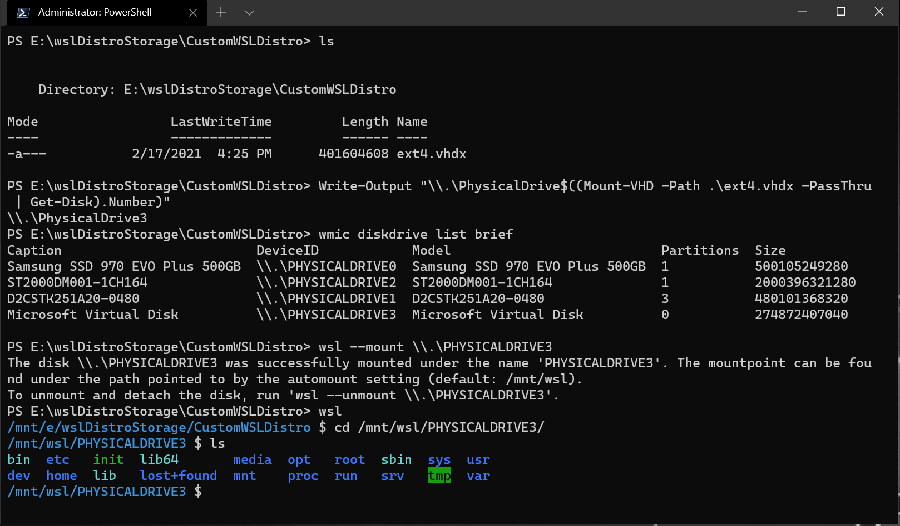

# Mount a Linux disk in WSL 2

If you want to access a Linux disk format that isn't supported by Windows, you can use WSL 2 to mount your disk and access its content. This tutorial will cover the steps to identify the disk and partition to attach to WSL2, how to mount them, and how to access them.

If you are connecting an external drive and do not have success with these mounting instructions, you may want to try the instructions to [Connect USB devices](./connect-usb.md). The `wsl --mount` command does not currently support USB/flash drives/SD card readers, ([learn more about this issue](https://github.com/microsoft/WSL/issues/6011)).

> [!NOTE]
> Administrator access is required to attach a disk to WSL 2.
> The WSL 2 `mount` command does not support mounting a disk (or partitions that belong to the disk) that is currently in use. `wsl --mount` always attaches the entire disk even if only a partition is requested. You can't mount the Windows installation disk.

## Prerequisites

You will need to be on Windows 11 Build 22000 or later, or be running the Microsoft Store version of WSL. To check your WSL and Windows version, use the command: `wsl.exe --version`

## Differences between mounting an external drive with Windows formatting versus Linux formatting

External drives formatted for Windows typically use the NTFS file system formatting. External drives formatted for Linux typically use the Ext4 file system formatting.

If you have mounted an NTFS-formatted drive on your Windows file system, you can access that drive from your Linux distribution using WSL by creating a mounted directory (`sudo mkdir /mnt/d`, replacing 'd' with whatever drive letter you'd like to use) and then using the `drvfs` file system interop plugin, with the command:

```bash
sudo mount -t drvfs D: /mnt/d
```

[Learn more about mounting scenarios](https://superuser.com/questions/1734353/is-there-a-way-to-mount-an-external-drive-when-it-becomes-available-in-wsl).

If you have an Ext4-formatted drive, you cannot mount it on your Windows file system. In order to mount an Ext4-formatted drive on your Linux distribution with WSL, you can use the `wsl --mount` command following the instructions below.

## Mounting an unpartitioned disk

If you have a disk that doesn't have any partitions, you can mount it directly using the `wsl --mount` command. First you need to identify the disk.

1. **Identify the disk** - To list the available disks in Windows, run:

    ```powershell
    GET-CimInstance -query "SELECT * from Win32_DiskDrive"
    ```

    The disks paths are available under the 'DeviceID' columns. Usually under the `\\.\PHYSICALDRIVE*` format.

2. **Mount the disk** - Using PowerShell, you can mount the disk using the Disk path discovered above, run:

    ```powershell
    wsl --mount <DiskPath>
    ```

    

## Mounting a partitioned disk

If you have a disk that you aren't sure what file format it is in, or what partitions it has, you can follow the steps below to mount it.

1. **Identify the disk** - To list the available disks in Windows, run:

    ```powershell
    GET-CimInstance -query "SELECT * from Win32_DiskDrive"
    ```

    The disks paths are listed after 'DeviceID', usually in the `\\.\PHYSICALDRIVE*` format.

2. **List and select the partitions to mount in WSL 2** - Once the disk is identified, run:

    ```powershell
    wsl --mount <DiskPath> --bare
    ```

    This will make the disk available in WSL 2. (In the case of our example, the `<DiskPath>` is `\\.\PHYSICALDRIVE*`.

3. Once attached, the partition can be listed by running the following command inside WSL 2:

    ```bash
    lsblk
    ```

    This will display the available block devices and their partitions.

Inside Linux, a block device is identified as  `/dev/<Device><Partition>`. For example, /dev/sdb3, is the partition number 3 of disk `sdb`.

Example output:

```bash
NAME   MAJ:MIN RM  SIZE RO TYPE MOUNTPOINT
sdb      8:16   0    1G  0 disk
├─sdb2   8:18   0   50M  0 part
├─sdb3   8:19   0  873M  0 part
└─sdb1   8:17   0  100M  0 part
sdc      8:32   0  256G  0 disk /
sda      8:0    0  256G  0 disk
```

### Identifying the filesystem type

If you don't know the type of filesystem of a disk or partition, you can use this command:

```bash
blkid <BlockDevice>
```

This will output the detected filesystem type (under the `TYPE="<Filesystem>"` format).

### Mount the selected partitions

Once you have identified the partitions you want to mount, run this command on each partition:

```powershell
wsl --mount <DiskPath> --partition <PartitionNumber> --type <Filesystem>
```

> [!NOTE]
> If you wish to mount the entire disk as a single volume (i.e. if the disk isn't partitioned), `--partition` can be omitted.
>
> If omitted, the default filesystem type is "ext4".

### Access the disk content

Once mounted, the disk can be accessed under the path pointed to by the config value: `automount.root`. The default value is `/mnt/wsl`.

From Windows, the disk can be accessed from File Explorer by navigating to: `\\wsl$\<Distro>\<Mountpoint>` (pick any Linux distribution).

## Unmount the disk

If you want to unmount and detach the disk from WSL 2, run:

```powershell
wsl --unmount <DiskPath>
```

## Mount a VHD in WSL

> [!NOTE]
> [WSL from the Microsoft Store](https://devblogs.microsoft.com/commandline/a-preview-of-wsl-in-the-microsoft-store-is-now-available/) introduces a new argument to directly mount a VHD: `wsl --mount --vhd <pathToVHD>`
>

You can also mount virtual hard disk files (VHD) into WSL using `wsl --mount`. To do this, you first need to mount the VHD into Windows using the [`Mount-VHD`](/powershell/module/hyper-v/mount-vhd) command in Windows. Be sure to run this command with administrator privileges. Below is an example where we use this command, and also output the disk path. Be sure to replace `<pathToVHD>` with your actual VHD path. 

```powershell
Write-Output "\\.\PhysicalDrive$((Mount-VHD -Path <pathToVHD> -PassThru | Get-Disk).Number)"
```

You can use the output above to obtain the disk path for this VHD and mount that into WSL following the instructions in the previous section.

You can also use this technique to mount and interact with the virtual hard disks of other WSL distros, as each WSL 2 distro is stored via a virtual hard disk file called: `ext4.vhdx`. By default the VHDs for WSL 2 distros are stored in this path: `C:\Users\[user]\AppData\Local\Packages\[distro]\LocalState\[distroPackageName]`, please exercise caution accessing these system files, this is a power user workflow. Make sure to run `wsl --shutdown` before interacting with this disk to ensure the disk is not in use. 



## Command line reference

### Mounting a specific filesystem

By default, WSL 2 will attempt to mount the device as ext4. To specify another filesystem, run:

```powershell
wsl --mount <DiskPath> -t <FileSystem>
```

For example, to mount a disk as fat, run:

```
wsl --mount <Diskpath> -t vfat
```

> [!NOTE]
> To list the available filesystems in WSL2, run: `cat /proc/filesystems` <br>
> When a disk has been mounted via WSL2 (Linux file system), it is no longer available to mount via an ext4 driver on the Windows file system.

### Mounting a specific partition

By default, WSL 2 attempts to mount the entire disk. To mount a specific partition, run:

```
wsl --mount <Diskpath> -p <PartitionIndex>
```

This only works if the disk is either MBR (Master Boot Record) or GPT (GUID Partition Table). [Read about partition styles - MBR and GPT](/windows-server/storage/disk-management/initialize-new-disks#about-partition-styles---gpt-and-mbr).

### Specifying mount options

To specify mount options, run:

```powershell
wsl --mount <DiskPath> -o <MountOptions>
```

Example:

```powershell
wsl --mount <DiskPath> -o "data=ordered"
```

> [!NOTE]
> Only filesystem specific options are supported at this time. Generic options such as `ro, rw, noatime, ...` are not supported.

### Attaching the disk without mounting it

If the disk scheme isn't supported by any of the above options, you can attach the disk to WSL 2 without mounting it by running:

```powershell
wsl --mount <DiskPath> --bare
```

This will make the block device available inside WSL 2 so it can be mounted manually from there. Use `lsblk` to list the available block devices inside WSL 2.

### Specifying the mount name

> [!NOTE]
> This option is only available with [WSL from the Microsoft Store](https://devblogs.microsoft.com/commandline/a-preview-of-wsl-in-the-microsoft-store-is-now-available/)

By default the mountpoint name is generated based on the physical disk or VHD name. This can be overridden with `--name`. Example: 

```powershell
wsl --mount <DiskPath> --name myDisk
```

### Detaching a disk

To detach a disk from WSL 2, run:

```powershell
wsl --unmount [DiskPath]
```

If `Diskpath` is omitted, all attached disks are unmounted and detached.

> [!NOTE]
> If one disk fails to unmount, WSL 2 can be forced to exit by running `wsl --shutdown`, which will detach the disk.

## Limitations

- At this time, only entire disks can be attached to WSL 2, meaning that it's not possible to attach only a partition. Concretely, this means that it's not possible to use `wsl --mount` to read a partition on the boot device, because that device can't be detached from Windows.

- Only filesystems that are natively supported in the kernel can be mounted by `wsl --mount`. This means that it's not possible to use installed filesystem drivers (such as ntfs-3g for example) by calling `wsl --mount`.

- Filesystems not directly supported by the kernel can be mounted via a `--bare` attach and then invoking the relevant FUSE driver.
