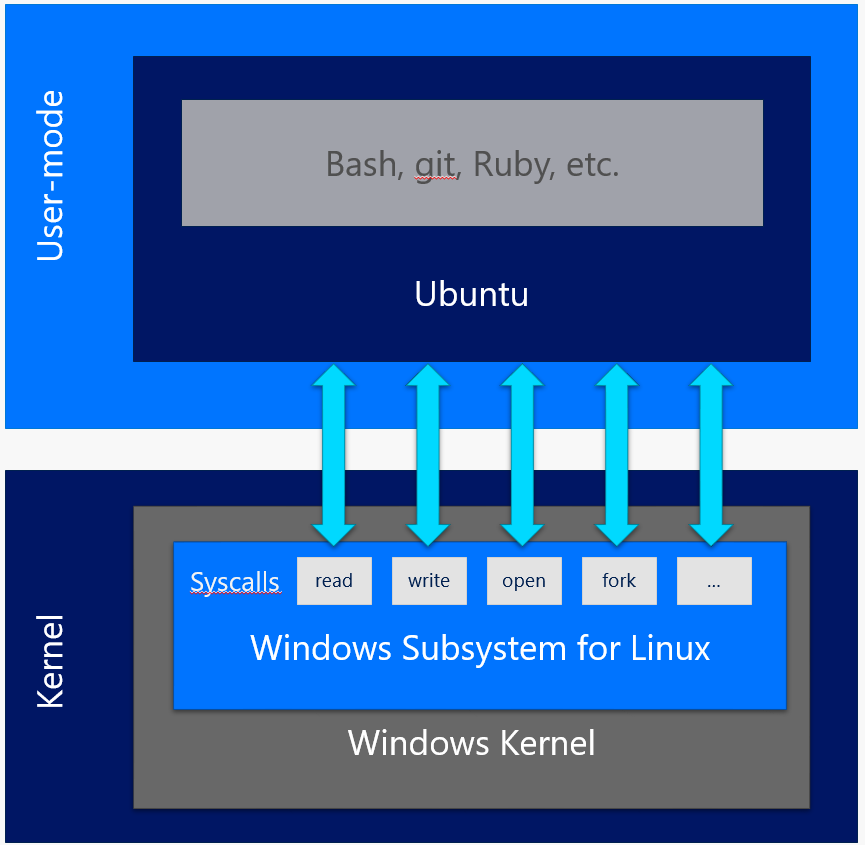

# BASH Running in Ubuntu on Windows

Windows provides developers with a familiar Bash environment. This environment will allow users to:

1.	Run common command line utilities such as `grep`, `sed`, and `awk`
2.	Navigate the file system using these commands
3.	Run bash shell scripts which rely on supported command line utilities

Windows is running Ubuntu user-mode binaries provided by Canonical.  This means the command line utilities are the same as those that run within a native Ubuntu environment.  

This is provided as beta software.  While many of the coreutil commands provided by Ubuntu will work, there are some that will not.  We welcome feedback and will prioritize accordingly.  

Feedback and questions should be directed to:
* Our [GitHub issue tracker](https://github.com/Microsoft/CommandLine-Documentation/issues)
* Our [command-line UserVoice portal](https://wpdev.uservoice.com/forums/266908-command-prompt/filters/top)
* Our [command-line team blog](https://blogs.msdn.microsoft.com/commandline/)

Additionally, developers can try command line applications that are compatible with Ubuntu such as Ruby and Redis and provide feedback on their experiences.

Requirements:
* 64-bit Windows 10 
* Windows Insider Preview build coming soon

## Architectural Overview

This scenario is comprised of two main components:

1.	**Ubuntu on Windows**  
  Genuine Ubuntu user-mode binaries provided by Canonical. 

2.	**Window Subsystem for Linux (WSL)**  
  This infrastructure supports unmodified Ubuntu binaries by exposing Linux-compatible kernel interfaces.  It includes Microsoft components that are responsible for handling Linux system call requests in coordination with the Windows NT kernel.  
  This subsystem was developed by Microsoft and contains no Linux code.

