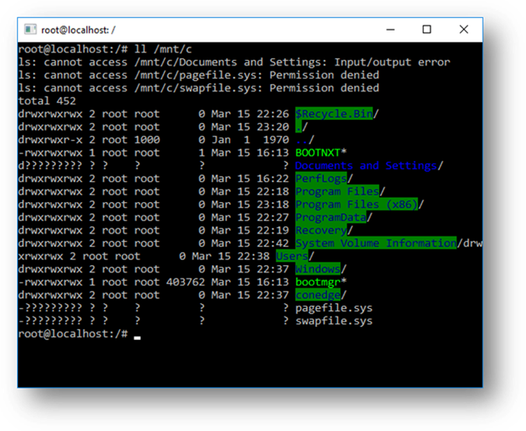

# Frequently Asked Questions

> **Important note**  
  This is the first release of this brand new technology and it is branded “beta” deliberately – it’s not yet complete! We know there are issues and incomplete features, you should expect some things to work and for many things to fail. But we appreciate you playing with this feature and helping us identify the issues we need to fix in order to deliver a great experience.

### What is BASH?
[BASH](https://en.wikipedia.org/wiki/Bash_%28Unix_shell%29) is a popular text-based shell and command-language. It is the default shell included within Ubuntu and other Linux distro’s, and in OSX. Users type commands into a shell to execute scripts and/or run commands and tools to accomplish many tasks.

### What Windows Subsystem for Linux (WSL)?
The Windows Subsystem for Linux (WSL) is a new Windows 10 feature that enables you to run native Linux command-line tools directly on Windows, alongside your traditional Windows desktop and modern store apps.

See the [about page](./about.md) for more details.

### What is “Ubuntu on Windows”
When WSL is enabled (it’s an optional feature), we download a genuine Ubuntu user-mode image, created by Canonical. Our Bash.exe application, when started, then loads and runs the native Bash shell and Linux command-line tools from the Ubuntu image.

### Who is this for?
This is primarily a tool for developers -- especially web developers and those who work on or with open source projects.  This allows those who want/need to use Bash, common Linux tools (`sed`, `awk`, etc.) and many Linux-first tools (Ruby, Python, etc.) to use their toolchain on Windows.

### What can I do with WSL?
WSL provides an application called Bash.exe that, when started, opens a Windows console running the Bash shell. Using Bash, you can run command-line Linux tools and apps. For example, type `lsb_release -a` and hit enter; you’ll see details of the Linux distro currently running:

You can also access your local machine’s filesystem from within the Linux Bash shell – you’ll find your local drives mounted under the `/mnt` folder. For example, your `C:` drive is mounted under `/mnt/c`:  

### How does this work?
See the [reference page](about.md) for more details about the underlying technology.

### Why would I use WSL rather than Linux in a VM?
WSL requires fewer resources (CPU, memory and storage) than a full virtualized machine. WSL also allows you to run Linux command-line tools and apps alongside your Windows command-line, desktop and store apps, and to access your Windows files from within Linux. This enables you to use Windows apps and Linux command-line tools on the same set of files if you wish.

### Why would I use, for example, Ruby on Linux instead of on Windows?
Some cross-platform tools were built assuming that the environment in which they run behaves like Linux. For example, some tools assume that they are able to access very long file paths or that specific files/folders exist. This often causes problems on Windows which often behaves differently from Linux.

Many languages like Ruby and node are often ported to, and run great, on Windows. However, not all of the Ruby Gem or node/NPM library owners port their libraries to support Windows, and many have Linux-specific dependencies. This can often result in systems built using such tools and libraries suffering from build and sometimes runtime errors or unwanted behaviors on Windows.

These are just some of issues that caused many people to ask Microsoft to improve Windows’ command-line tools and what drove us to partner with Canonical to enable native Bash and Linux command-line tools to run on Windows.

### What does this mean for PowerShell?
While working with OSS projects, there are numerous scenarios where it’s immensely useful to drop into BASH from a PowerShell prompt.  Bash support is complementary and strengthens the value of the command-line on Windows, allowing PowerShell and the PowerShell community to leverage other popular technologies.

Read more on the PowerShell team blog -- [Bash for Windows: Why it’s awesome and what it means for PowerShell](https://blogs.msdn.microsoft.com/powershell/2016/04/01/bash-for-windows-why-its-awesome-and-what-it-means-for-powershell/)

### Can run ALL Linux apps in WSL?
No! WSL is a tool aimed at enabling users who need them to run Bash and core Linux command-line tools on Windows.  

WSL does **not** aim to support GUI desktops or applications (e.g. Gnome, KDE, etc.)  

Also, even though you will be able to run many popular server applications (e.g. Redis), we do not recommend WSL for server scenarios – Microsoft offers a variety of solutions for running production Ubuntu workloads in Azure, Hyper-V and Docker. 

### Why is this a beta release?
This is the first release of a brand new technology. There will be gaps. We know some of them, and we’re certain you will find many more.
Again, this is a beta release – expect things to fail. Some tools will crash and/or not run. But please be sure to let us know when you run into issues – we’re working hard to fix problems and dramatically improve WSL over time.

### Can I run other Linux distro’s than Ubuntu?
Not at this time: We’re currently focused on delivering a great Ubuntu experience. We are keen to explore supporting other Linux distro’s in the future.

### What Windows SKU’s is WSL included in?
Windows Subsystem for Linux will be available in desktop versions of Windows.  
WSL is NOT a server technology and so will not be available on Server SKU’s.  WSL is an optional Windows feature and can be enabled via the “Turn Windows features on or off” tool or via DISM via an (elevated) command-line.

### What processors do we support?
We only support x64 CPU’s.

###How do I access my C drive?
Mount points for hard drives on the local machine are automatically created and provide easy access to the Windows filesystem. 
 
**/mnt/\<drive letter>/**
 
Example usage would be `cd /mnt/c` to access c:\

###Is there any distinction between files in the Linux drive and the mounted Windows drives?
1. Files under the Linux root (i.e. “/”) are controlled by the subsystem.  This allows for Linux specific behavior including but is not limited to:
  * Files which contain invalid Windows filename characters
  * Symlinks created for non-admin users
  * Changing file attributes through chmod and chown
  * Support case sensitivity
2. Files in mounted drives are controlled by Windows and have the following behaviors:
  * Do not support case sensitivity
  * Do not support the creation of symlinks
  * All permissions are set to 777 (full permissions of the user who launched the bash session)
3. It is not possible to create a symlink between the two filesystems

### Where can I provide feedback?
You can share feedback and ask questions through multiple channels:
Feedback and questions should be directed to:
* Our [GitHub issue tracker](https://github.com/Microsoft/BashOnWindows/issues)
* Our [command-line UserVoice portal](https://wpdev.uservoice.com/forums/266908-command-prompt/filters/top)
* Our [command-line team blog](https://blogs.msdn.microsoft.com/commandline/)
* Via Twitter. Please follow [@richturn_ms](https://twitter.com/richturn_MS) on twitter to learn of news, updates, etc.
