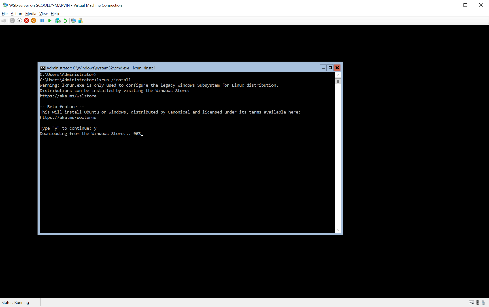
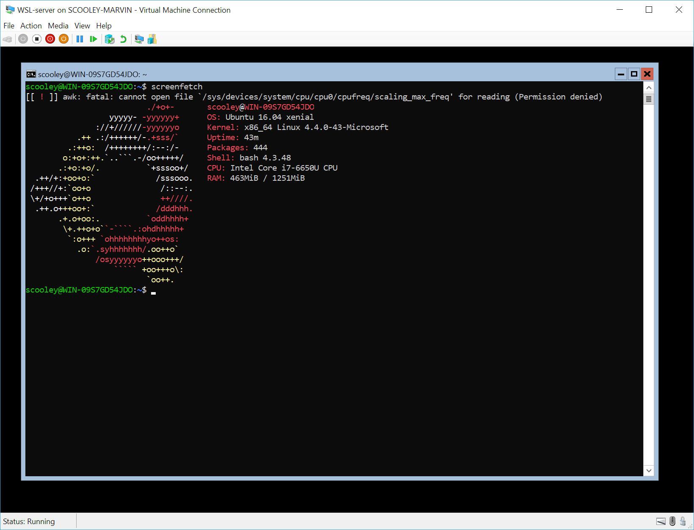

# Windows Server 2016 Installation Guide

At //Build2017, Microsoft announced that Windows Subsystem for Linux will be [available on Windows Server](https://blogs.technet.microsoft.com/hybridcloud/2017/05/10/windows-server-for-developers-news-from-microsoft-build-2017/).  These instructions help you become a Windows Insider, download Windows Server, and get Linux running on the Windows Subsystem for Linux.

## Prerequisites

Windows Server 2016 (build 16215+).  Right now, that means a Windows Insider's build.

Already have Windows Server preview?  [Skip ahead](install-on-server.md#Enable-the-Windows-Subsystem-for-Linux).

### Join Windows Insiders and Download Windows Server

1. Join a Windows Insiders program:
    * [Windows Insiders](https://insider.windows.com)
    * [Windows Insiders for Business](https://insider.windows.com/ForBusiness)

2. Download [Windows Server 2016 -- Insider Preview](https://www.microsoft.com/en-us/software-download/windowsinsiderpreviewserver).  
Make sure you're logged in, images are only available to Windows Insiders.


### Setting up Windows Server

Now that you have a Windows Server image (.iso), install Windows Server on a physical computer or a virtual machine.  I'm going to use a virtual machine on Hyper-V.

Here are instructions for [enabling Hyper-V](https://docs.microsoft.com/virtualization/hyper-v-on-windows/quick-start/enable-hyper-v) and [creating a new virtual machine from an .iso](https://docs.microsoft.com/virtualization/hyper-v-on-windows/quick-start/quick-create-virtual-machine).

During installation, Windows Server will ask for a product key.  The following keys are available for unlimited activations of Windows Server. These keys may be used throughout the pre-release cycle.  Read more [here](https://blogs.windows.com/windowsexperience/2017/07/13/announcing-windows-server-insider-preview-build-16237).
* Server Datacenter Core: B69WH-PRNHK-BXVK3-P9XF7-XD84W
* Server Standard Core: V6N4W-86M3X-J77X3-JF6XW-D9PRV

When you're done, you should see something like this:  


Remember to start PowerShell.

### Check your build number

To find your Windows Server build number, run the following in PowerShell:  
``` PowerShell
systeminfo | Select-String "^OS Name","^OS Version"
```

You can also confirm that your build has the Windows Subsystem for Linux by running the following in PowerShell:  
``` PowerShell
Get-WindowsOptionalFeature -Online -FeatureName Microsoft-Windows-Subsystem-Linux
```

## Enable the Windows Subsystem for Linux
Enable the "Windows Subsystem for Linux" optional feature and reboot.

1. Open PowerShell as Administrator and run:
    ``` PowerShell
    Enable-WindowsOptionalFeature -Online -FeatureName Microsoft-Windows-Subsystem-Linux
    ```
    
    > **Troubleshooting: Enable-WindowsOptionalFeature is not recognized**  
    > Make sure you started PowerShell.  Windows Server Core starts cmd by default.

2. Restart your computer when prompted.


## Install a Linux distribution

1. Download the appx for your favorite Linux distribution.  
    Here are links directly to the apps available through the store:
    * [Ubuntu]()
    * comming soon -- [OpenSUSE]()
    * comming soon --[SLES]()

    You can download the distributions to Windows Server with [`Invoke-WebRequest`]() cmdlet.  Here's a sample instruction to download Ubuntu.
    
    ``` PowerShell
    $destinationfilename = Ubuntu.zip

    cd ~
    Invoke-WebRequest -Uri $UbuntuLink -OutFile $destinationfilename -PassThru | select -ExpandProperty headers
    ```

    > The Windows Subsystem for Linux only runs on your system drive (usually this is your C: drive).  
    Example: `C:\Distros\Ubuntu`

3. Unzip the file into the install directory

    ``` PowerShell
    [System.Reflection.Assembly]::LoadWithPartialName("System.IO.Compression.FileSystem") | Out-Null
    Expand-Archive $pathToZip $targetDir
    ```

5. Run the installer, named `<distro>.exe`  
    For example: `ubuntu.exe`, `fedora.exe`, etc.
 
5. Create your UNIX username and password.  This user account can be different from, and has no relationship to, your Windows username and password. [Read more](https://msdn.microsoft.com/en-us/commandline/wsl/user_support).

You're done!  Now you can use your Linux environment.


## Install default Linux environment using lxrun

lxrun installs Ubuntu user-mode by default on top of the Windows Subsystem for Linux.  

2. Run `lxrun /install`  
  After you have accepted the License, the Ubuntu user-mode image will be downloaded and extracted.
  
    

3. Launch a new Ubuntu shell by running `bash` from a command-prompt

4. Create a UNIX user
    
    The first time you install the Windows Subsystem for Linux, you will be prompted to create a UNIX username and password.  
    
    This UNIX username and password can be different from, and has no relationship to, your Windows username and password. [Learn more about your UNIX account.](https://msdn.microsoft.com/en-us/commandline/wsl/user_support).

After installation your Linux distribution will be located at: `%localappdata%\lxss\`.

**Avoid creating and/or modifying files in %localappdata%\lxss\ using Windows tools and apps!** If you do, it is likely that your Linux files will be corrupted and data loss may occur. Avoid this issue by using a directory located under /mnt/.  
Read this [blog post](https://blogs.msdn.microsoft.com/commandline/2016/11/17/do-not-change-linux-files-using-windows-apps-and-tools/) for more information.

You're done!  Go use your new Linux environment!


